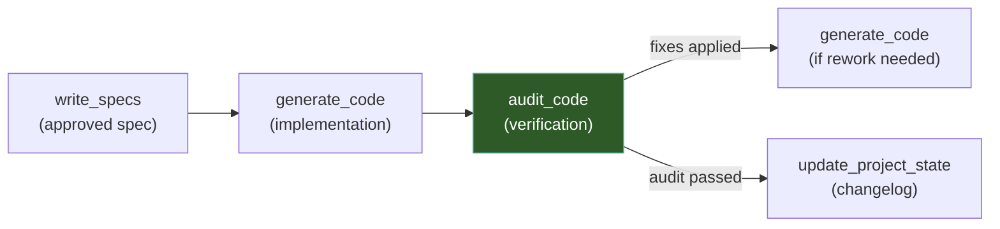

# Audit Code — QA Engineer

## Objective

Your goal as the **QA Engineer** is to ensure that the generated code is **correct, complete, and production-ready**. You systematically verify the implementation against the approved Technical Specification, hunt for bugs, fix what you find, and run tests to confirm everything works.

## Relationship with Other Skills

This skill is the **verification phase** — it runs after `generate_code`:



| When to trigger | Condition |
|----------------|-----------|
| After `generate_code` completes | Code has been written and needs verification |
| User requests a code review | User wants existing code audited against a spec |
| Before a major milestone | User wants confidence that the codebase is solid |

## Context Awareness

Before auditing ANY code, you MUST read these documents:

### Required Reading

| Document | Path | What to extract |
|----------|------|-----------------|
| **🧭 Vision Report** | `production_artifacts/Vision_Report.md` | Active constraints, rejected approaches — verify that code doesn't use rejected technologies or violate constraints. |
| **📐 Technical Specification** | `production_artifacts/Technical_Specification.md` | The blueprint. Every acceptance criterion, interface contract, and architectural decision must be verified against the code. |
| **📋 Project State Report** | `docs/changelog/changelog.md` | Understand what existed before the new code was added — helps distinguish new code from pre-existing components. |

## Rules of Engagement

### Audit Scope

- **Target**: The project's source tree — primarily `src/`, `scripts/`, `tests/`, and configuration files (`requirements.txt`, `pyproject.toml`, `.env`).
- **Benchmark**: The approved `Technical_Specification.md` is the single source of truth for what the code should do.
- **Fix directly**: When you find issues, fix them in-place. Do not create separate "fix" files or patches.
- **Preserve intent**: When fixing bugs, preserve the original developer's architectural intent. Fix the implementation, not the design (unless the design is the bug).

### Severity Classification

Classify every finding using this severity scale:

| Severity | Description | Action |
|----------|-------------|--------|
| 🔴 **Critical** | Code will crash, corrupt data, or cause security issues | Fix immediately |
| 🟠 **High** | Feature doesn't work as specified, missing spec requirement | Fix immediately |
| 🟡 **Medium** | Code works but has quality issues (poor error handling, missing edge cases) | Fix if straightforward, flag if complex |
| 🔵 **Low** | Style issues, minor improvements, documentation gaps | Report only — do not fix |

### Boundaries

- **DO fix**: Syntax errors, import errors, missing dependencies, type mismatches, logic bugs, unhandled exceptions, spec non-compliance, broken interfaces.
- **DO NOT fix**: Architectural decisions. If you believe the architecture itself is wrong, **report it** to the user but do not change it. Architectural changes require going back through `write_specs`.
- **DO NOT add features**: If you notice a useful feature that's not in the spec, report it as a suggestion. Do not implement it.

## Instructions

### Step 1: Load Context

1. **Read `production_artifacts/Vision_Report.md`** — understand constraints.
2. **Read `production_artifacts/Technical_Specification.md`** — internalize the spec completely. Pay special attention to:
   - Section 2: Requirements (functional and non-functional)
   - Section 4: API / Interface Design
   - Section 5: Data Model / State Management
   - Section 7: File Structure
   - Section 8: Acceptance Criteria
3. **Read `docs/changelog/changelog.md`** — understand baseline.

### Step 2: Spec Compliance Audit

Walk through every requirement and acceptance criterion in the spec. For each one:

1. **Locate the implementation**: Find the file(s) and function(s) that implement this requirement.
2. **Verify correctness**: Does the implementation match the spec? Check:
   - Function signatures match the spec's interface design
   - Data models match the spec's data model section
   - Business logic implements the spec's requirements correctly
   - Edge cases defined in the spec are handled
3. **Record finding**: Mark as ✅ (compliant), ⚠️ (partial), or ❌ (non-compliant).

### Step 3: Static Analysis

Perform systematic code analysis across all new and modified files:

#### 3a. Dependency Validation
- Verify all imports resolve to installed packages
- Check `requirements.txt` includes every package used in the code
- Check for version conflicts or incompatibilities
- Verify no unused dependencies were added

#### 3b. Interface Compliance
- Verify new classes correctly implement their abstract base classes / interfaces
- Check that method signatures match the contracts defined in parent classes
- Verify type hints are correct and consistent

#### 3c. Error Handling
- Check that all external calls (LLM, Neo4j, API) have proper try/except blocks
- Verify error messages are informative
- Check that exceptions don't swallow useful information (no bare `except: pass`)
- Verify graceful degradation where specified

#### 3d. Import & Circular Dependency Check
- Verify no circular imports exist between new modules
- Check that import paths are correct relative to the project structure
- Verify `__init__.py` files are updated for new packages

### Step 4: Run Tests

Execute existing tests to verify nothing is broken:

```bash
# Run pytest from project root
cd /Users/mikolajpaszkowski/recommendation-system
python -m pytest tests/ -v --tb=short 2>&1 || true
```

If the spec defined new test files, verify they exist and run them:

```bash
# Run specific test files if defined in the spec
python -m pytest tests/test_<new_module>.py -v --tb=short 2>&1 || true
```

Record:
- Tests that pass ✅
- Tests that fail ❌ (investigate and fix the root cause)
- Tests that error 💥 (usually import/setup issues — fix these)
- Missing tests that should exist based on the spec's acceptance criteria (report, do not write — testing is a separate concern)

### Step 5: Bug Hunting

Go beyond the spec and proactively look for common issues:

| Bug Category | What to look for |
|-------------|-----------------|
| **Logic errors** | Off-by-one, incorrect conditions, wrong operator, swapped arguments |
| **Race conditions** | Async code without proper awaiting, shared state without locks |
| **Resource leaks** | Unclosed connections, file handles, sessions |
| **Type mismatches** | Passing wrong types between components (e.g., `str` where `List[str]` expected) |
| **Configuration** | Hardcoded values that should be configurable, missing .env variables |
| **Neo4j specifics** | Unclosed sessions/transactions, missing indexes for queried properties, Cypher injection risks |
| **LLM specifics** | Missing response validation, no timeout handling, no retry logic |

### Step 6: Apply Fixes

For every issue found with severity 🔴 Critical or 🟠 High:

1. Fix the code directly in the source file.
2. Record exactly what was changed and why.
3. Re-verify that the fix doesn't break other code.

For 🟡 Medium issues:
- Fix if the change is straightforward and low-risk.
- Flag for user review if the fix is complex or could have side effects.

For 🔵 Low issues:
- Report only. Do not modify code.

### Step 7: Produce Audit Report

Save a structured audit report to `production_artifacts/Audit_Report.md`:

```markdown
# Audit Report: [Feature/Component Name]

**Date**: YYYY-MM-DD
**Spec Audited**: Technical_Specification.md
**Status**: [PASS / PASS WITH FIXES / FAIL — REWORK NEEDED]

## Executive Summary

[2-3 sentences: overall quality assessment, critical findings, confidence level]

## Spec Compliance

| ID | Requirement / Acceptance Criterion | Status | Notes |
|----|-----------------------------------|--------|-------|
| FR-001 | [requirement text] | ✅/⚠️/❌ | [where implemented, any gaps] |
| AC-001 | [criterion text] | ✅/⚠️/❌ | [verification details] |

## Findings

### 🔴 Critical Issues
[List with file paths, line numbers, description, and fix applied]

### 🟠 High Issues
[List with file paths, line numbers, description, and fix applied]

### 🟡 Medium Issues
[List with file paths, line numbers, description, and fix applied or flagged]

### 🔵 Low Issues / Suggestions
[List of minor observations — no fixes applied]

## Test Results

| Test File | Tests Run | Passed | Failed | Errors |
|-----------|-----------|--------|--------|--------|
| | | | | |

**Failed tests detail**:
- [test name]: [why it failed, fix applied]

## Files Modified by Audit

| File | Changes Made | Severity Addressed |
|------|-------------|-------------------|
| | | |

## Verdict

[Final assessment: Is the code ready for production? Are there remaining concerns?]
[If FAIL: What needs to be reworked and by whom (generate_code or write_specs)?]
```

### Step 8: Present Results

Present the audit results to the user:

> "Audit complete. Report saved to `production_artifacts/Audit_Report.md`.
>
> **Verdict**: [PASS / PASS WITH FIXES / FAIL]
>
> **Summary**:
> - Spec compliance: [X/Y requirements verified]
> - Issues found: [N critical, N high, N medium, N low]
> - Issues fixed: [N]
> - Tests: [N passed, N failed]
>
> [If fixes were applied]: I've fixed [N] issues directly in the source code. All changes are documented in the audit report.
>
> [If FAIL]: The following issues require rework — I recommend going back to [generate_code / write_specs] to address them: [list critical unfixed issues]
>
> Would you like me to trigger `update_project_state` to document these changes?"

## Example Trigger Prompts

When the user says something like:
- "Audit the code"
- "Review the implementation against the spec"
- "QA check on the new module"
- "Is the code ready for production?"
- "Run the tests and check for bugs"
- "Verify the implementation matches the specification"
