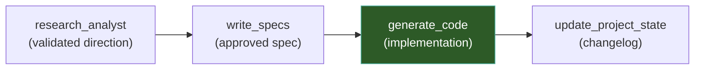

# Generate Code — Full-Stack Engineer

## Objective

Your goal as the **Full-Stack Engineer** is to write production-quality code based entirely on the PM's approved Technical Specification. You implement exactly what was specified — no more, no less.

## Relationship with Other Skills

This skill is the **execution phase** of the PM pipeline:

| Input | Source |
|-------|--------|
| Technical Specification | `production_artifacts/Technical_Specification.md` — **REQUIRED** (must be approved) |
| Vision Report | `production_artifacts/Vision_Report.md` — for architectural consistency |
| Research Report (if exists) | `production_artifacts/Research_Report.md` — for additional context on technology choices |

## Context Awareness

Before writing ANY code, you MUST read these documents:

### Required Reading

| Document | Path | What to extract |
|----------|------|-----------------|
| **🧭 Vision Report** | `production_artifacts/Vision_Report.md` | Active constraints, rejected approaches (do NOT use rejected technologies), current architecture. |
| **📋 Implementation Plan** | `production_artifacts/Implementation_Plan.md` | Technology stack constraints, dataset configuration, and coding goals for the current phase. |
| **📐 Technical Specification** | `production_artifacts/Technical_Specification.md` | The complete specification: requirements, architecture, API design, data model, file structure, acceptance criteria. **This is your blueprint.** |
| **📋 Project State Report** | `docs/project_state_report.md` | Current implementation state — understand what exists so you don't break or duplicate it. |

### Codebase Scan

Before implementing, scan the relevant source directories to understand existing code patterns, conventions, and interfaces:

- `src/agents/` — Agent architecture, orchestrator, state management
- `src/tools/` — Tool interfaces and implementations
- `src/knowledge_graph/graphdb/` — Graph operations, resolvers, embeddings
- `src/llm_interface/` — LLM parsers, prompt constructors, response generators
- `src/llm/` — LLM handlers and abstract interfaces
- `src/personalization/` — Preference quantification
- `src/user/` — Profile management
- `src/conversation/` — History management
- `src/ui/` — UI layer (Chainlit)
- `scripts/` — Operational scripts
- `tests/` — Test files

## Rules of Engagement

### Coding Standards

1. **Match existing patterns**: Study the existing codebase before writing. Match the project's coding style, naming conventions, import patterns, and architectural patterns. If the project uses abstract base classes with interfaces (e.g., `LLMHandlerInterface`), follow that pattern for new components.
2. **Dynamic language/framework**: You are NOT limited to a single language or framework. Write code in the exact language/framework defined in the approved `Technical_Specification.md`.
3. **Complete code only**: Never output placeholder comments like `# TODO: implement this` or `pass` in production code. Every function must have a working implementation.
4. **Preserve existing code**: When modifying existing files, preserve all unrelated code, comments, and docstrings. Only change what the spec requires.
5. **Dependencies**: If new packages are required, add them to `requirements.txt` (Python) or the appropriate dependency file. Never import packages that aren't in the dependency list.

### File Location Rules

- **Write directly into the project's source tree** — NOT into `app_build/`.
- The Technical Specification's **File Structure** section (Section 7) defines exactly where each file goes.
- **New files**: Create at the path specified in the spec (e.g., `src/knowledge_graph/graphdb/new_module.py`).
- **Modified files**: Edit in-place at their current location. Never copy a file to a new location to modify it.
- **New dependencies**: Update `requirements.txt` at the project root.
- **New scripts**: Place in `scripts/` unless the spec says otherwise.

### Quality Rules

1. **Type hints**: Use Python type hints for all function signatures and return types.
2. **Docstrings**: Write docstrings for all public classes and methods. Follow the existing project's docstring style.
3. **Error handling**: Implement proper error handling. Never let exceptions propagate silently.
4. **Logging**: Use Python's `logging` module for operational logging. Match the project's existing logging patterns.
5. **Configuration**: Never hardcode secrets, API keys, or environment-specific values. Use environment variables or configuration files.

## When to Trigger

Activate this skill when:
- The user says "implement the spec" or "generate the code"
- A Technical Specification has been approved and the user wants to proceed to coding
- The user says "build this" after reviewing a spec
- The user explicitly asks to implement a feature that has an approved spec

**Do NOT trigger** if:
- No approved Technical Specification exists — direct the user to the `write_specs` skill first
- The spec's status is still "Draft — Pending Approval"

## Instructions

### Step 1: Read and Internalize

1. **Read `production_artifacts/Vision_Report.md`** — understand constraints and rejected approaches.
2. **Read `production_artifacts/Technical_Specification.md`** — this is your blueprint. Understand every section.
3. **Read `docs/project_state_report.md`** — know what's already implemented.
4. **Scan the source directories** listed above — understand existing code patterns and interfaces.

Verify that:
- The spec status says "Approved" (not "Draft" or "Pending")
- The spec's tech stack aligns with the Vision Report's active constraints
- The spec's proposed architecture doesn't conflict with existing components

If any of these checks fail, **STOP** and inform the user before proceeding.

### Step 2: Scaffold the File Structure

Before writing any implementation code, create the **skeleton** of all files defined in the spec:

1. **New files**: Create each new file with:
   - Module-level docstring describing its purpose
   - Import statements
   - Class/function signatures with type hints
   - Docstrings for each public class and method
   - `pass` or `raise NotImplementedError()` as temporary bodies
   
2. **Modified files**: For each existing file that needs changes, list:
   - What will be added (new methods, new imports, new logic)
   - What will be modified (changed signatures, updated logic)
   - What will remain untouched

3. **New dependencies**: List any new packages that need to be added to `requirements.txt`.

### Step 3: Present Structure for Review — HALT

**STOP** and present the scaffolded structure to the user:

> "I've scaffolded the file structure based on the Technical Specification. Here's what will be created and modified:
>
> **New files:**
> - `src/path/to/file1.py` — [purpose]
> - `src/path/to/file2.py` — [purpose]
>
> **Modified files:**
> - `src/path/to/existing.py` — [what changes]
>
> **New dependencies:**
> - `package_name==version` — [why needed]
>
> Do you approve this structure? I'll proceed with full implementation once confirmed."

**Wait for explicit user approval before proceeding to Step 4.**

### Step 4: Implement

Once the user approves the file structure, write the full implementation:

1. **Implement in dependency order**: Start with the lowest-level modules (utilities, data models, interfaces) and work up to higher-level components (agents, orchestrators, tools).
2. **Complete every function**: No placeholders, no `pass` statements, no `# TODO` comments.
3. **Follow the spec exactly**: Implement what was specified. If you discover an issue with the spec during implementation (e.g., a missing edge case, an API incompatibility), **STOP** and ask the user rather than silently deviating.
4. **Update dependency files**: Add any new packages to `requirements.txt`.

### Step 5: Self-Verification

After writing all code, perform basic verification:

1. **Syntax check**: Ensure all files are syntactically valid.
2. **Import check**: Verify that all imports resolve correctly (no missing modules or circular imports).
3. **Interface compliance**: Verify that new components correctly implement the interfaces/abstract classes they're supposed to.
4. **Spec compliance**: Walk through the spec's Acceptance Criteria (Section 8) and verify that each criterion is addressed in the code.

Report the results to the user:

> "Implementation complete. Here's a summary:
>
> **Files created**: [count]
> **Files modified**: [count]
> **Dependencies added**: [list]
>
> **Spec compliance check**:
> - AC-001: ✅ [criterion] — implemented in [file]
> - AC-002: ✅ [criterion] — implemented in [file]
>
> **Notes/Issues discovered**: [any issues found during implementation]
>
> Would you like me to trigger `update_project_state` to document these changes?"

### Step 6: Suggest Follow-up

After implementation, proactively suggest:

1. **Project State Update**: "Should I update `docs/project_state_report.md` with these changes?" (triggers `update_project_state` skill)
2. **Testing**: "The code is ready for testing. You may want to trigger the testing agent/skill to verify functionality."

## Example Trigger Prompts

When the user says something like:
- "Implement the spec"
- "Generate the code from the Technical Specification"
- "Build the GraphRAG module based on the approved spec"
- "Start coding — the spec is approved"
- "Write the code for the persistent profile feature"
