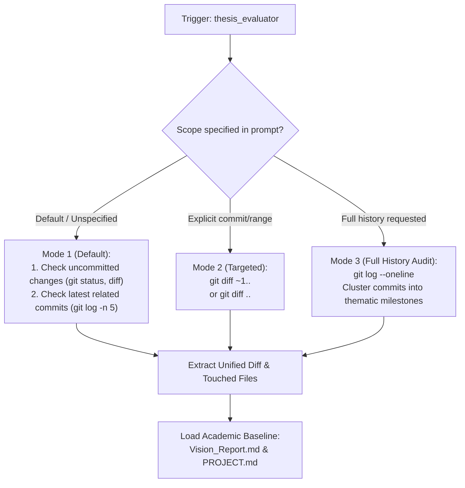
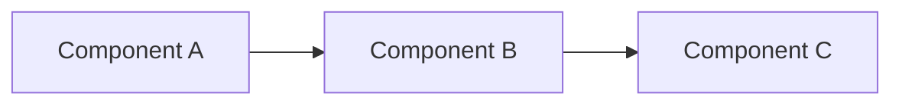

# Master's Thesis Scientific Contribution Evaluator (`@thesis-evaluator`)

## Purpose

This skill audits changes introduced to the recommendation system codebase to determine whether they hold genuine **scientific, theoretical, or empirical value** suitable for presentation in a Master's Thesis paper (*"Explainable Hybrid GraphRAG for Conversational Recommendation"*).

Not every software improvement is an academic contribution. Routine bug fixes, boilerplate setup, and standard library wiring are necessary engineering, but they do not belong in a scientific thesis. This skill applies a strict **10-point academic rubric** to separate scientific advancements from routine implementation, and compiles qualifying work into thesis-ready documentation.

---

## When to Trigger

Activate this skill when:
- A new feature, pipeline, or architecture milestone has been completed.
- You want to evaluate current working changes before or immediately after committing.
- The user asks: *"Does this code have scientific value for my thesis?"* or *"Analyze my changes for thesis documentation"*.
- Retroactive audit: When explicitly requested, audit historical commits to extract thesis contributions from past milestones.

---

## Change Scope Resolution Protocol

The agent resolves what code to evaluate according to the following priority:



### Mode 1: Default (Uncommitted Changes + Recent Related Commits)
1. Run `git status -s` to inspect dirty or staged files.
2. Run `git diff HEAD` to capture uncommitted changes across the working tree.
3. Run `git log -n 5 --oneline` to identify recent commits on the current branch that form part of the same cohesive scope of work.
4. Synthesize the uncommitted diff with the related commit diffs to evaluate the complete unit of work.

### Mode 2: Targeted Scope (Explicit Commit or Range)
- If the user specifies a commit hash: run `git show <commit_hash>` or `git diff <commit_hash>~1..<commit_hash>`.
- If the user specifies a range: run `git diff <start_sha>..<end_sha>`.
- If the user specifies a branch: run `git diff main..<branch>`.

### Mode 3: Full History Audit (Explicitly Requested)
- When the user explicitly requests an audit across the entire repository history (e.g., *"audit whole git history for thesis"* or *"--all-history"*):
  1. Run `git log --reverse --format="%h %ad %s" --date=short` to view the chronological progression.
  2. Group commits into major thematic clusters (e.g., *Foundation KG pipeline*, *Session Schema & Adapters*, *Dialogue Manager*, *Hybrid Graph Search*, *Evaluation Harness*).
  3. Evaluate each cluster sequentially through the 10-point rubric.

---

## Pre-Flight Context Loading

Before evaluating code, load the following academic references:
1. **`production_artifacts/Vision_Report.md`**: Master thesis objectives, core engine logic (Multi-Agent, MemoCRS, Hybrid GraphRAG), rejected approaches, and active evaluation metrics ($NDCG@K$, $Recall@K$, Coherence, Explainability, Groundedness, Recoverability).
2. **`PROJECT.md`** (or current spec): Active architecture contracts, schemas, and milestone definitions.
3. **`thesis/README.md`** (if it exists): Previously documented thesis contributions, ensuring no redundant duplication of existing chapters.

---

## The 10-Point Scientific Evaluation Rubric

Every candidate change must be evaluated against the following 10 academic criteria:

### 1. Algorithmic & Architectural Novelty
- Does this code introduce a new algorithm, architectural pattern, or methodology?
- *Examples*: Custom GraphRAG hybrid retrieval fusing dense vector search with multi-hop Cypher filtering, dynamic preference quantification, multi-agent router-critic verification loop.

### 2. Unexpected or Original Combination
- Is it an unexpected or highly original combination of existing technologies or data?
- *Examples*: Combining structured graph topology with unstructured review chunks in Neo4j; pairing LLM-as-a-judge with deterministic topological graph validation; integrating Pydantic session state with LangGraph persistence.

### 3. Problem Significance in Literature
- Does the change solve a problem currently considered unsolved, inefficient, or overly complex in academic literature?
- *Examples*: Eliminating conversational attribute hallucination; resolving cold-start user profiling without explicit onboarding surveys; handling preference drift without unbounded context window degradation.

### 4. 🚨 Red Flag Check (Anti-Triviality Filter)
- **CRITICAL FILTER**: *Is this just a standard implementation of a well-documented tutorial, library, or design pattern?*
- If the change simply calls a standard library API (e.g., standard Flask route, basic ChromaDB wrapper, off-the-shelf OpenAI API call, standard CSS tweak), it **FAILS** the academic threshold.
- To pass, the code must adapt, extend, or configure the technology to address a domain-specific research challenge.

### 5. State-of-the-Art (SOTA) Gap Alignment
- Does this change directly address a recognized gap or limitation in the current state of the art in Conversational Recommender Systems (CRS) or GraphRAG?
- *Examples*: Bridging the gap between black-box deep recommender models and transparent, verifiable path-based justifications.

### 6. Formal Research Question ($RQ$) Formulability
- Can the underlying problem this code solves be translated into a formal, answerable research question?
- *Format requirement*: Must be expressible as:
  $$RQ_x: \text{"To what extent does [Proposed Technique] improve [Metric] compared to [Baseline] under [Conditions]?"}$$

### 7. Tangible Research Artifact
- Does this change produce a tangible artifact (a reusable framework, formal schema, dataset curation pipeline, or evaluation benchmark) that helps the field understand the problem better?
- *Examples*: A formal session context schema for conversational recommendation; a curated 25-user/25-product Amazon benchmark graph; a modular evaluation harness for CRS.

### 8. Empirical Instrumentation
- Does the code include instrumentation for benchmarking, performance testing, or statistical analysis?
- *Examples*: Latency timers, token counters, LLM-as-a-Judge prompt matrices, structured test tiers (Tiers 1–5), reproducibility logs.

### 9. Measurable Metric Improvements
- Are there measurable improvements in specific metrics?
  - **Ranking / Recommendation Metrics**: $NDCG@K$, $HitRate@K$, $Recall@K$, $MRR$.
  - **Conversation / XAI Metrics**: Groundedness score, Coherence, Recoverability rate, Hallucination penalty.
  - **System / Durability Metrics**: Latency (ms), token overhead, Time-To-Modification (TTM).

### 10. Scientific Reproducibility
- Is the solution designed in a way that allows for reproducible experiments by other researchers?
- *Checklist*: Seeded randomness, deterministic mock fixtures, decoupled datasets, clear CLI entry points (`scripts/`), isolated test commands.

---

## Qualification Decision Logic

Based on the 10-point audit, classify the change into one of three verdicts:

| Verdict | Criteria Profile | Action |
|---|---|---|
| **QUALIFIES: Primary Academic Contribution** | Passes Red Flag Check + Strong Novelty (Criteria 1, 2 or 3) + Clear $RQ$ (Criterion 6) + Empirical Validation (Criteria 8, 9 or 10). | Generate thesis doc `thesis/<N>-doc-<one-two-words>.md` and register in `thesis/README.md`. |
| **QUALIFIES: Methodological Artifact** | Passes Red Flag Check + High-value research artifact (Criterion 7) or specialized evaluation harness (Criteria 8 & 10) enabling thesis experiments. | Generate thesis doc `thesis/<N>-doc-<one-two-words>.md` focusing on experimental methodology. |
| **DOES NOT QUALIFY: Engineering / Maintenance** | Fails Red Flag Check (routine plumbing, tutorial code) OR lacks research formulability (no clear $RQ$ or academic novelty). | **DO NOT generate a thesis file.** Output a concise, honest rejection audit explaining why this is software engineering rather than an academic contribution. |

---

## Thesis Directory & File Naming Convention

When a change qualifies:

1. **Root Directory**: Ensure `thesis/` exists at the workspace root (`/thesis/`).
2. **File Sequence Calculation**:
   - Inspect all existing markdown files in `thesis/` matching:
     `^(\d+)-doc-([a-z0-9-]+)\.md$`
   - Find the highest integer $N$.
   - The new file must be assigned $(N+1)$. If no such files exist, start with `1`.
3. **Naming Pattern**:
   Strictly follow:
   `thesis/<N>-doc-<one-two-words>.md`
   - Immediately following `-doc-` must be **1 or 2 words** describing the scope, slugified with lowercase letters and hyphens.
   - *Valid Examples*:
     - `thesis/1-doc-session-schema.md`
     - `thesis/2-doc-hybrid-retrieval.md`
     - `thesis/3-doc-critic-verification.md`
     - `thesis/4-doc-memocrs-persistence.md`
   - *Invalid Examples*:
     - `thesis/doc-session.md` (missing index)
     - `thesis/1-doc.md` (missing scope words)
     - `thesis/1-doc-session-schema-and-dialogue-manager-and-adapters.md` (too many words; must be 1–2 words)

---

## Thesis Document Template

Each generated file in `thesis/<N>-doc-<one-two-words>.md` must use this structured markdown template:

```markdown
# Thesis Contribution <N>: <Descriptive Scientific Title>

**Document ID**: `<N>-doc-<one-two-words>`  
**Date**: YYYY-MM-DD  
**Status**: Confirmed Master's Thesis Contribution  
**Git Scope**: `<commit_sha or branch or uncommitted>`  
**Relevant Modules**: `src/path/to/module.py`, `tests/path/to/test.py`  

---

## 1. Formal Research Context

### 1.1 Academic Problem Statement
[Describe the fundamental problem in Conversational Recommender Systems or GraphRAG that this work addresses.]

### 1.2 Formal Research Question (RQ)
$$\mathbf{RQ_{<N>}}: \text{"[State the formal, answerable research question clearly and rigorously.]"}$$

### 1.3 Hypotheses
* **$\mathbf{H_1}$ (Alternative Hypothesis)**: [Expected improvement, e.g. integrating explicit session state reduces attribute hallucination by >20% compared to pure zero-shot LLM prompts.]
* **$\mathbf{H_0}$ (Null Hypothesis)**: [No statistically significant difference in performance.]

---

## 2. State-of-the-Art Gap Analysis

### 2.1 Limitations of Current Literature
[Explain what existing published CRS / RAG approaches lack. Cite standard paradigms (e.g. pure collaborative filtering, text-to-Cypher generation, unconstrained LLM chat).]

### 2.2 Red Flag Defense (Novelty Justification)
* **Why this is NOT tutorial/boilerplate code**: [Explain why this implementation required domain-specific design rather than simple library wiring.]
* **Core Scientific Contribution**: [1–2 sentences summarizing the conceptual advance.]

---

## 3. Architecture & Algorithmic Formulation

### 3.1 Architectural Flow


### 3.2 Formal Specifications & Data Models
[Provide mathematical definitions, Cypher patterns, or canonical schema models introduced by this change.]

### 3.3 Key Implemented Classes & Interfaces
* `Module.ClassName`: [Role and contribution]
* `Adapter / Function`: [Data translation or reasoning logic]

---

## 4. Empirical Instrumentation & Reproducibility

### 4.1 Evaluation Metrics
| Metric | Dimension | Target / Expected Impact |
|---|---|---|
| NDCG@K / HitRate@K | Recommendation Quality | [Target improvement] |
| Groundedness Score | Conversation Quality | [Hallucination suppression] |
| Latency / Complexity | System Feasibility | [Evaluation bounds] |

### 4.2 Instrumentation & Benchmarks in Code
[Detail the test harnesses, fixtures, or scripts included in the codebase to evaluate this component.]

### 4.3 Experimental Replication Protocol
Instructions for an independent researcher to replicate the experiment:
```bash
pytest tests/path/to/relevant_test.py -v
python scripts/path/to/eval_script.py
```

---

## 5. Master's Thesis Chapter Mapping

* **Target Thesis Chapter**: Chapter X: [Chapter Name, e.g., Chapter 3: System Architecture & Dialogue State Modeling]
* **Key Claims to Make in Thesis Text**:
  1. [Claim 1 supported by this code]
  2. [Claim 2 supported by this code]
* **Suggested Baseline Comparisons**: [e.g., Ablation without session adapter vs. full hybrid context]
* **Related Academic Citations**: [Key papers in CRS / GraphRAG to cite alongside this work]
```

---

## Master Registry (`thesis/README.md`)

Whenever a new thesis doc is generated, automatically update (or create) `thesis/README.md` to maintain the Master Thesis Contribution Registry:

```markdown
# Master's Thesis Scientific Contribution Registry

> **Thesis Title**: *Explainable Hybrid GraphRAG for Conversational Recommendation*  
> **Repository Baseline**: `production_artifacts/Vision_Report.md`  

## Documented Academic Contributions

| # | Document | Scope | Research Question | Target Chapter | Status |
|---|---|---|---|---|---|
| 1 | [`1-doc-<scope>.md`](./1-doc-<scope>.md) | `<scope>` | $RQ_1$: ... | Chapter 3: ... | ✅ Documented |

## Evaluation Summary
- **Total Thesis Documents**: [Count]
- **Core Research Questions Covered**: [List]
```

---

## Negative Verdict Handling (Rejection Audit)

If changes fail the academic threshold, output a clear, structured rejection audit without writing a file to `thesis/`:

```markdown
### 📋 Thesis Scientific Evaluation: DOES NOT QUALIFY

**Evaluated Scope**: [Commit / Branch / Working Tree]  
**Verdict**: ❌ Software Engineering / Maintenance (Not an Academic Contribution)  

**Rubric Assessment**:
- **Algorithmic Novelty**: [Low / None - Explain]
- **Red Flag Filter**: 🚨 Triggered: Standard implementation of [library/pattern]
- **Research Question Fit**: Cannot be formulated into a formal academic RQ.
- **Academic Value**: Essential for system stability/plumbing, but does not represent a theoretical or empirical contribution for the Master's Thesis.

*No file created in `thesis/` to keep thesis documentation focused on genuine research contributions.*
```
