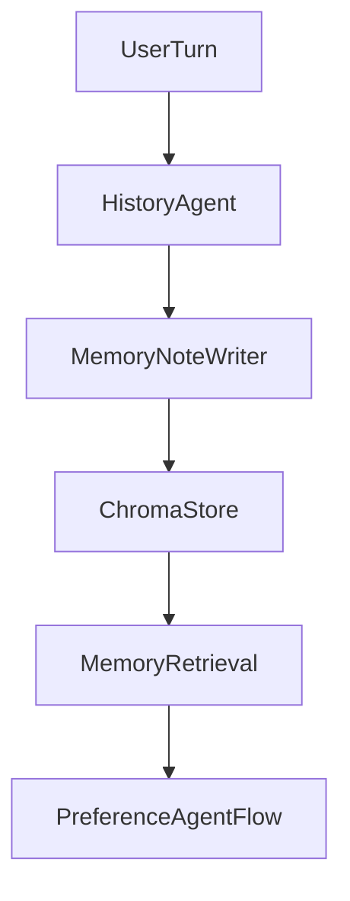

# Agentic Memory (A-MEM) for HistoryAgent

## Goal

Replace the passive history list with an agentic memory subsystem that writes atomic notes, links them semantically, applies PAMU (EMA+SW+prioritization), and retrieves a compact memory context for the current turn.

## Proposed Changes

- **Define memory primitives and PAMU scoring**: Add a small memory domain model (atomic note, links, scores) + PAMU update rules (EMA decay, sliding window capacity, refresh/priority on reuse) in [`/Users/mikolajpaszkowski/recommendation-system/src/conversation/agentic_memory.py`](/Users/mikolajpaszkowski/recommendation-system/src/conversation/agentic_memory.py).
- **Local vector store (Chroma)**: Add a thin adapter for Chroma CRUD + similarity search, scoped per user (namespace/collection) in [`/Users/mikolajpaszkowski/recommendation-system/src/memory/vector_store/chroma_store.py`](/Users/mikolajpaszkowski/recommendation-system/src/memory/vector_store/chroma_store.py).
- **Atomic note writer**: Implement a `MemoryNoteWriter` that uses the existing LLM stack to summarize a turn into an atomic note (entities + facts), in [`/Users/mikolajpaszkowski/recommendation-system/src/memory/note_writer.py`](/Users/mikolajpaszkowski/recommendation-system/src/memory/note_writer.py) with a prompt template near `src/llm_interface`.
- **HistoryAgent upgrade**: Replace `InMemoryHistoryManager` usage with a `HistoryAgent` that:
- records the user/assistant turn,
- generates atomic notes,
- embeds + stores notes in Chroma,
- updates PAMU scores,
- retrieves top-K memories within a token budget for the current query.

File: [`/Users/mikolajpaszkowski/recommendation-system/src/conversation/history_agent.py`](/Users/mikolajpaszkowski/recommendation-system/src/conversation/history_agent.py).

- **Wire into Phase I flow**: Update [`/Users/mikolajpaszkowski/recommendation-system/src/dialog_manager/preference_agent_flow.py`](/Users/mikolajpaszkowski/recommendation-system/src/dialog_manager/preference_agent_flow.py) to request `memory_context` from HistoryAgent and pass it into `PromptConstructor` (as a new optional section), plus expose a hook to record assistant responses after LLM output.
- **Documentation**: Add a concise description of A-MEM/HistoryAgent responsibilities and data flow to [`/Users/mikolajpaszkowski/recommendation-system/src/README.md`](/Users/mikolajpaszkowski/recommendation-system/src/README.md).

## Flow Sketch

## Implementation Todos

- **memory-model**: Add atomic note schema + PAMU scoring rules (EMA, SW, refresh) with clear defaults.
- **vector-store**: Implement Chroma adapter (per-user collection, similarity search, metadata links).