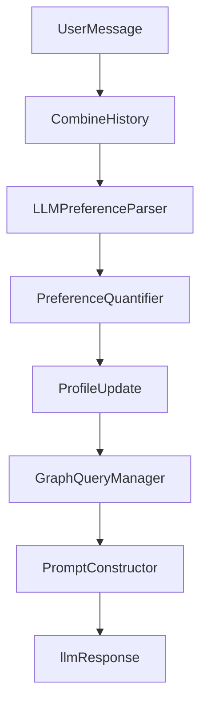

# Graph Retrieval Integration Plan

## Approach

- Add a small graph retrieval layer that uses an LLM tool to produce Cypher, executes it via the existing Neo4j connector, and maps results into the current `retrieved_items` shape used by the prompt constructor.
- Inject this retrieval step in `PreferenceAgentFlow.run` after profile update and before `PromptConstructor.construct_recommendation_prompt`, matching your desired flow.
- Add console logging around Cypher generation, query execution, and mapping output for visibility.

## Proposed Flow

## Files to Add/Change

- Add graph query tool + manager:
- `src/knowledge-graph/graphdb/graph_query_manager.py`
- `src/llm_interface/prompts/graph_cypher_prompt.py`
- Wire into flow:
- `src/dialog_manager/preference_agent_flow.py`
- Optional small helpers/tests:
- `src/knowledge-graph/graphdb/__init__.py`
- `tests/` (if existing) for graph query mapping behavior

## Implementation Todos

- **add-graph-query-tool**: Create a `GraphQueryManager` that accepts preferences/profile/history and uses an LLM tool to emit Cypher, then runs it via `Neo4jConnector` and returns mapped items.
- **wire-flow**: Inject retrieval in `PreferenceAgentFlow.run` before prompt construction and pass `retrieved_items` into `PromptConstructor`.
- **mapping-shape**: Implement mapping of Neo4j records to current `retrieved_items` format (`item['details']` fields) with safe defaults.
- **test-mapping-script**: Create a Python script that runs the mapping against a real query result and prints the mapped items.
