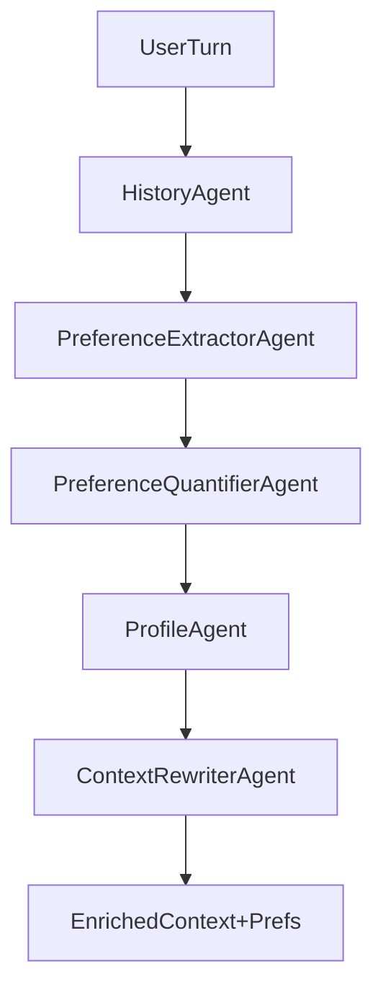

# Phase I Agentic Preference Extraction Plan

## Scope

Implement Phase I (preference extraction + quantification) with a simple, SOLID, agentic workflow built on LangChain, reusing existing folders (`src/conversation`, `src/dialog_manager`, `src/llm`, `src/llm_interface`, `src/user`). No new phase-specific directory.

## Architecture (Agentic Flow)

- Agents:
- **HistoryAgent**: wraps a concrete `HistoryManager` to fetch recent turns.
- **PreferenceExtractorAgent**: LangChain prompt/LLM to extract structured attributes from conversation (implicit + explicit) using `PreferenceParserInterface` impl.
- **PreferenceQuantifierAgent**: simple scorer (rule/LLM-based now, BERT-ready) to assign weights/strength; respects SOLID by isolating scoring strategy.
- **ProfileAgent**: uses `AbstractProfileManager` to persist preferences and interaction snippets.
- **ContextRewriterAgent**: builds enriched prompt (`PromptConstructorInterface` extension) adding weighted prefs to conversation for downstream recommender.
- Orchestrator (in `src/dialog_manager`): wires the above in sequence, returns enriched context/prefs.

## Data flow (Phase I)

## Key design decisions

- **Interfaces first**: extend existing ABCs for history/prompt/parser; keep handlers injectable (SOLID, testable).
- **LangChain chains**: prompt templates + `SimpleLLMHandler` for extraction; quantifier uses separate chain or heuristic class to stay swappable with BERT later.
- **Separation of concerns**: parsing, scoring, storage, and prompt construction live in their own classes; orchestrator only coordinates.
- **Minimal, readable prompts**: concise system/human templates; structured JSON output for preferences.

## File-level plan

- `src/conversation/`: add concrete `InMemoryHistoryManager` (or light stub) implementing `AbstractHistoryManager`.
