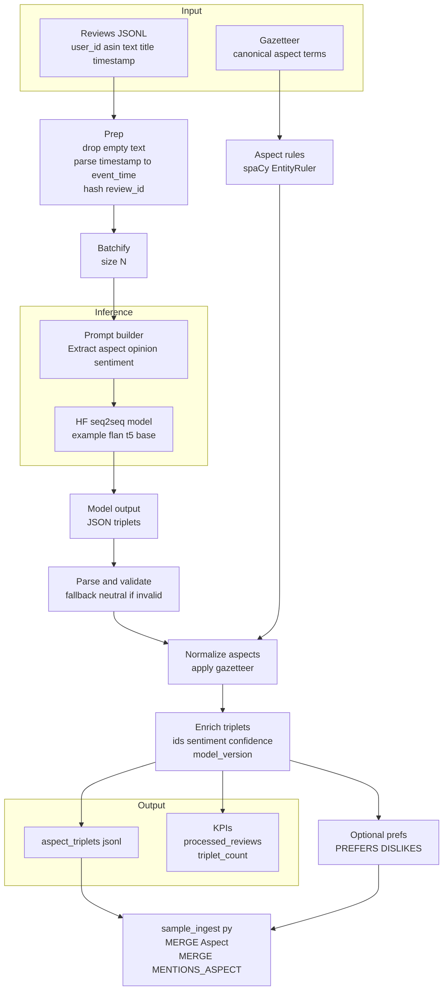

```mermaid
flowchart TD

%% Inputs
subgraph Input
R[Reviews JSONL\nuser_id asin text title timestamp]
GZ[Gazetteer\ncanonical aspect terms]
end

%% Prep
R --> PREP[Prep\ndrop empty text\nparse timestamp to event_time\nhash review_id]
PREP --> BATCH[Batchify\nsize N]
GZ --> CANON_RULES[Aspect rules\nspaCy EntityRuler]

%% Inference
subgraph Inference
P[Prompt builder\nExtract aspect opinion sentiment]
M[HF seq2seq model\nexample flan t5 base]
end

BATCH --> P --> M
M --> RAW[Model output\nJSON triplets]

%% Postprocess
RAW --> PARSE[Parse and validate\nfallback neutral if invalid]
PARSE --> NORM[Normalize aspects\napply gazetteer]
CANON_RULES --> NORM
NORM --> ENRICH[Enrich triplets\nids sentiment confidence\nmodel_version]

%% Outputs
subgraph Output
OUT[aspect_triplets jsonl]
KPI[KPIs\nprocessed_reviews\ntriplet_count]
end

ENRICH --> OUT
ENRICH --> KPI

%% Hand-off
OUT --> INGEST[sample_ingest py\nMERGE Aspect\nMERGE MENTIONS_ASPECT]
ENRICH --> PREF[Optional prefs\nPREFERS DISLIKES]
PREF --> INGEST

```
