# Full System Conversation Flow

> Shows the end-to-end flow of a user interaction: from the Chainlit UI through intent classification, memory loading, all LLM invocations, Knowledge Graph queries, and final response delivery.

```mermaid
flowchart TD
    %% ─── Styling ───────────────────────────────────────────────
    classDef llm        fill:#6c3eb8,color:#fff,stroke:#4a2a8a,stroke-width:2px
    classDef neo4j      fill:#0d7377,color:#fff,stroke:#085a5d,stroke-width:2px
    classDef memory     fill:#d4782a,color:#fff,stroke:#a35a1e,stroke-width:2px
    classDef agent      fill:#1a6b3c,color:#fff,stroke:#124d2b,stroke-width:2px
    classDef ui         fill:#1f5fa6,color:#fff,stroke:#174580,stroke-width:2px
    classDef decision   fill:#5c5c5c,color:#fff,stroke:#3a3a3a,stroke-width:2px

    %% ─── UI ────────────────────────────────────────────────────
    USER(["👤 User"]):::ui
    CHAINLIT["🖥️ Chainlit UI\n(src/ui/app.py)"]:::ui

    %% ─── Orchestrator ──────────────────────────────────────────
    ORCH["🧠 AgentOrchestrator\n(src/agents/orchestrator.py)\n\nrun(user_id, user_message)"]:::agent

    %% ─── Memory Loading ────────────────────────────────────────
    HIST_LOAD["📖 HistoryManager.get_history()\n(src/conversation/history_manager.py)\n⚠️ InMemory — process-bound"]:::memory
    PROF_LOAD["👤 ProfileTool.get_profile()\n(src/tools/profile_tool.py)\n⚠️ InMemory — no persistence"]:::memory

    %% ─── State ─────────────────────────────────────────────────
    STATE["📦 ConversationState\n(src/agents/state.py)\n─────────────────────\nmessages: List[BaseMessage]\nactive_filters: dict\nuser_profile: dict\nnext_step: str"]:::agent

    %% ─── LLM 1: Router ─────────────────────────────────────────
    LLM_ROUTER["🤖 LLM Call 1 — Intent Router\n(SimpleLLMHandler via router_prompt.py)\n─────────────────────\nInput: history + profile + active_filters\n         + user_message\nOutput: JSON action decision"]:::llm
    ROUTER_DECISION{{"⚙️ Action Decision\nSEARCH / CLARIFY /\nUPDATE_PROFILE / ANSWER"}}:::decision

    %% ─── SEARCH Branch ─────────────────────────────────────────
    LLM_SEARCH_PARAMS["🤖 LLM Call 2 — Search Param Generator\n(SEARCH_GENERATION_PROMPT)\n─────────────────────\nInput: user_message + history\n         + active_filters\nOutput: semantic_query + structured_filters"]:::llm
    FILTER_MERGE["🔀 Merge Filters\nUpdate active_filters\nwith LLM-returned deltas"]:::agent
    GRAPH_TOOL["🔍 GraphSearchTool.search()\n(src/tools/graph_search_tool.py)\nStrategy: HYBRID / VECTOR / FILTER"]:::neo4j
    ATTR_FETCH["📋 GraphSearchTool\n.fetch_product_attributes()\nFetches Attributes + Reviews\nfrom Neo4j for each candidate"]:::neo4j
    CRITIC["⚖️ CriticAgent.evaluate_candidates()\n(src/agents/critic_agent.py)\nAsync parallel LLM scoring\nper candidate product"]:::agent
    LLM_CRITIC["🤖 LLM Call 3 — Critic (×N parallel)\nInput: user_persona + product features\n         + unstructured reviews\nOutput: fit_score + is_recommended"]:::llm
    RERANK["🏆 Rerank & Filter\nSort by fit_score\nDrop is_recommended=false\nReturn top 3"]:::agent
    PROMPT_BUILD["📝 PromptConstructor\n.construct_recommendation_prompt()\n(src/llm_interface/prompt_constructor.py)\nBuilds structured context for generation"]:::agent
    LLM_FINAL["🤖 LLM Call 4 — Response Generator\n(SimpleLLMHandler.query())\nInput: user_query + profile + top-3 items\nOutput: Natural language recommendation"]:::llm

    %% ─── CLARIFY Branch ────────────────────────────────────────
    LLM_CLARIFY["🤖 LLM Call — Clarifier\n⚠️ Hardcoded generic prompt\n(GAP-012: no context awareness)\nOutput: Clarification question"]:::llm

    %% ─── UPDATE_PROFILE Branch ─────────────────────────────────
    PROFILE_UPDATE["👤 ProfileTool\n.update_preferences_from_conversation()\nExtract + persist preference signals\n⚠️ InMemory — not persisted"]:::memory
    LLM_PREF["🤖 LLM Call — Preference Parser\n(LLMPreferenceParser)\nExtracts structured preferences\nfrom natural language"]:::llm

    %% ─── ANSWER Branch ─────────────────────────────────────────
    LLM_CHIT["🤖 LLM Call — Direct Answer\nFallback chit-chat response"]:::llm

    %% ─── History Save ───────────────────────────────────────────
    HIST_SAVE["💾 HistoryManager.add_turn()\nSave (user_message, agent_answer)\n⚠️ InMemory — lost on restart"]:::memory

    %% ─── Response ───────────────────────────────────────────────
    RESPONSE["💬 Response\nPassed back to Chainlit UI"]:::ui

    %% ─── Neo4j ──────────────────────────────────────────────────
    NEO4J[("🗄️ Neo4j Knowledge Graph\n─────────────────────────────\n:Item :Brand :Category\n:Attribute :Review :PriceRange\n+ Vector Indexes\n(product / brand / category /\nattribute embeddings)")]:::neo4j

    %% ─── Flow ───────────────────────────────────────────────────
    USER --> CHAINLIT --> ORCH
    ORCH --> HIST_LOAD & PROF_LOAD
    HIST_LOAD & PROF_LOAD --> STATE
    STATE --> LLM_ROUTER --> ROUTER_DECISION

    ROUTER_DECISION -- "SEARCH" --> LLM_SEARCH_PARAMS
    LLM_SEARCH_PARAMS --> FILTER_MERGE --> GRAPH_TOOL
    GRAPH_TOOL <--> NEO4J
    GRAPH_TOOL --> ATTR_FETCH
    ATTR_FETCH <--> NEO4J
    ATTR_FETCH --> CRITIC
    CRITIC --> LLM_CRITIC
    LLM_CRITIC --> RERANK --> PROMPT_BUILD --> LLM_FINAL

    ROUTER_DECISION -- "CLARIFY" --> LLM_CLARIFY
    ROUTER_DECISION -- "UPDATE_PROFILE" --> LLM_PREF --> PROFILE_UPDATE
    ROUTER_DECISION -- "ANSWER" --> LLM_CHIT

    LLM_FINAL & LLM_CLARIFY & PROFILE_UPDATE & LLM_CHIT --> HIST_SAVE
    HIST_SAVE --> RESPONSE --> CHAINLIT --> USER
```

