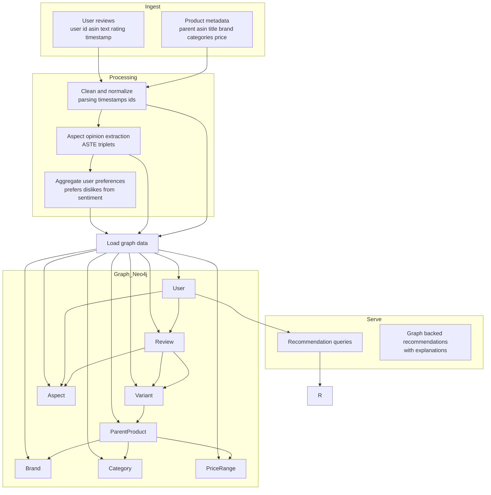

```mermaid
flowchart TD

subgraph Ingest
  METADATA[Product metadata\nparent asin title brand categories price]
  REVIEWS[User reviews\nuser id asin text rating timestamp]
end

subgraph Processing
  CLEAN[Clean and normalize\nparsing timestamps ids]
  ASPECTS[Aspect opinion extraction\nASTE triplets]
  AGG_PREFS[Aggregate user preferences\nprefers dislikes from sentiment]
end

subgraph Graph_Neo4j
  USER[User]
  REVIEW[Review]
  VAR[Variant]
  PARENT[ParentProduct]
  ASPECT[Aspect]
  BRAND[Brand]
  CAT[Category]
  PRICE[PriceRange]

  USER --> REVIEW
  REVIEW --> VAR
  VAR --> PARENT
  REVIEW --> VAR
  PARENT --> BRAND
  PARENT --> CAT
  PARENT --> PRICE
  REVIEW --> ASPECT
  USER --> ASPECT
end

subgraph Serve
  QUERY[Recommendation queries]
  RECS[Graph backed recommendations\nwith explanations]
end

METADATA --> CLEAN
REVIEWS --> CLEAN
CLEAN --> GRAPHLOAD[Load graph data]
ASPECTS --> GRAPHLOAD
AGG_PREFS --> GRAPHLOAD

CLEAN --> ASPECTS
ASPECTS --> AGG_PREFS

GRAPHLOAD --> USER
GRAPHLOAD --> REVIEW
GRAPHLOAD --> VAR
GRAPHLOAD --> PARENT
GRAPHLOAD --> ASPECT
GRAPHLOAD --> BRAND
GRAPHLOAD --> CAT
GRAPHLOAD --> PRICE

USER --> QUERY
QUERY --> R

```
