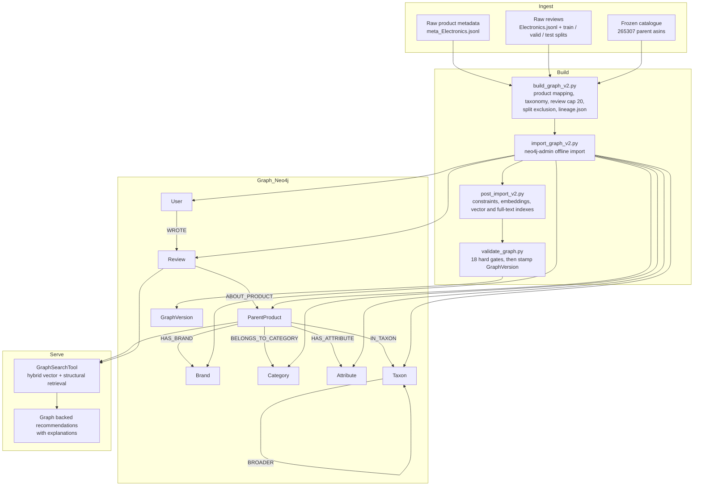

```mermaid
flowchart TD
%% Graph v2 build and schema, live since 2026-10-20 (Vision 2026-10-19-018; runbook in scripts/graph_ingestion/README.md).
%% Redrawn 2026-10-20: the ASTE / aspect-preference layer and the Variant / PriceRange nodes of the v1 design are not part of v2.

subgraph Ingest
  METADATA[Raw product metadata\nmeta_Electronics.jsonl]
  REVIEWS[Raw reviews\nElectronics.jsonl + train / valid / test splits]
  CATALOGUE[Frozen catalogue\n265307 parent asins]
end

subgraph Build
  TRANSFORM[build_graph_v2.py\nproduct mapping, taxonomy, review cap 20,\nsplit exclusion, lineage.json]
  IMPORT[import_graph_v2.py\nneo4j-admin offline import]
  POST[post_import_v2.py\nconstraints, embeddings, vector and full-text indexes]
  VALIDATE[validate_graph.py\n18 hard gates, then stamp GraphVersion]
end

subgraph Graph_Neo4j
  USER[User]
  REVIEW[Review]
  PARENT[ParentProduct]
  BRAND[Brand]
  CAT[Category]
  ATTR[Attribute]
  TAXON[Taxon]
  GVER[GraphVersion]

  USER -->|WROTE| REVIEW
  REVIEW -->|ABOUT_PRODUCT| PARENT
  PARENT -->|HAS_BRAND| BRAND
  PARENT -->|BELONGS_TO_CATEGORY| CAT
  PARENT -->|HAS_ATTRIBUTE| ATTR
  PARENT -->|IN_TAXON| TAXON
  TAXON -->|BROADER| TAXON
end

subgraph Serve
  QUERY[GraphSearchTool\nhybrid vector + structural retrieval]
  RECS[Graph backed recommendations\nwith explanations]
end

METADATA --> TRANSFORM
REVIEWS --> TRANSFORM
CATALOGUE --> TRANSFORM
TRANSFORM --> IMPORT
IMPORT --> POST
POST --> VALIDATE
VALIDATE --> GVER

IMPORT --> USER
IMPORT --> REVIEW
IMPORT --> PARENT
IMPORT --> BRAND
IMPORT --> CAT
IMPORT --> ATTR
IMPORT --> TAXON

PARENT --> QUERY
REVIEW --> QUERY
QUERY --> RECS
```
