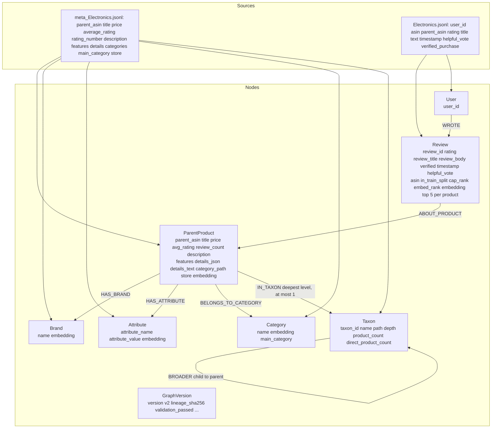

```mermaid
flowchart TD
%% Graph v2 schema, live since 2026-10-20 (Vision 2026-10-19-018; Technical_Specification_Graph_Rebuild.md section 5.1).
%% Dropped from v1: Variant, Product, PriceRange, Aspect, CoPurchaseSet and the edges RATED, REVIEWS, SUBCATEGORY_OF,
%% IN_PRICE_RANGE, IS_VARIANT_OF. The July 2026 design-time schema is in docs/kg_pipeline/schema.md, Part 2.

subgraph Sources
  M["meta_Electronics.jsonl: parent_asin title price average_rating rating_number description features details categories main_category store"]
  R["Electronics.jsonl: user_id asin parent_asin rating title text timestamp helpful_vote verified_purchase"]
end

subgraph Nodes
  PP["ParentProduct<br/>parent_asin title price avg_rating review_count description<br/>features details_json details_text category_path store embedding"]
  REV["Review<br/>review_id rating review_title review_body verified timestamp helpful_vote<br/>asin in_train_split cap_rank embed_rank embedding top 5 per product"]
  U["User<br/>user_id"]
  B["Brand<br/>name embedding"]
  CAT["Category<br/>name embedding main_category"]
  ATTR["Attribute<br/>attribute_name attribute_value embedding"]
  TX["Taxon<br/>taxon_id name path depth product_count direct_product_count"]
  GV["GraphVersion<br/>version v2 lineage_sha256 validation_passed ..."]
end

%% Source routing
M --> PP
M --> B
M --> ATTR
M --> CAT
M --> TX
R --> REV
R --> U

%% Product side
PP -->|"HAS_BRAND"| B
PP -->|"HAS_ATTRIBUTE"| ATTR
PP -->|"BELONGS_TO_CATEGORY"| CAT
PP -->|"IN_TAXON deepest level, at most 1"| TX
TX -->|"BROADER child to parent"| TX

%% Review side (ABOUT_PRODUCT always targets the parent; the child SKU is Review.asin)
U -->|"WROTE"| REV
REV -->|"ABOUT_PRODUCT"| PP

%% GraphVersion is a standalone provenance node with no relationships.
```
