# Recommendation Process Deep-Dive

> Zooms into the SEARCH execution path only. Shows how a user's natural language request becomes a ranked list of explainable product recommendations — including hybrid retrieval strategy selection, CriticAgent parallel scoring, and the planned Phase 3 KECR reasoning path injection.

```mermaid
flowchart TD
    %% ─── Styling ───────────────────────────────────────────────
    classDef llm        fill:#6c3eb8,color:#fff,stroke:#4a2a8a,stroke-width:2px
    classDef neo4j      fill:#0d7377,color:#fff,stroke:#085a5d,stroke-width:2px
    classDef embed      fill:#1a5276,color:#fff,stroke:#154360,stroke-width:2px
    classDef critic     fill:#7b2d00,color:#fff,stroke:#5a2000,stroke-width:2px
    classDef phase3     fill:#4a235a,color:#fff,stroke:#321540,stroke-width:2px,stroke-dasharray:6 3
    classDef output     fill:#1a6b3c,color:#fff,stroke:#124d2b,stroke-width:2px
    classDef decision   fill:#5c5c5c,color:#fff,stroke:#3a3a3a,stroke-width:2px
    classDef input      fill:#1f5fa6,color:#fff,stroke:#174580,stroke-width:2px

    %% ─── Input ──────────────────────────────────────────────────
    INPUT["📥 User Message + Active Filters\nex: 'gaming laptop under 2000 PLN, prefer Asus'\nactive_filters: {price_max: 2000}"]:::input

    %% ─── Step 1: LLM Search Param Generation ───────────────────
    LLM1["🤖 LLM — Search Parameter Generator\n────────────────────────────────────\nAnalyzes: message + history + active_filters\nIdentifies: filter deltas (add / modify / reset)\nOutputs JSON:\n{\n  semantic_query: 'high-perf gaming laptop\n                   lightweight Asus',\n  structured_filters: {\n    brand: 'Asus',\n    price_max: 2000,\n    category: 'laptop'\n  }\n}"]:::llm

    %% ─── Step 2: Filter Normalization ──────────────────────────
    RESOLVER["🔧 ResolverService — Filter Normalization\n(src/knowledge_graph/graphdb/resolver_service.py)\n──────────────────────────────────────────────\nBrand 'Asus' → vector search → KG Brand node\nConfidence threshold: ≥ 0.60\nCategory 'laptop' → vector search → KG Category\nConfidence threshold: ≥ 0.75\nLow confidence → drop filter (vector handles it)"]:::embed
    EMBEDDER1["🔢 EmbeddingService.embed_query()\n(all-MiniLM-L6-v2)\nEmbed brand/category string for\nANN resolution in Neo4j"]:::embed

    %% ─── Step 3: Strategy Selection ────────────────────────────
    STRATEGY{{"⚙️ Search Strategy Selection\nsemantic_query present? → Y/N\nfilters present? → Y/N"}}:::decision

    STRAT_H["HYBRID\n(Most Common)\nsemantic_query AND filters"]:::decision
    STRAT_V["VECTOR ONLY\nsemantic_query,\nno meaningful filters"]:::decision
    STRAT_F["FILTER ONLY\nno semantic_query,\nfilters only"]:::decision

    %% ─── Step 4: Neo4j Vector Search ───────────────────────────
    EMBED_QUERY["🔢 EmbeddingService.embed_query()\nEmbed semantic_query into\n384-dim dense vector"]:::embed

    CYPHER_H["🗄️ Neo4j — Hybrid Cypher\n─────────────────────────────────\nCALL db.index.vector.queryNodes(\n  'product_embedding_index', k×30, $vector)\nYIELD node, score\nWHERE node.price <= $price_max\n  AND EXISTS { MATCH (node)-[:HAS_BRAND]\n               →(b:Brand {name: 'Asus'}) }\n  AND EXISTS { MATCH (node)-[:BELONGS_TO]\n               →(c:Category) WHERE\n               toLower(c.name) CONTAINS 'laptop'}\nRETURN node, score\nORDER BY score DESC LIMIT k"]:::neo4j

    CYPHER_V["🗄️ Neo4j — Vector Cypher\n─────────────────────────\nCALL db.index.vector.queryNodes(\n  'product_embedding_index', k, $vector)\nYIELD node, score\nRETURN node, score\nORDER BY score DESC LIMIT k"]:::neo4j

    CYPHER_F["🗄️ Neo4j — Filter Cypher\n─────────────────────────────\nMATCH (node:ParentProduct)\nWHERE {Cypher WHERE clauses}\nRETURN node, 1.0 as score LIMIT k"]:::neo4j

    CANDIDATES["📦 Candidate Items (top-k)\n─────────────────────────────\n[{title, price, brand, category,\n  score, asin, id}, ...]"]:::output

    %% ─── Step 5: Attribute Fetch ────────────────────────────────
    ATTR["🗄️ Neo4j — Attribute + Review Fetch\n─────────────────────────────────────\nMATCH (p:ParentProduct)-[:HAS_ATTRIBUTE]→(a)\nWHERE p.parent_asin IN $asins\n+\nMATCH (r:Review)-[:ABOUT_PRODUCT]→(p)\nWHERE p.parent_asin IN $asins\nORDER BY r.helpful_votes DESC LIMIT 20\n─────────────────────────────────────\nReturns: unstructured context per ASIN"]:::neo4j

    %% ─── Step 6: CriticAgent ────────────────────────────────────
    CRITIC_FANOUT["⚖️ CriticAgent.evaluate_candidates()\nasync parallel fan-out\none LLM call per candidate"]:::critic
    LLM_C1["🤖 LLM — Critic\nProduct 1\n──────────────\nfit_score: 87\nis_recommended: true\nreasoning: '...'"]:::llm
    LLM_C2["🤖 LLM — Critic\nProduct 2\n──────────────\nfit_score: 62\nis_recommended: true\nreasoning: '...'"]:::llm
    LLM_C3["🤖 LLM — Critic\nProduct N\n──────────────\nfit_score: 34\nis_recommended: false\nreasoning: '...'"]:::llm

    RERANK["🏆 Rerank & Filter\n──────────────────────────────\n1. Drop is_recommended=false\n2. Sort by semantic_score DESC\n3. Take top 3"]:::output

    %% ─── Step 7: KECR (Phase 3 — Planned) ─────────────────────
    KECR["🔬 KECR — Reasoning Path Extraction\n(Phase 3 — NOT YET IMPLEMENTED)\n────────────────────────────────────\nFor each top-3 item:\nFind shortest graph paths:\n  User preferences → Item\n  via (:Category), (:Brand),\n      (:Attribute), (:Review)\nReturn explicit path strings:\n  'Prefers gaming → Category:Gaming\n   → Attribute:GPU=RTX4070\n   → Item:ASUS ROG Zephyrus'"]:::phase3

    %% ─── Step 8: Prompt Construction ───────────────────────────
    PROMPT["📝 PromptConstructor\n.construct_recommendation_prompt()\n──────────────────────────────────\nContext window assembled:\n• user_query\n• user_profile (preferences)\n• active_filters (hard constraints)\n• top-3 items (title, price, brand,\n  category, critic score, reasoning)\n• [Phase 3] graph reasoning paths"]:::output

    %% ─── Step 9: Final LLM Generation ──────────────────────────
    LLM_FINAL["🤖 LLM — Response Generator\n(GPT-4o via SimpleLLMHandler)\n──────────────────────────────────────────\nInstruction: 'Explain WHY each product\n fits the user using ONLY the provided\n graph evidence. Do not invent features.'\n──────────────────────────────────────────\nOutput: Natural language recommendation\nwith fact-grounded justification per item"]:::llm

    RESPONSE["💬 Final Recommendation\n────────────────────────────────────\n'Here are 3 laptops for you:\n1. ASUS ROG Zephyrus G14 — fits your\n   gaming need (RTX 4070, 2000 PLN)\n   and your preference for ASUS brand...\n2. ...'"]:::output

    %% ─── Flows ──────────────────────────────────────────────────
    INPUT --> LLM1
    LLM1 --> RESOLVER
    RESOLVER --> EMBEDDER1
    EMBEDDER1 -.->|"brand/category\nvector lookup"| RESOLVER
    RESOLVER --> STRATEGY

    STRATEGY -->|"query + filters"| STRAT_H
    STRATEGY -->|"query only"| STRAT_V
    STRATEGY -->|"filters only"| STRAT_F

    STRAT_H --> EMBED_QUERY --> CYPHER_H
    STRAT_V --> EMBED_QUERY --> CYPHER_V
    STRAT_F --> CYPHER_F

    CYPHER_H & CYPHER_V & CYPHER_F --> CANDIDATES
    CANDIDATES --> ATTR
    ATTR --> CRITIC_FANOUT
    CRITIC_FANOUT --> LLM_C1 & LLM_C2 & LLM_C3
    LLM_C1 & LLM_C2 & LLM_C3 --> RERANK
    RERANK -->|"Phase 3"| KECR
    RERANK -->|"Phase 2 (current)"| PROMPT
    KECR -->|"inject graph paths"| PROMPT
    PROMPT --> LLM_FINAL --> RESPONSE
```

