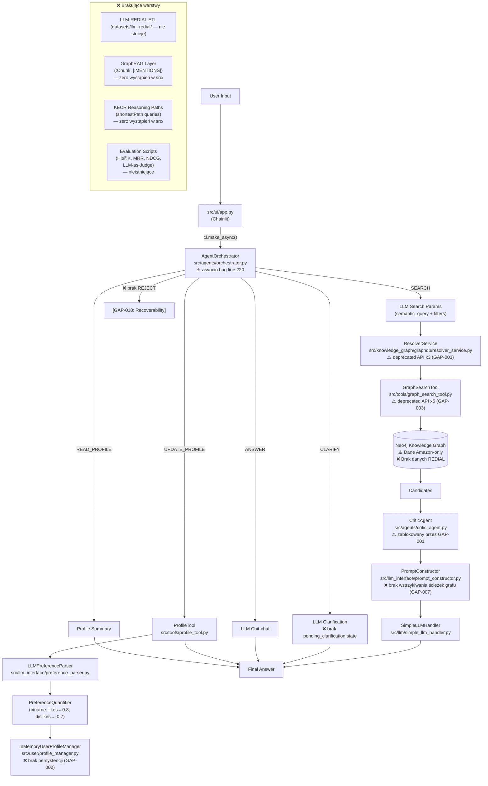
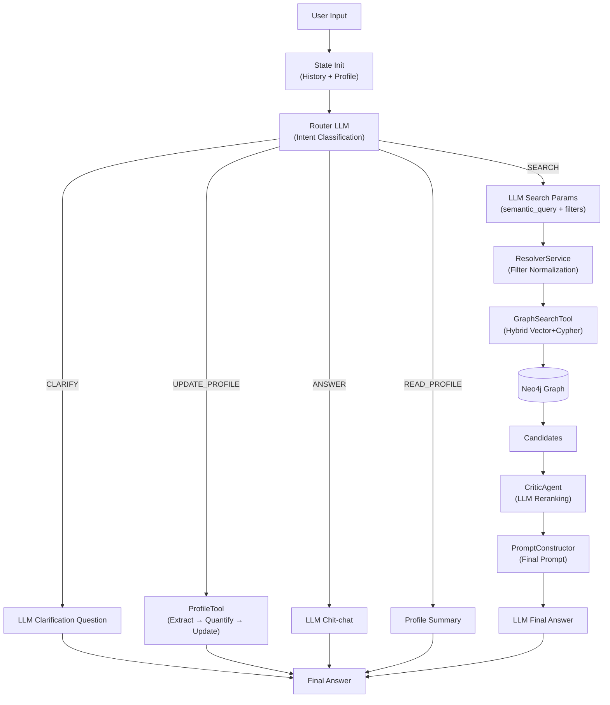
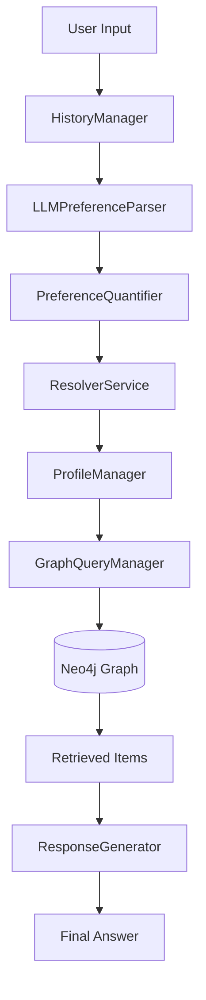

# Raport Stanu Projektu: System Rekomendacji 2.0 (Knowledge Graph)

> **Konwencja**: Każda sekcja datowana opisuje stan systemu na dany dzień.
> Najnowsze zmiany są na górze. Starsze wpisy poniżej stanowią historię projektu.

---

## 📅 2026-07-08

### Changelog (względem stanu z 2026-06-21)

> **Kontekst**: Niniejszy wpis dokumentuje wyniki sesji audytu `/audit-state` przeprowadzonej w dniach 2026-07-05 do 2026-07-08. Audyt objął trzy fazy: ocenę aktualności Wizji (@pm-research), inspekcję kodu (@inspector) oraz walidację luk (@pm-specs). Zakończył się decyzją o **strategicznym resecie wszystkich faz** ze względu na krytyczne odkrycie dotyczące błędnej podstawy danych.

---

#### 🔴 Nowe odkrycia (nieudokumentowane w poprzednim raporcie)

Inspekcja kodu przeprowadzona przez @inspector w dniu 2026-07-05 potwierdziła istnienie i poprawne okablowanie następujących komponentów, których obecność nie była wcześniej zweryfikowana względem planu implementacji:

1. **`AgentOrchestrator` (`src/agents/orchestrator.py`)**
   - Główny entry point systemu MAS z klasyfikacją intencji przez LLM.
   - Obsługuje 5 akcji: `SEARCH`, `CLARIFY`, `UPDATE_PROFILE`, `ANSWER`, `READ_PROFILE`.
   - Routuje żądania proceduralnym kodem Python (nie LangGraph StateGraph — patrz sekcja korekty).
   - Wdrożony jako `ConversationState` TypedDict w `src/agents/state.py`.

2. **`CriticAgent` (`src/agents/critic_agent.py`)**
   - 123-liniowy agent asynchroniczny do rerankingu kandydatów (Context-Aware Reranking).
   - Używa `asyncio.gather()` do równoległej ewaluacji produktów przez LLM.
   - Zwraca `fit_score` (0–100), `reasoning`, `is_recommended` per produkt.
   - Podłączony do orkiestratora w liniach 213–231.

3. **`GraphSearchTool` (`src/tools/graph_search_tool.py`)**
   - 350-liniowa implementacja hybrydowego wyszukiwania: HYBRID (Vector ANN + Cypher WHERE), VECTOR_ONLY, FILTER_ONLY.
   - Normalizacja filtrów przez `ResolverService` (brand, category, attribute).
   - Metoda `fetch_product_attributes()` pobiera węzły `HAS_ATTRIBUTE` i `Review` dla kontekstu krytyka.
   - Aktywnie używa 4 indeksów wektorowych Neo4j: `product_embedding_index`, `brand_embedding_index`, `category_embedding_index`, `attribute_embedding_index`.

4. **`ProfileTool` (`src/tools/profile_tool.py`)**
   - Wrapper spinający `ProfileManager` + `LLMPreferenceParser` + `PreferenceQuantifier`.
   - Metoda `update_preferences_from_conversation()` — pełny pipeline: Extract → Normalize → Quantify → Update.

5. **`EmbeddingService` (`src/knowledge_graph/graphdb/embedding_service.py`)**
   - Oparty na `sentence-transformers` (`all-MiniLM-L6-v2`).
   - Używany przez `ResolverService`, `GraphSearchTool`, `BackfillService`.

6. **`SimpleLLMHandler` (`src/llm/simple_llm_handler.py`)**
   - Zunifikowany handler LLM z obsługą synchroniczną (`query()`) i asynchroniczną (`aquery()`).
   - Implementuje `LLMHandlerInterface` z `src/llm/abstract_llm_handler.py`.

7. **`ConversationState` TypedDict (`src/agents/state.py`)**
   - Wspólny schemat stanu orkiestratora: `messages`, `next_step`, `active_filters`, `user_profile`.

8. **UI Chainlit (`src/ui/app.py`)**
   - Interfejs czatowy z funkcjami `start_chat()` i `main()`.
   - Wrappuje `AgentOrchestrator` przez `cl.make_async()`.

---

#### 🟡 Korekty opisu istniejących komponentów

1. **LangGraph — nieużywany mimo deklaracji w planie implementacji**
   - Plan implementacji (Faza 2) wskazywał LangGraph jako framework orkiestracji.
   - Inspekcja wykazała: **zero importów LangGraph w całym katalogu `src/`**. Nie ma go też w `requirements.txt`.
   - `AgentOrchestrator` implementuje routing wyłącznie proceduralnym kodem Python (`if/elif`), nie grafem `StateGraph`.
   - Decyzja PM: zaakceptowane odchylenie — proceduralne podejście dostarcza równoważną funkcjonalność. Zalecane: wprowadzić LangGraph przez `SqliteSaver` jako implementację GAP-002 (persystencja MemoCRS), co nada mu uzasadnienie funkcjonalne.

2. **MemoCRS — wyłącznie in-memory, brak persystencji między sesjami**
   - `InMemoryUserProfileManager` (`src/user/profile_manager.py`) przechowuje dane w słowniku `self.profiles` — tracone przy każdym restarcie procesu.
   - `InMemoryHistoryManager` (`src/conversation/history_manager.py`) analogicznie — max 20 tur, in-memory.
   - Brak jakiegokolwiek backendu persystencji: brak Redis, SQLite, bazy danych.
   - Brak semantycznego wyszukiwania historycznych preferencji między sesjami.
   - PM zdegradowała ten element do statusu **🔴 Krytyczny** (wcześniej: 🟠 Wysoki) — MemoCRS jest jednym z czterech filarów architektury zgodnie z Vision Report sekcja 3.

3. **`PreferenceQuantifier` — wagi binarne, nie gradientowe**
   - Stosuje **stałe wagi binarne**: `likes → 0.8`, `dislikes → -0.7`.
   - Brak mapowania słów kluczowych na intensywność sentymentu.
   - Metoda abstrakcyjna `quantify()` rzuca `NotImplementedError` (zgodnie z projektem); konkretna klasa `HeuristicQuantificationStrategy` działa poprawnie.

4. **`ResponseGenerator` (`src/llm_interface/response_generator.py`) — kod martwy**
   - 70-liniowa klasa zaimplementowana, ale nigdzie niezaimportowana w aktywnym flow.
   - Aktywny flow używa `PromptConstructor` + `SimpleLLMHandler.query()` bezpośrednio.
   - Ukryta rozbieżność konfiguracji: `ResponseGenerator.__init__()` tworzy własną instancję `ChatOpenAI` niezależnie od wstrzykniętego `llm_handler`.

5. **`PreferenceAgentFlow` (`src/dialog_manager/preference_agent_flow.py`) — legacy, zastąpiony**
   - Implementuje pipeline Fazy 0 — nadal funkcjonalny, ale nie jest aktywnym entry pointem.
   - Korzysta z dynamicznej manipulacji ścieżkami przez `importlib`.

---

#### ⚠️ Krytyczne błędy techniczne (odkryte podczas audytu)

1. **`asyncio.get_event_loop()` w `orchestrator.py:220` (GAP-001 — 🔴 Krytyczny)**
   - `run()` jest metodą synchroniczną. Wywołuje `asyncio.get_event_loop().run_until_complete()` by uruchomić async `CriticAgent.evaluate_candidates()`.
   - W kontekście Chainlit (`cl.make_async()` wrapper w `src/ui/app.py`) — Chainlit już prowadzi pętlę zdarzeń asyncio. Wywołanie `run_until_complete()` w działającej pętli rzuca `RuntimeError: This event loop is already running`.
   - **System produkcyjnie nie działa** za każdym razem gdy flow dochodzi do krytyka.

2. **Deprecated API Neo4j w `graph_search_tool.py` i `resolver_service.py` (GAP-003 — 🟠 Wysoki)**
   - 5 wystąpień `CALL db.index.vector.queryNodes()` w `src/tools/graph_search_tool.py` (linie 109, 139).
   - 3 wystąpienia w `src/knowledge_graph/graphdb/resolver_service.py` (linie 34, 67, 101).
   - Metoda `db.index.vector.createNodeIndex()` w `create_vector_indexes.cypher` — deprecated.
   - Procedura `db.index.vector.queryNodes()` zdeprecjonowana w Neo4j 2026.04 — przy każdym upgrade Neo4j przestanie działać.
   - Wymagana migracja do Cypher 25 `VECTOR SEARCH` / `CREATE VECTOR INDEX` DDL.

3. **`#TODO TEMPORARY DISABLED` w `neo4j_connector.py:62` (S-001 — 🟠 Wysoki)**
   - Walidacja konfiguracji wyłączona — brakujące zmienne środowiskowe nie są zgłaszane.

4. **`openai>=0.27.0` w `requirements.txt` — latentny konflikt zależności (AI-002 — 🟠 Wysokie ryzyko)**
   - `langchain-openai>=0.3.x` wymaga API OpenAI v1.x. Jeśli pip zainstaluje `openai==0.28.x`, cały stack LangChain nie zaimportuje się poprawnie.

---

#### 🔄 Strategiczny reset — Zmiana Strategii Danych (2026-07-08)

> [!CAUTION]
> To jest najważniejsze odkrycie całego audytu. Wszystkie dotychczasowe prace na grafie wiedzy, embeddingach i indeksach wektorowych oparto na **błędnej podstawie danych**. Narusza to fundamentalną strategię projektu opisaną w Vision Report sekcja 4.

**Odkrycie**: Cały Knowledge Graph, pipeline embeddingów oraz 4 indeksy wektorowe zostały zbudowane wyłącznie na danych **Amazon Electronics** — bez żadnego powiązania z datasetu LLM-REDIAL.

**Dowody z inspekcji kodu:**
- `datasets/llm_redial/` — **katalog nie istnieje** — dane nigdy nie zostały pobrane
- `graph-builder/sample_ingest.py` (1285 linii) — zakodowane na stałe: `Electronics.jsonl` / `meta_Electronics.jsonl`
- `backfill_embeddings.py` — embeduje węzły `Attribute`, `Brand`, `Category`, `ParentProduct` pochodzące wyłącznie z Amazon
- `create_vector_indexes.cypher` — indeksuje węzły ze źródła Amazon przy użyciu zdeprecjonowanego API `db.index.vector.createNodeIndex()`
- Wyszukiwanie frazy „REDIAL" w całej bazie kodu (`src/`, `scripts/`, `datasets/`): **0 dopasowań** w jakimkolwiek pliku `.py` lub `.cypher`

**Naruszenie strategii Vision Report:**
Vision Report sekcja 4 („Dual-Dataset Graph Construction") definiuje wymagany porządek:
> *„LLM-REDIAL dataset will serve as the conversational and behavioral foundation. [...] Only the items specifically present in the selected LLM-REDIAL domains will be extracted from the massive Amazon catalog."*

Zamiast tego wykonano: Amazon dane pierwsze → REDIAL nigdy nierozpoczęte.

**Konsekwencje:**
- Graf może zawierać produkty z Amazon, które nie pojawiają się w żadnym dialogu LLM-REDIAL
- Embeddingi wygenerowane dla węzłów bez gwarancji pokrycia itemów REDIAL
- Wszystkie 4 indeksy wektorowe indeksują węzły ze złego źródła
- Cała praca nad ETL, embeddingami i indeksami musi zostać **powtórzona** z poprawną kolejnością danych

**Decyzja użytkownika (2026-07-08):**
- **Wszystkie fazy zresetowane do `[ ]` (NOT DONE / NOT VERIFIED)**
- Plan implementacji przepisany z uwzględnieniem poprawnej kolejności pipeline'u
- Faza 1 rozszerzona do 6 kroków (zamiast 4) z REDIAL-first podejściem
- Dodano krytyczną notatkę strategiczną do każdej fazy w planie implementacji

**Nowa wymagana kolejność pipeline'u:**
```
1. LLM-REDIAL Dataset Acquisition & Item Extraction
   → klonowanie LitGreenhand/LLM-Redial, ekstrakcja unikalnych ID itemów
2. Schema Definition (REDIAL-first)
   → węzły (:User), (:Dialogue), (:Turn), (:Item) z LLM-REDIAL
3. Amazon Metadata Enrichment
   → wyłącznie dla itemów obecnych w LLM-REDIAL canonical set
4. Lexical Graph Construction (GraphRAG)
   → chunkowanie opisów i recenzji, węzły (:Chunk), relacje [:MENTIONS]
5. Semantic Embedding Generation
   → nowe embeddingi dla węzłów opartych na REDIAL
6. Vector Index Configuration
   → nowe indeksy (Cypher 25 DDL) dla nowych węzłów
```

---

#### ❌ Nadal brakuje / Zresetowane do NOT DONE

**Faza 0 (❌ NOT VERIFIED — kod istnieje, ale nie zweryfikowany z REDIAL-first grafem):**
- Schemat Knowledge Graph i inicjalna ingestia — wymaga ponownej walidacji po ustanowieniu grafu REDIAL-first
- `LLMPreferenceParser` — kod istnieje, ale nie testowany na danych REDIAL
- Deterministyczne mapowanie Cypher — istnieje, wymaga ponownej walidacji
- Zarządzanie sesją i profilem — istnieje, wymaga GAP-001 fix

**Faza 1 (❌ NOT DONE — 0% ukończenia):**
- Akwizycja datasetu LLM-REDIAL — katalog `datasets/llm_redial/` nie istnieje
- Schemat Neo4j REDIAL-first — niezdefiniowany, brak węzłów `(:User)`, `(:Dialogue)`, `(:Turn)`, `(:Item)`
- Wzbogacenie metadanych Amazon (wyłącznie dla itemów REDIAL) — nierozpoczęte
- Leksykalny graf GraphRAG — brak węzłów `(:Chunk)`, brak relacji `[:MENTIONS]` (zero wystąpień w całym `src/`)
- Generowanie embeddingów (REDIAL-first) — istniejące embeddingi są dla danych Amazon
- Konfiguracja indeksów wektorowych (Cypher 25) — istniejące indeksy używają deprecated API i dotyczą danych Amazon

**Faza 2 (❌ NOT VERIFIED — kod istnieje, ale produkcyjnie broken):**
- `GraphSearchTool` — istnieje, ale używa 5× deprecated `db.index.vector.queryNodes()`
- `AgentOrchestrator` — istnieje, ale `asyncio.get_event_loop()` line 220 powoduje `RuntimeError` w produkcji
- `CriticAgent` — istnieje, ale zablokowany przez GAP-001
- MemoCRS persystencja — `InMemoryUserProfileManager` traci dane przy restarcie

**Faza 3 (❌ NOT STARTED):**
- Ekstrakcja ścieżek rozumowania (KECR) — brak zapytań `shortestPath()` w całym kodzie
- Generowanie odpowiedzi z wyjaśnieniem — `PromptConstructor` nie wstrzykuje ścieżek grafu
- Mechanizm Recoverability — brak akcji `REJECT` w routerze, brak `excluded_asins` w `active_filters`
- Skrypty ewaluacji ilościowej (Hit@K, MRR, NDCG) — nieistniejące
- Framework LLM-as-Judge — nieistniejący

---

#### 📋 Zidentyfikowane luki (GAP-001 do GAP-013)

| ID | Nazwa | Priorytet | Faza | Status blokowania |
|----|-------|-----------|------|-------------------|
| GAP-001 | asyncio Event Loop Conflict w `orchestrator.py:220` | 🔴 Krytyczny | Faza 2 (bug) | Blokuje GAP-002 |
| GAP-002 | ProfileManager Persistence — MemoCRS Incomplete | 🔴 Krytyczny | Faza 2 | Wymaga GAP-001 |
| GAP-003 | Deprecated Neo4j Vector API (8 wystąpień) | 🟠 Wysoki | Faza 2 / Pre-Faza 3 | Blokuje GAP-008 |
| GAP-004 | LLM-REDIAL Dataset Migration (brak jakichkolwiek skryptów ETL) | 🟠 Wysoki | Faza 1 | Blokuje GAP-005, GAP-008 |
| GAP-005 | Lexical GraphRAG Layer (brak `:Chunk` / `[:MENTIONS]`) | 🟠 Wysoki | Faza 1 / Faza 3 | Wymaga GAP-004 |
| GAP-006 | KECR Reasoning Path Extraction (brak `shortestPath()`) | 🟠 Wysoki (podniesiony z Medium) | Faza 3 | Wymaga GAP-005, GAP-003 |
| GAP-007 | Explainable Response Generation (`PromptConstructor` bez ścieżek grafu) | 🟠 Wysoki (podniesiony z Medium) | Faza 3 | Wymaga GAP-006 |
| GAP-008 | Quantitative Retrieval Evaluation (brak skryptów Hit@K, MRR, NDCG) | 🟡 Średni | Faza 3 | Wymaga GAP-004, GAP-003 |
| GAP-009 | LLM-as-Judge Evaluation Framework | 🔵 Niski | Faza 3 | Wymaga GAP-007, GAP-008 |
| GAP-010 | Recoverability Mechanism Absent (brak akcji `REJECT`, brak `excluded_asins`) | 🟠 Wysoki (nowy) | Faza 2 / Faza 3 | Wymaga GAP-001 |
| GAP-011 | `requirements.txt` Dependency Hygiene (`openai>=0.27.0`, brak `langgraph`) | 🟡 Średni (nowy) | Infrastruktura | Brak zależności |
| GAP-012 | CLARIFY Path Structural Deficiency (brak `pending_clarification` w stanie) | 🟡 Średni (nowy) | Faza 2 | Wymaga GAP-001 |
| GAP-013 | `ResponseGenerator` Dead Code (`src/llm_interface/response_generator.py`) | 🔵 Niski (nowy) | Faza 2 (dług techniczny) | Brak zależności |

**Kolejność implementacji (zatwierdzona przez PM):**
1. GAP-001 + GAP-011 (równolegle) → 2. GAP-003 + GAP-004 (równolegle) → 3. GAP-002 + GAP-012 (równolegle) → 4. GAP-005 → 5. GAP-006 → 6. GAP-010 + GAP-007 (równolegle) → 7. GAP-008 → 8. GAP-009 → 9. GAP-013

---

#### 📊 Aktualne statusy technologiczne

| Technologia | Status | Wymagane działanie |
|-------------|--------|-------------------|
| LangGraph v1.2.7 LTS | ✅ Aktualny | `create_react_agent` deprecated → zmigrować na `create_agent` |
| Neo4j vector procedures (`db.index.vector.queryNodes`) | ⚠️ DEPRECATED (Neo4j 2026.04) | Migracja do Cypher 25 `VECTOR SEARCH` — wymagana przed jakimkolwiek upgrade Neo4j |
| `all-MiniLM-L6-v2` (sentence-transformers) | ⚠️ WATCH | Nie jest SOTA; rozważyć BGE-M3 lub ModernBERT Embed dla warstwy GraphRAG (Faza 3) |
| LLM-REDIAL dataset (GitHub: `LitGreenhand/LLM-Redial`) | ✅ Aktualny | Potwierdzić dostęp do pełnego datasetu (email do autorów); dane nie zostały jeszcze pobrane |
| OpenAI `text-embedding-3-small` | ✅ Aktualny | Bez zmian; zachować dla pracy magisterskiej |
| `openai>=0.27.0` w `requirements.txt` | 🟠 Krytyczny błąd | Zmienić na `openai>=1.0.0` natychmiast |

---

### Zaktualizowana Architektura (stan po audycie, 2026-07-08)



---

*Wpis sporządzony przez @historian w dniu 2026-07-08. Opisuje wyłącznie fakty zweryfikowane przez bezpośrednią inspekcję kodu źródłowego oraz dokumenty produkcyjne wygenerowane podczas sesji audytu `/audit-state` (2026-07-05 do 2026-07-08). Żaden kod nie został zmodyfikowany podczas tworzenia tego wpisu.*

---

## 📅 2026-06-21

### Changelog (względem stanu z 2026-02-07)

#### 🔴 Nowe komponenty (nieopisane w poprzednim raporcie)

1.  **Multi-Agent Orchestrator (`AgentOrchestrator` w `src/agents/orchestrator.py`):**
    *   Nowy **główny entry point** systemu, zastępujący `PreferenceAgentFlow` jako aktywny flow.
    *   Implementuje wzorzec **Router / State Machine** z klasyfikacją intencji przez LLM.
    *   Obsługuje akcje: `SEARCH`, `CLARIFY`, `ANSWER`, `UPDATE_PROFILE`, `READ_PROFILE`.
    *   Stan konwersacji zarządzany przez `ConversationState` (TypedDict w `src/agents/state.py`).

2.  **CriticAgent (`src/agents/critic_agent.py`):**
    *   Agent do **kontekstowego rerankingu** (Context-Aware Reranking) kandydatów.
    *   Asynchronicznie ewaluuje produkty (via `asyncio.gather`) pod kątem dopasowania do profilu użytkownika.
    *   Zwraca `fit_score` (0-100), `reasoning`, `is_recommended` per produkt.
    *   Prompt w języku polskim — "Ekspert ds. Weryfikacji Jakości Produktów".

3.  **GraphSearchTool (`src/tools/graph_search_tool.py`):**
    *   Narzędzie do **hybrydowego wyszukiwania** w Knowledge Graph.
    *   Trzy strategie: **HYBRID** (Vector + Cypher), **VECTOR_ONLY**, **FILTER_ONLY**.
    *   Używa `product_embedding_index` Neo4j do semantycznego wyszukiwania ANN.
    *   Integruje `ResolverService` do normalizacji filtrów (brand, category) z progami ufności.

4.  **ProfileTool (`src/tools/profile_tool.py`):**
    *   Wrapper narzędziowy spinający `ProfileManager` + `LLMPreferenceParser` + `PreferenceQuantifier`.
    *   Metoda `update_preferences_from_conversation()` — pełny pipeline: Extract → Normalize → Quantify → Update.

5.  **EmbeddingService (`src/knowledge_graph/graphdb/embedding_service.py`):**
    *   Serwis embeddingów oparty na `sentence-transformers` (`all-MiniLM-L6-v2`).
    *   Używany przez `ResolverService`, `GraphSearchTool`, `BackfillService`.

6.  **SimpleLLMHandler (`src/llm/simple_llm_handler.py`):**
    *   Zunifikowany handler LLM z obsługą synchroniczną (`query()`) i asynchroniczną (`aquery()`).
    *   Implementuje `LLMHandlerInterface` (`src/llm/abstract_llm_handler.py`).

7.  **UI Chainlit (`src/ui/app.py`):**
    *   Interfejs czatowy do interakcji z systemem rekomendacji.

#### 🟡 Korekty opisu istniejących komponentów

1.  **`PreferenceQuantifier`** — poprzedni raport twierdził, że nadaje wagi typu `"uwielbiam" > "lubię"` (granularne ważenie sentymentu). **To nieprawda.** Quantifier stosuje **stałe wagi binarne**: `likes → 0.8`, `dislikes → -0.7`. Brak mapowania słów kluczowych na intensywność.

2.  **`ResolverService`** — poprzedni przykład `"tani" → PriceRange` jest **mylący**. Resolver obsługuje `resolve_brand()`, `resolve_attribute()`, `resolve_category()` przez wyszukiwanie wektorowe. **Nie obsługuje PriceRange** — cena jest filtrem numerycznym (`price_max`, `price_min`).

3.  **`ProfileManager` (`InMemoryUserProfileManager`)** — opisany jako „trwały profil". W rzeczywistości jest **wyłącznie in-memory** i ginie po restarcie. Mergowanie preferencji jest proste — nadpisuje istniejące wartości.

4.  **Wyszukiwanie** — raport twierdził, że system polega wyłącznie na Text-to-Cypher i brakuje indeksów wektorowych. **Nieprawda.** System aktywnie używa 4 indeksów wektorowych Neo4j:
    *   `product_embedding_index`, `brand_embedding_index`, `attribute_embedding_index`, `category_embedding_index`.

#### ✅ Bez zmian (potwierdzone jako zgodne)

*   `PreferenceAgentFlow` w `src/dialog_manager` — istnieje, pipeline Fazy I działa zgodnie z opisem (choć nie jest już głównym entry pointem).
*   `LLMPreferenceParser` w `src/llm_interface` — wyciąga preferencje z tekstu przez LLM tool-calling.
*   `GraphQueryManager` + `ExternalLLMCypherGenerator` w `src/knowledge_graph/graphdb` — tłumaczy język naturalny na Cypher.
*   `HistoryManager` w `src/conversation` — zarządza kontekstem sesji (in-memory, max 20 turns).
*   Pipeline ASTE (`aspect_pipeline.py`) — oparty na PyABSA, funkcjonalny.
*   `backfill_embeddings.py` — backfill embeddingów tekstowych dla 4 typów węzłów.

#### ❌ Nadal brakuje (względem pełnej wizji projektu)

*   **GraphRAG** — brak chunkowania recenzji, węzłów `(:Chunk)`, relacji `[:MENTIONS]`, entity linking.
*   **GNN / KGAT** — brak trenowania grafowych sieci neuronowych.
*   **FAISS** — brak dedykowanego indeksu FAISS (ale Neo4j vector indexes pełnią zbliżoną rolę).
*   **Trwała pamięć profilu** — `ProfileManager` jest in-memory, brak persystencji (np. Redis/DB).

### Zaktualizowana Architektura (Faza II — obecna)



---

## 📅 2026-02-07

### Stan Flow Rekomendacji (Faza I — MVP)

Obecny flow rekomendacji stanowi **Fazę I (MVP)**, zrealizowaną zgodnie z planem `phase_i_agentic_preference_extraction`. Jest to system oparty na **Agentowej Ekstrakcji Preferencji** oraz deterministycznym wyszukiwaniu w grafie (Text-to-Cypher).

#### ✅ Co jest zrobione (Zaimplementowane):
1.  **Orkiestracja Agentowa (`PreferenceAgentFlow`):**
    *   Centralny punkt sterowania w `src/dialog_manager`.
    *   Spina proces: Pobranie historii -> Ekstrakcja preferencji (LLM) -> Kwantyfikacja (Wagi) -> Budowa Profilu -> Generowanie zapytania.
2.  **Ekstrakcja & Uziemianie (Extraction & Resolution):**
    *   `LLMPreferenceParser` skutecznie wyciąga intencje z tekstu.
    *   `PreferenceQuantifier` nadaje wagi (np. "uwielbiam" > "lubię").
    *   `ResolverService` mapuje luźne określenia użytkownika na konkretne węzły w grafie (np. "tani" -> `PriceRange`).
3.  **Retrieval (Wyszukiwanie):**
    *   `GraphQueryManager` (wspierany przez `ExternalLLMCypherGenerator`) tłumaczy język naturalny na zapytania Cypher do Neo4j.
    *   System potrafi znaleźć produkty spełniające twarde kryteria logiczne.
4.  **ETL & NLP (Offline):**
    *   Zaimplementowano pipeline **ASTE (Aspect Sentiment Triplet Extraction)** (`aspect_pipeline.py`) oparty na PyABSA.

#### ❌ Czego brakuje (względem planu "Budowa Knowledge Graphu"):
1.  **GraphRAG (Warstwa Leksykalna):**
    *   Brakuje mechanizmu RAG na poziomie fragmentów tekstu (Chunks).
    *   System nie potrafi "wyjąć" konkretnego zdania z recenzji jako dowodu dla rekomendacji (np. "użytkownik X napisał, że bateria trzyma 10h").
    *   Brak węzłów `(:Chunk)` i relacji `[:MENTIONS]` łączących tekst z encjami.
2.  **GNN & Embeddingi Grafowe (KGAT):**
    *   W kodzie brak mechanizmu trenowania **Grafowych Sieci Neuronowych (KGAT)**.
    *   Brak logiki rekomendacji opartej na wektorach z grafu (Collaborative Filtering + Semantyka).
    *   `backfill_embeddings.py` sugeruje jedynie proste embeddingi tekstowe.
3.  **Wyszukiwanie Hybrydowe (FAISS/ANN):**
    *   Obecne wyszukiwanie polega na generowaniu zapytań Cypher (Text-to-Cypher).
    *   Brak indeksu wektorowego (FAISS), który pozwalałby na szybkie, "rozmyte" wyszukiwanie podobnych semantycznie produktów w dużej skali.

### Architektura Agentowa (Faza I)

Architektura jest nowoczesna, modularna i zgodna z zasadami **SOLID**. Została zaprojektowana w oparciu o wzorzec **Orchestrator-Workers**.

#### Kluczowe Komponenty:

1.  **Orkiestrator (`PreferenceAgentFlow` w `src/dialog_manager`):**
    *   "Mózg" operacji. Zarządza stanem i deleguje zadania.
    *   Nie wykonuje logiki biznesowej bezpośrednio, lecz koordynuje pracę agentów.

2.  **Pamięć i Stan (State Management):**
    *   **Krótkoterminowa (`HistoryManager`):** Przechowuje kontekst bieżącej sesji.
    *   **Długoterminowa (`ProfileManager`):** Buduje trwały profil użytkownika z ważonymi preferencjami.

3.  **Percepcja (Extraction Layer `src/llm_interface`):**
    *   `LLMPreferenceParser` & `PromptConstructor`: Oddzielają logikę "rozmowy" od logiki biznesowej.

4.  **Działanie (Data Access `src/knowledge-graph`):**
    *   `GraphQueryManager`: Warstwa abstrakcji nad Neo4j. Ukrywa skomplikowany Cypher przed resztą aplikacji.

#### Diagram Przepływu Danych (Faza I):



### Rekomendowane Następne Kroki (z perspektywy Fazy I)

Aby przejść do Fazy II i zrealizować pełną wizję projektu, należy skupić się na:

1.  **Implementacja GraphRAG:**
    *   Dodać logikę chunkowania recenzji i tworzenia węzłów `(:Chunk)`.
    *   Zintegrować linkowanie fragmentów do encji (Entity Linking).
2.  **Budowa Indeksu Wektorowego (FAISS):**
    *   Wdrożyć FAISS dla szybkiego wyszukiwania podobieństw (ANN).
3.  **Trening GNN (KGAT):**
    *   Zaimplementować model KGAT do uczenia się relacji w grafie.
