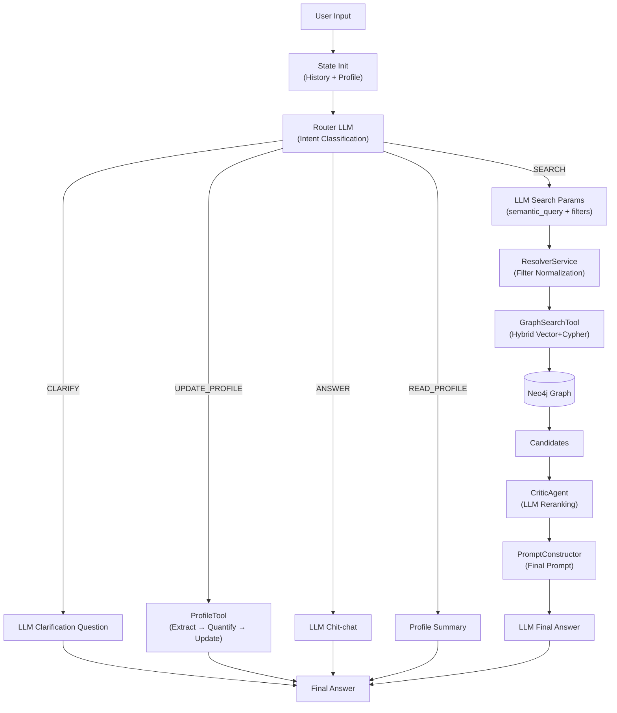
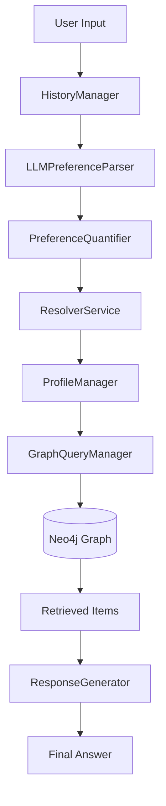

# Raport Stanu Projektu: System Rekomendacji 2.0 (Knowledge Graph)

> **Konwencja**: Każda sekcja datowana opisuje stan systemu na dany dzień.
> Najnowsze zmiany są na górze. Starsze wpisy poniżej stanowią historię projektu.

---

## 📅 2026-06-21

### Changelog (względem stanu z 2026-02-07)

#### 🔴 Nowe komponenty (nieopisane w poprzednim raporcie)

1.  **Multi-Agent Orchestrator (`AgentOrchestrator` w `src/agents/orchestrator.py`):**
    *   Nowy **główny entry point** systemu, zastępujący `PreferenceAgentFlow` jako aktywny flow.
    *   Implementuje wzorzec **Router / State Machine** z klasyfikacją intencji przez LLM.
    *   Obsługuje akcje: `SEARCH`, `CLARIFY`, `ANSWER`, `UPDATE_PROFILE`, `READ_PROFILE`.
    *   Stan konwersacji zarządzany przez `ConversationState` (TypedDict w `src/agents/state.py`).

2.  **CriticAgent (`src/agents/critic_agent.py`):**
    *   Agent do **kontekstowego rerankingu** (Context-Aware Reranking) kandydatów.
    *   Asynchronicznie ewaluuje produkty (via `asyncio.gather`) pod kątem dopasowania do profilu użytkownika.
    *   Zwraca `fit_score` (0-100), `reasoning`, `is_recommended` per produkt.
    *   Prompt w języku polskim — "Ekspert ds. Weryfikacji Jakości Produktów".

3.  **GraphSearchTool (`src/tools/graph_search_tool.py`):**
    *   Narzędzie do **hybrydowego wyszukiwania** w Knowledge Graph.
    *   Trzy strategie: **HYBRID** (Vector + Cypher), **VECTOR_ONLY**, **FILTER_ONLY**.
    *   Używa `product_embedding_index` Neo4j do semantycznego wyszukiwania ANN.
    *   Integruje `ResolverService` do normalizacji filtrów (brand, category) z progami ufności.

4.  **ProfileTool (`src/tools/profile_tool.py`):**
    *   Wrapper narzędziowy spinający `ProfileManager` + `LLMPreferenceParser` + `PreferenceQuantifier`.
    *   Metoda `update_preferences_from_conversation()` — pełny pipeline: Extract → Normalize → Quantify → Update.

5.  **EmbeddingService (`src/knowledge_graph/graphdb/embedding_service.py`):**
    *   Serwis embeddingów oparty na `sentence-transformers` (`all-MiniLM-L6-v2`).
    *   Używany przez `ResolverService`, `GraphSearchTool`, `BackfillService`.

6.  **SimpleLLMHandler (`src/llm/simple_llm_handler.py`):**
    *   Zunifikowany handler LLM z obsługą synchroniczną (`query()`) i asynchroniczną (`aquery()`).
    *   Implementuje `LLMHandlerInterface` (`src/llm/abstract_llm_handler.py`).

7.  **UI Chainlit (`src/ui/app.py`):**
    *   Interfejs czatowy do interakcji z systemem rekomendacji.

#### 🟡 Korekty opisu istniejących komponentów

1.  **`PreferenceQuantifier`** — poprzedni raport twierdził, że nadaje wagi typu `"uwielbiam" > "lubię"` (granularne ważenie sentymentu). **To nieprawda.** Quantifier stosuje **stałe wagi binarne**: `likes → 0.8`, `dislikes → -0.7`. Brak mapowania słów kluczowych na intensywność.

2.  **`ResolverService`** — poprzedni przykład `"tani" → PriceRange` jest **mylący**. Resolver obsługuje `resolve_brand()`, `resolve_attribute()`, `resolve_category()` przez wyszukiwanie wektorowe. **Nie obsługuje PriceRange** — cena jest filtrem numerycznym (`price_max`, `price_min`).

3.  **`ProfileManager` (`InMemoryUserProfileManager`)** — opisany jako „trwały profil". W rzeczywistości jest **wyłącznie in-memory** i ginie po restarcie. Mergowanie preferencji jest proste — nadpisuje istniejące wartości.

4.  **Wyszukiwanie** — raport twierdził, że system polega wyłącznie na Text-to-Cypher i brakuje indeksów wektorowych. **Nieprawda.** System aktywnie używa 4 indeksów wektorowych Neo4j:
    *   `product_embedding_index`, `brand_embedding_index`, `attribute_embedding_index`, `category_embedding_index`.

#### ✅ Bez zmian (potwierdzone jako zgodne)

*   `PreferenceAgentFlow` w `src/dialog_manager` — istnieje, pipeline Fazy I działa zgodnie z opisem (choć nie jest już głównym entry pointem).
*   `LLMPreferenceParser` w `src/llm_interface` — wyciąga preferencje z tekstu przez LLM tool-calling.
*   `GraphQueryManager` + `ExternalLLMCypherGenerator` w `src/knowledge_graph/graphdb` — tłumaczy język naturalny na Cypher.
*   `HistoryManager` w `src/conversation` — zarządza kontekstem sesji (in-memory, max 20 turns).
*   Pipeline ASTE (`aspect_pipeline.py`) — oparty na PyABSA, funkcjonalny.
*   `backfill_embeddings.py` — backfill embeddingów tekstowych dla 4 typów węzłów.

#### ❌ Nadal brakuje (względem pełnej wizji projektu)

*   **GraphRAG** — brak chunkowania recenzji, węzłów `(:Chunk)`, relacji `[:MENTIONS]`, entity linking.
*   **GNN / KGAT** — brak trenowania grafowych sieci neuronowych.
*   **FAISS** — brak dedykowanego indeksu FAISS (ale Neo4j vector indexes pełnią zbliżoną rolę).
*   **Trwała pamięć profilu** — `ProfileManager` jest in-memory, brak persystencji (np. Redis/DB).

### Zaktualizowana Architektura (Faza II — obecna)

---

## 📅 2026-02-07

### Stan Flow Rekomendacji (Faza I — MVP)

Obecny flow rekomendacji stanowi **Fazę I (MVP)**, zrealizowaną zgodnie z planem `phase_i_agentic_preference_extraction`. Jest to system oparty na **Agentowej Ekstrakcji Preferencji** oraz deterministycznym wyszukiwaniu w grafie (Text-to-Cypher).

#### ✅ Co jest zrobione (Zaimplementowane):
1.  **Orkiestracja Agentowa (`PreferenceAgentFlow`):**
    *   Centralny punkt sterowania w `src/dialog_manager`.
    *   Spina proces: Pobranie historii -> Ekstrakcja preferencji (LLM) -> Kwantyfikacja (Wagi) -> Budowa Profilu -> Generowanie zapytania.
2.  **Ekstrakcja & Uziemianie (Extraction & Resolution):**
    *   `LLMPreferenceParser` skutecznie wyciąga intencje z tekstu.
    *   `PreferenceQuantifier` nadaje wagi (np. "uwielbiam" > "lubię").
    *   `ResolverService` mapuje luźne określenia użytkownika na konkretne węzły w grafie (np. "tani" -> `PriceRange`).
3.  **Retrieval (Wyszukiwanie):**
    *   `GraphQueryManager` (wspierany przez `ExternalLLMCypherGenerator`) tłumaczy język naturalny na zapytania Cypher do Neo4j.
    *   System potrafi znaleźć produkty spełniające twarde kryteria logiczne.
4.  **ETL & NLP (Offline):**
    *   Zaimplementowano pipeline **ASTE (Aspect Sentiment Triplet Extraction)** (`aspect_pipeline.py`) oparty na PyABSA.

#### ❌ Czego brakuje (względem planu "Budowa Knowledge Graphu"):
1.  **GraphRAG (Warstwa Leksykalna):**
    *   Brakuje mechanizmu RAG na poziomie fragmentów tekstu (Chunks).
    *   System nie potrafi "wyjąć" konkretnego zdania z recenzji jako dowodu dla rekomendacji (np. "użytkownik X napisał, że bateria trzyma 10h").
    *   Brak węzłów `(:Chunk)` i relacji `[:MENTIONS]` łączących tekst z encjami.
2.  **GNN & Embeddingi Grafowe (KGAT):**
    *   W kodzie brak mechanizmu trenowania **Grafowych Sieci Neuronowych (KGAT)**.
    *   Brak logiki rekomendacji opartej na wektorach z grafu (Collaborative Filtering + Semantyka).
    *   `backfill_embeddings.py` sugeruje jedynie proste embeddingi tekstowe.
3.  **Wyszukiwanie Hybrydowe (FAISS/ANN):**
    *   Obecne wyszukiwanie polega na generowaniu zapytań Cypher (Text-to-Cypher).
    *   Brak indeksu wektorowego (FAISS), który pozwalałby na szybkie, "rozmyte" wyszukiwanie podobnych semantycznie produktów w dużej skali.

### Architektura Agentowa (Faza I)

Architektura jest nowoczesna, modularna i zgodna z zasadami **SOLID**. Została zaprojektowana w oparciu o wzorzec **Orchestrator-Workers**.

#### Kluczowe Komponenty:

1.  **Orkiestrator (`PreferenceAgentFlow` w `src/dialog_manager`):**
    *   "Mózg" operacji. Zarządza stanem i deleguje zadania.
    *   Nie wykonuje logiki biznesowej bezpośrednio, lecz koordynuje pracę agentów.

2.  **Pamięć i Stan (State Management):**
    *   **Krótkoterminowa (`HistoryManager`):** Przechowuje kontekst bieżącej sesji.
    *   **Długoterminowa (`ProfileManager`):** Buduje trwały profil użytkownika z ważonymi preferencjami.

3.  **Percepcja (Extraction Layer `src/llm_interface`):**
    *   `LLMPreferenceParser` & `PromptConstructor`: Oddzielają logikę "rozmowy" od logiki biznesowej.

4.  **Działanie (Data Access `src/knowledge-graph`):**
    *   `GraphQueryManager`: Warstwa abstrakcji nad Neo4j. Ukrywa skomplikowany Cypher przed resztą aplikacji.

#### Diagram Przepływu Danych (Faza I):

### Rekomendowane Następne Kroki (z perspektywy Fazy I)

Aby przejść do Fazy II i zrealizować pełną wizję projektu, należy skupić się na:

1.  **Implementacja GraphRAG:**
    *   Dodać logikę chunkowania recenzji i tworzenia węzłów `(:Chunk)`.
    *   Zintegrować linkowanie fragmentów do encji (Entity Linking).
2.  **Budowa Indeksu Wektorowego (FAISS):**
    *   Wdrożyć FAISS dla szybkiego wyszukiwania podobieństw (ANN).
3.  **Trening GNN (KGAT):**
    *   Zaimplementować model KGAT do uczenia się relacji w grafie.
