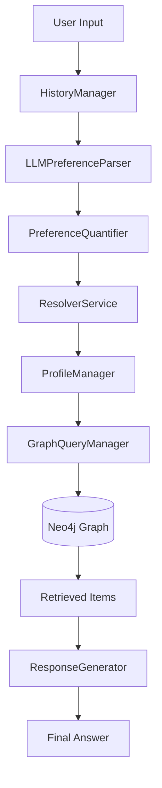

# Raport Stanu Projektu: System Rekomendacji 2.0 (Knowledge Graph)
**Data:** 2026-02-07

## 1. Stan Flow Rekomendacji

Obecny flow rekomendacji stanowi **Fazę I (MVP)**, zrealizowaną zgodnie z planem `phase_i_agentic_preference_extraction`. Jest to system oparty na **Agentowej Ekstrakcji Preferencji** oraz deterministycznym wyszukiwaniu w grafie (Text-to-Cypher).

### ✅ Co jest zrobione (Zaimplementowane):
1.  **Orkiestracja Agentowa (`PreferenceAgentFlow`):**
    *   Centralny punkt sterowania w `src/dialog_manager`.
    *   Spina proces: Pobranie historii -> Ekstrakcja preferencji (LLM) -> Kwantyfikacja (Wagi) -> Budowa Profilu -> Generowanie zapytania.
2.  **Ekstrakcja & Uziemianie (Extraction & Resolution):**
    *   `LLMPreferenceParser` skutecznie wyciąga intencje z tekstu.
    *   `PreferenceQuantifier` nadaje wagi (np. "uwielbiam" > "lubię").
    *   `ResolverService` mapuje luźne określenia użytkownika na konkretne węzły w grafie (np. "tani" -> `PriceRange`).
3.  **Retrieval (Wyszukiwanie):**
    *   `GraphQueryManager` (wspierany przez `ExternalLLMCypherGenerator`) tłumaczy język naturalny na zapytania Cypher do Neo4j.
    *   System potrafi znaleźć produkty spełniające twarde kryteria logiczne.
4.  **ETL & NLP (Offline):**
    *   Zaimplementowano pipeline **ASTE (Aspect Sentiment Triplet Extraction)** (`aspect_pipeline.py`) oparty na PyABSA.

### ❌ Czego brakuje (względem planu "Budowa Knowledge Graphu"):
1.  **GraphRAG (Warstwa Leksykalna):**
    *   Brakuje mechanizmu RAG na poziomie fragmentów tekstu (Chunks).
    *   System nie potrafi "wyjąć" konkretnego zdania z recenzji jako dowodu dla rekomendacji (np. "użytkownik X napisał, że bateria trzyma 10h").
    *   Brak węzłów `(:Chunk)` i relacji `[:MENTIONS]` łączących tekst z encjami.
2.  **GNN & Embeddingi Grafowe (KGAT):**
    *   W kodzie brak mechanizmu trenowania **Grafowych Sieci Neuronowych (KGAT)**.
    *   Brak logiki rekomendacji opartej na wektorach z grafu (Collaborative Filtering + Semantyka).
    *   `backfill_embeddings.py` sugeruje jedynie proste embeddingi tekstowe.
3.  **Wyszukiwanie Hybrydowe (FAISS/ANN):**
    *   Obecne wyszukiwanie polega na generowaniu zapytań Cypher (Text-to-Cypher).
    *   Brak indeksu wektorowego (FAISS), który pozwalałby na szybkie, "rozmyte" wyszukiwanie podobnych semantycznie produktów w dużej skali.

---

## 2. Architektura Agentowa

Architektura jest nowoczesna, modularna i zgodna z zasadami **SOLID**. Została zaprojektowana w oparciu o wzorzec **Orchestrator-Workers**.

### Kluczowe Komponenty:

1.  **Orkiestrator (`PreferenceAgentFlow` w `src/dialog_manager`):**
    *   "Mózg" operacji. Zarządza stanem i deleguje zadania.
    *   Nie wykonuje logiki biznesowej bezpośrednio, lecz koordynuje pracę agentów.

2.  **Pamięć i Stan (State Management):**
    *   **Krótkoterminowa (`HistoryManager`):** Przechowuje kontekst bieżącej sesji.
    *   **Długoterminowa (`ProfileManager`):** Buduje trwały profil użytkownika z ważonymi preferencjami.

3.  **Percepcja (Extraction Layer `src/llm_interface`):**
    *   `LLMPreferenceParser` & `PromptConstructor`: Oddzielają logikę "rozmowy" od logiki biznesowej.

4.  **Działanie (Data Access `src/knowledge-graph`):**
    *   `GraphQueryManager`: Warstwa abstrakcji nad Neo4j. Ukrywa skomplikowany Cypher przed resztą aplikacji.

### Diagram Przepływu Danych (Faza I):

## 3. Rekomendowane Następne Kroki

Aby przejść do Fazy II i zrealizować pełną wizję projektu, należy skupić się na:

1.  **Implementacja GraphRAG:**
    *   Dodać logikę chunkowania recenzji i tworzenia węzłów `(:Chunk)`.
    *   Zintegrować linkowanie fragmentów do encji (Entity Linking).
2.  **Budowa Indeksu Wektorowego (FAISS):**
    *   Wdrożyć FAISS dla szybkiego wyszukiwania podobieństw (ANN).
3.  **Trening GNN (KGAT):**
    *   Zaimplementować model KGAT do uczenia się relacji w grafie.
