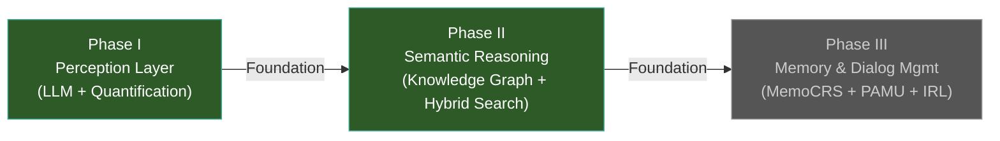

# Vision Report: Recommendation System 2.0 (Knowledge Graph CRS)

> **This document is the canonical source of truth for the project's strategic direction.**
> Every agent skill MUST read this document before making architectural decisions.
>
> Last updated: 2026-06-24

---

## Current Strategic Direction

### System Goal

Build a **next-generation Knowledge Graph-enhanced Conversational Recommender System (CRS)** that goes beyond simple filtering to truly understand and remember user preferences. The system must be capable of multi-turn contextual dialogue, semantic reasoning over a Knowledge Graph (Neo4j), and long-term memory-based personalization. The target domain is e-commerce product recommendation using the Amazon Reviews '23 dataset.

### Core Philosophy

> **Simplicity as a constraint**: Every module, algorithm, and integration must justify its existence. The system must not become unnecessarily complex. If a simpler approach achieves 80% of the value at 20% of the complexity, prefer it unless there's a clear, documented reason not to.

### Agreed Architecture — Three-Phase Plan

The system follows a **three-phase evolutionary architecture**, where each phase builds on the previous:

| Phase | Status | Core Capability |
|-------|--------|----------------|
| **Phase I** — Hybrid LLM + Quantification | ✅ Implemented (with corrections) | Extract implicit preferences from dialogue via LLM, quantify with weighted scoring. Profile-Augmented Prompting. |
| **Phase II** — Knowledge Graph & Semantic Reasoning | ✅ Partially Implemented (current focus) | Multi-agent orchestrator, hybrid vector+Cypher search, context-aware reranking (CriticAgent), filter normalization (ResolverService). |
| **Phase III** — Memory & Dialog Management | ❌ Not started | User-specific memory (MemoCRS), preference drift detection (PAMU), adaptive dialog strategy (IRL/CRIF). |

### Current Implementation State (as of 2026-06-21)

**Active entry point**: `AgentOrchestrator` (`src/agents/orchestrator.py`) — Router/State Machine pattern with LLM intent classification.

**Implemented components**:
- `AgentOrchestrator` — multi-agent router (SEARCH, CLARIFY, ANSWER, UPDATE_PROFILE, READ_PROFILE)
- `CriticAgent` — context-aware LLM reranking of search candidates
- `GraphSearchTool` — hybrid search (Vector ANN + Cypher) with 3 strategies
- `ProfileTool` — preference extraction pipeline (Extract → Normalize → Quantify → Update)
- `ResolverService` — brand/category/attribute normalization via vector search
- `EmbeddingService` — sentence-transformers (`all-MiniLM-L6-v2`) for semantic embeddings
- `SimpleLLMHandler` — unified sync/async LLM interface
- 4 Neo4j vector indexes: product, brand, attribute, category
- Chainlit UI for chat interaction

**Known limitations (documented in project state report)**:
- `PreferenceQuantifier` uses fixed binary weights, not granular sentiment mapping
- `ProfileManager` is in-memory only — no persistence across restarts
- No GraphRAG (no chunk nodes, no MENTIONS relations, no entity linking)
- No GNN/KGAT training pipeline
- No dedicated FAISS index (Neo4j ANN serves this role currently)

### Active Constraints

These are non-negotiable unless explicitly revisited and approved by the user:

| Constraint | Rationale |
|-----------|-----------|
| **Neo4j** as the graph database | Already deployed, schema established, vector indexes in use |
| **Python** as the backend language | Entire codebase is Python, team expertise |
| **Multi-agent orchestrator pattern** | Established in Phase II, proven architecture |
| **Amazon Reviews '23** as the dataset | KG schema designed around this dataset |
| **No unnecessary complexity** | Every new module must justify its value-to-complexity ratio |

### Current Phase & Next Steps

- **We are in**: Phase II — completing semantic reasoning capabilities
- **Next priorities** (to be validated through research_analyst before implementation):
  - GraphRAG: Chunking reviews, entity linking, path reasoning
  - Persistent user profiles (replacing in-memory ProfileManager)
  - Preference drift detection
- **Deferred to Phase III**:
  - MemoCRS memory architecture
  - IRL-based dialog strategy
  - User simulator for dialog training

### Foundational Documents

These documents contain the original theoretical analysis and requirements. They are **static references** — the Vision Report reflects the current agreed-upon interpretation of these documents:

| Document | Path | Role |
|----------|------|------|
| Master Implementation Plan | `prompts_and_req/Plan Implementacji Systemu Rekomendacyjnego.md` | Original 3-phase theoretical architecture (KECR + MemoCRS) |
| KG Pipeline Requirements | `prompts_and_req/knowledge-graph-pipeline-requirements.md` | KG schema, ETL pipeline, advanced AI module integration |
| Semantic Alignment Strategy | `prompts_and_req/Dopasowanie Preferencji Użytkownika do Grafu Wiedzy.md` | Three-layer integration architecture (MIM + ReFinED + Dual Encoder) |
| KG-CRS Design | `prompts_and_req/kg-crs-design.html` | Additional CRS design reference |

### Rejected Approaches

> Approaches listed here were researched, considered, and explicitly rejected. Do NOT revisit without user approval.

| Approach | Why Rejected | Date | Notes |
|----------|-------------|------|-------|
| *No entries yet* | — | — | This table will be populated as research decisions are made |

---

## Decision Log

> Each entry below records a strategic decision that shaped the project's direction.
> Entries are ordered newest-first (most recent at the top).

### 📅 2026-06-24 — Established Vision Report as Strategic Ledger

**Context**: The project lacked a single living document to track strategic decisions across agent sessions. Vision was scattered across static foundational documents.

**Decision**: Created `production_artifacts/Vision_Report.md` as the canonical, persistent source of truth for strategic direction. All agent skills (`research_analyst`, `write_specs`, `update_project_state`) now read this document first.

**Rationale**: Agents have no memory between sessions. They need a single file to bootstrap understanding of the project's current strategic state — not just what code exists (project_state_report.md) but what direction was agreed upon and what was rejected.

**Impact on vision**: No change to technical direction. This is a process/governance improvement.

**Approved by**: User

---

### 📅 2026-06-21 — Phase II Architecture Validated

**Context**: First comprehensive audit of the codebase against the original foundational documents.

**Decision**: Confirmed the system has successfully transitioned from Phase I (PreferenceAgentFlow) to Phase II (AgentOrchestrator with multi-agent routing). Documented corrections to previous inaccuracies (e.g., PreferenceQuantifier uses binary weights, not granular; ResolverService doesn't handle PriceRange).

**Rationale**: The project state report from 2026-06-21 provided the first accurate picture of what's implemented vs. what was originally planned.

**Impact on vision**: Phase I and Phase II core components confirmed. Remaining Phase II work: GraphRAG, persistent profiles. Phase III remains untouched.

**Approved by**: User (via project state report review)
