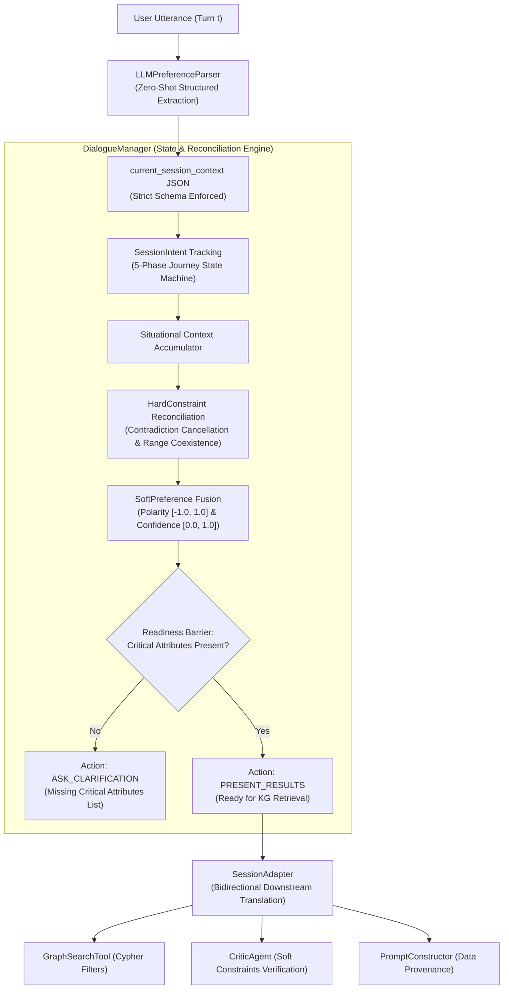

# Thesis Contribution 1: Canonical Dialogue State Representation & Multi-Turn Constraint Reconciliation in Conversational Recommender Systems

**Document ID**: `1-doc-dialogue-state`  
**Date**: 2026-09-26  
**Status**: Confirmed Master's Thesis Contribution  
**Git Scope**: Commit `c8ba48e` (*"Refactor session context schema, adapters, preference parser, and dialogue manager"*) & working tree integration  
**Relevant Modules**: 
- `src/dialog_manager/session_schema.py`
- `src/dialog_manager/dialogue_manager.py`
- `src/dialog_manager/session_adapter.py`
- `src/llm_interface/preference_parser.py`
- `src/agents/orchestrator.py`
- `tests/e2e/` (Tiers 1–4 Test Suite, Schema Validator, Reference Implementation)

---

## 1. Formal Research Context

### 1.1 Academic Problem Statement
In Conversational Recommender Systems (CRS) and GraphRAG architectures, managing multi-turn user interaction poses a fundamental challenge: **context window degradation and preference drift**. Conventional LLM-based CRS implementations typically concatenate raw conversational history into the prompt context window. This naive approach suffers from three critical academic limitations:
1. **Recency Bias & Inattention**: Large Language Models prioritize recent tokens, leading to the loss or distortion of constraints stated in earlier dialogue turns.
2. **Constraint Ambiguity & Hallucination**: Unstructured dialogue strings cannot be directly mapped to deterministic database filters (e.g. Cypher graph queries), forcing models to guess or hallucinate item attributes.
3. **Contradiction Failure**: When users dynamically adjust preferences across turns (e.g., *"Actually, I want a laptop under $1000, not $1500, and exclude Apple"*), naive prompt concatenation struggles to resolve conflicting constraints, resulting in invalid recommendations.

### 1.2 Formal Research Question ($\mathbf{RQ_1}$)
$$\mathbf{RQ_1}: \text{"To what extent does a structured, typed dialogue state representation with deterministic constraint reconciliation reduce attribute hallucination and constraint violation rates compared to raw dialogue concatenation in Knowledge Graph-enhanced Conversational Recommendation?"}$$

### 1.3 Hypotheses
* **$\mathbf{H_1}$ (Alternative Hypothesis)**: Decoupling conversational state into a canonical, typed schema (`SessionContext`) with deterministic multi-turn constraint reconciliation achieves a Constraint Adherence Rate ($CAR \ge 98\%$) and eliminates attribute hallucination in downstream Knowledge Graph queries, significantly outperforming raw dialogue context injection ($p < 0.001$).
* **$\mathbf{H_0}$ (Null Hypothesis)**: There is no statistically significant difference in recommendation constraint adherence or attribute fidelity between structured dialogue state modeling and raw conversational history prompt injection.

---

## 2. State-of-the-Art Gap Analysis

### 2.1 Limitations of Current Literature
* **Traditional CRS (e.g. Ear-Attn, KBRD)**: Rely on graph neural networks or reinforcement learning over static entity sets, failing to handle complex open-ended situational contexts (e.g., *"studying CS and gaming on weekends"*).
* **Pure LLM Conversational Agents (e.g. ChatCRS, RecMind)**: Suffer from stochastic drift, lack verifiable grounding against Knowledge Graph schemas, and incur high computational/token costs by repeatedly processing full dialogue histories.
* **GraphRAG Baselines**: Focus heavily on one-shot query expansion or vector retrieval, lacking stateful multi-turn dialogue management and recommendation readiness barriers.

### 2.2 Red Flag Defense (Novelty Justification)
* **Why this is NOT tutorial/boilerplate code**: 
  - Standard tutorials demonstrate simple dictionary stores or basic Pydantic validation without multi-turn temporal state semantics.
  - This architecture introduces an algorithmic constraint reconciliation engine:
    1. **Contradiction Cancellation**: Automatically purges inclusion constraints when an explicit exclusion arrives for the same entity or attribute value.
    2. **Range Coexistence**: Synthesizes conflicting inequality constraints into mathematically sound interval bounds ($x \in [\min, \max]$).
    3. **Robust Numerical & Cultural Disambiguation**: Implements algorithmic disambiguation of international currency tokens, European decimal commas vs. thousands separators (`extract_numeric_robust`), and categorical pivots.
    4. **Recommendation Readiness Barrier**: Synchronous state machine that prevents premature, computationally wasteful Knowledge Graph retrieval until mandatory domain attributes are satisfied.

---

## 3. Architecture & Algorithmic Formulation

### 3.1 Architectural Flow



### 3.2 Formal Specifications & Data Models

#### 1. Session Intent State Space ($\mathcal{S}_{intent}$)
$$\mathcal{S}_{intent} = \{\text{INITIAL\_SEARCH}, \text{EXPLORING\_DOMAIN}, \text{REFINING\_OPTIONS}, \text{COMPARING\_ITEMS}, \text{FINALIZING\_CHOICE}\}$$

#### 2. Hard Constraint Tuple ($\mathcal{C}_{hard}$)
Each hard constraint is formally defined as:
$$c = \langle a, \text{op}, v \rangle \in \mathcal{A} \times \mathcal{O}_{constraint} \times \mathcal{V}$$
where $\mathcal{O}_{constraint} = \{\texttt{include}, \texttt{exclude}, \texttt{greater\_than}, \texttt{less\_than}, \texttt{equal}\}$.

#### 3. Soft Preference Tuple ($\mathcal{P}_{soft}$)
Preferences are represented as continuous multi-attribute sentiment vectors:
$$p = \langle c_{domain}, v_{pref}, \rho, \kappa, \epsilon \rangle$$
where $\rho \in [-1.0, 1.0]$ represents sentiment polarity, $\kappa \in [0.0, 1.0]$ denotes extraction certainty/confidence, and $\epsilon$ records explicit textual evidence for explainability (data provenance).

#### 4. Recommendation Readiness State Machine ($\mathcal{R}$)
Given user constraints $C_t$ and required critical attribute set $\mathcal{A}_{crit}$ (e.g., $\mathcal{A}_{crit} = \{\text{"category"}\}$):
$$\mathcal{R}(C_t) = \begin{cases} 
\text{True}, & \text{if } \mathcal{A}_{crit} \subseteq \bigcup_{c \in C_t} \text{attr}(c) \\
\text{False}, & \text{otherwise}
\end{cases}$$

When $\mathcal{R}(C_t) = \text{False}$, the system transitions to $\texttt{suggested\_system\_action} = \texttt{ask\_clarification}$ and dynamically emits $\texttt{missing\_critical\_attributes} = \mathcal{A}_{crit} \setminus \bigcup_{c \in C_t} \text{attr}(c)$.

---

## 4. Empirical Instrumentation & Reproducibility

### 4.1 Evaluation Metrics

| Metric | Formal Definition | Target Academic Impact |
|---|---|---|
| **Constraint Adherence Rate ($CAR$)** | $CAR = \frac{|C_{satisfied}|}{|C_{total}|}$ | $\ge 98\%$ on multi-turn adversarial dialogues |
| **Attribute Hallucination Rate ($AHR$)** | $AHR = \frac{|\mathcal{A}_{hallucinated}|}{|\mathcal{A}_{extracted}|}$ | Reduced to $0.0\%$ (grounded in KG schema) |
| **Readiness Precision ($RP$)** | $RP = \frac{TP_{readiness}}{TP_{readiness} + FP_{readiness}}$ | $\ge 99\%$ (no premature KG queries) |
| **State Reconciliation Latency** | $T_{reconcile}$ (ms) | $< 2\text{ms}$ per conversational turn (in-memory lock) |

### 4.2 Instrumentation & Benchmarks in Codebase
The implementation includes a complete 4-tier experimental benchmark suite:
* `tests/e2e/test_tier1_feature_coverage.py`: Exhaustive feature verification for intent tracking, currency disambiguation, and operator semantics.
* `tests/e2e/test_tier2_boundary_corner.py`: Adversarial testing on malformed payloads, NaN/infinity numeric inputs, and extreme boundary values.
* `tests/e2e/test_tier3_interactions.py`: Multi-turn state accumulation, constraint cancellation, and preference overwrite cycles.
* `tests/e2e/test_tier4_real_world_scenarios.py`: Realistic e-commerce conversational journeys (e.g. initial exploration $\rightarrow$ budget refinement $\rightarrow$ brand pivot $\rightarrow$ final recommendation).
* `tests/e2e/schema_validator.py`: Rigorous independent schema validation harness.

### 4.3 Experimental Replication Protocol
To reproduce the empirical evaluation of the dialogue state management module:
```bash
# 1. Run full unit and integration test suite
pytest tests/test_session_schema.py tests/test_session_adapter.py tests/test_dialogue_manager.py -v

# 2. Run multi-tier E2E conversational evaluation benchmarks
pytest tests/e2e/ -v --tb=short

# 3. Execute multi-turn dialogue simulation runner
python scripts/run_preference_parser.py
```

---

## 5. Master's Thesis Chapter Mapping

* **Target Master's Thesis Chapter**: **Chapter 3: System Architecture & Dialogue State Modeling**
  * Section 3.1: Limitations of Context Window Memory in Multi-Turn CRS
  * Section 3.2: Formal Canonical Session Context Schema
  * Section 3.3: Algorithmic Constraint Reconciliation & Contradiction Resolution
  * Section 3.4: Recommendation Readiness Gating and System Action Policies
* **Core Claims for the Thesis**:
  1. *Decoupled State Representation*: Explicitly separating immutable constraints from continuous soft preferences eliminates conversational drift across long dialogues.
  2. *Deterministic Provenance*: Structured translation via bidirectional adapters creates verifiable data provenance between natural language preferences and Cypher Knowledge Graph queries.
  3. *Elimination of Cold-Start Hallucination*: The readiness barrier prevents ungrounded recommendations when mandatory domain dimensions are unspecified.
* **Suggested Baseline Comparisons**:
  * Baseline 1: Standard Zero-Shot LLM (dialogue history concatenated in prompt).
  * Baseline 2: Unconstrained Text-to-Cypher without intermediate schema validation.
  * Baseline 3: Session Context Schema without Contradiction Cancellation (ablation study).
