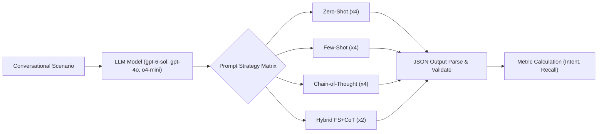

# Thesis Contribution 2: Empirical Evaluation of LLM Preference Extraction Strategies

**Document ID**: `2-doc-preference-benchmark`  
**Date**: 2026-09-26  
**Status**: Confirmed Master's Thesis Contribution  
**Git Scope**: Uncommitted changes in `tests/benchmarks/`  
**Relevant Modules**: `tests/benchmarks/prompts/prompts_dict.py`, `tests/benchmarks/scripts/run_benchmark.py`  

---

## 1. Formal Research Context

### 1.1 Academic Problem Statement
In Conversational Recommender Systems (CRS), seamlessly bridging natural language interaction with structured deterministic backend systems (e.g., a Neo4j Knowledge Graph) represents a major architectural challenge. Modern LLMs are prone to "attribute hallucination"—inventing constraints or misinterpreting soft user preferences as hard exclusionary rules. Constructing a highly reliable extraction layer is critical for downstream Hybrid GraphRAG retrieval to function without breaking due to malformed structural Cypher queries.

### 1.2 Formal Research Question (RQ)
$$\mathbf{RQ_2}: \text{"To what extent do Few-Shot and guided Chain-of-Thought (CoT) prompting strategies improve constraint schema compliance and intent accuracy compared to Zero-Shot instructions in CRS preference extraction?"}$$

### 1.3 Hypotheses
* **$\mathbf{H_1}$ (Alternative Hypothesis)**: Providing concrete structural examples (Few-Shot) yields significantly higher constraint recall and schema compliance than forcing reasoning processes (Chain-of-Thought) without concrete examples.
* **$\mathbf{H_0}$ (Null Hypothesis)**: There is no statistically significant difference in extraction accuracy between prompting strategies.

---

## 2. State-of-the-Art Gap Analysis

### 2.1 Limitations of Current Literature
Current CRS implementations typically rely on standard unconstrained LLM chat interfaces, or use simplistic zero-shot JSON parsers that frequently fail on nuanced, multi-turn dialogues where users modify or implicitly state preferences. Academic literature extensively discusses LLM reasoning (Chain-of-Thought) for complex logic tasks, but literature exploring prompt engineering specifically optimized for rigid structural extraction mapped to graph schemas is limited.

### 2.2 Red Flag Defense (Novelty Justification)
* **Why this is NOT tutorial/boilerplate code**: This is not a simple OpenAI API call script. It is a highly specialized, 15-variant prompt evaluation matrix (testing Sequential, Evidence-First, Contrastive, and Turn-by-Turn Replay CoT strategies) applied against 5 rigorously defined conversational edge cases (Vague, Correction, High-Detail).
* **Core Scientific Contribution**: A reproducible methodological framework establishing that Few-Shot prompting structurally dominates unguided Chain-of-Thought for deterministic parameter extraction in Recommender Systems.

---

## 3. Architecture & Algorithmic Formulation

### 3.1 Architectural Flow


### 3.2 Formal Specifications & Data Models
The benchmark evaluates the extraction against a strict Pydantic-style definition of the `current_session_context`, focusing specifically on extracting `session_intent` and `extracted_parameters` (divided into `hard_constraints` and `soft_preferences`).

### 3.3 Key Implemented Classes & Interfaces
* `tests/benchmarks/prompts/prompts_dict.py`: Registry of 15 distinct prompt architectures.
* `tests/benchmarks/conversations/scenarios.py`: Golden dataset of 5 conversational scenarios with expected JSON outputs.
* `tests/benchmarks/scripts/run_benchmark.py`: Autonomous execution harness tracking latency, token usage, JSON compliance, constraint precision/recall, and intent matching.

---

## 4. Empirical Instrumentation & Reproducibility

### 4.1 Evaluation Metrics
| Metric | Dimension | Target / Expected Impact |
|---|---|---|
| Schema Compliance | System Feasibility | Must approach 100% to ensure downstream DB stability. |
| Intent Accuracy | Conversation Quality | Ensures the Dialogue Manager routes correctly. |
| Constraint Recall | Recommendation Quality | Validates that no user requirement is silently dropped. |
| Latency (ms) / Tokens | System Feasibility | Defines the cost/performance trade-off of complex CoT prompts. |

### 4.2 Instrumentation & Benchmarks in Code
The benchmark automatically generates a `results.csv` and 8 publication-ready charts (e.g., `score_by_strategy.png`, `latency_boxplot.png`, `prompt_heatmap.png`) utilizing seaborn and pandas to perform multi-dimensional analysis on the 225 execution permutations.

### 4.3 Experimental Replication Protocol
Instructions for an independent researcher to replicate the experiment:
```bash
# Ensure OPENAI_API_KEY is exported or defined in .env
python tests/benchmarks/scripts/run_benchmark.py
```

---

## 5. Master's Thesis Chapter Mapping

* **Target Thesis Chapter**: Chapter 5: Empirical Evaluation & Comparative Analysis (or a dedicated section in Chapter 3 on Dialogue State Extraction).
* **Key Claims to Make in Thesis Text**:
  1. Few-Shot examples are the primary driver of high schema compliance and constraint recall, outperforming unguided reasoning.
  2. Pure Chain-of-Thought prompting, while effective for logical reasoning, introduces hallucinations or misalignment when applied to strict structural parsing tasks without examples.
  3. Advanced models (like `gpt-6-sol`) exhibit strong zero-shot capabilities, but Few-Shot remains the safest architectural choice for CRS reliability.
* **Suggested Baseline Comparisons**: Comparison of extraction accuracy across LLM generations (`gpt-4o` vs `o4-mini` vs `gpt-6-sol`).
