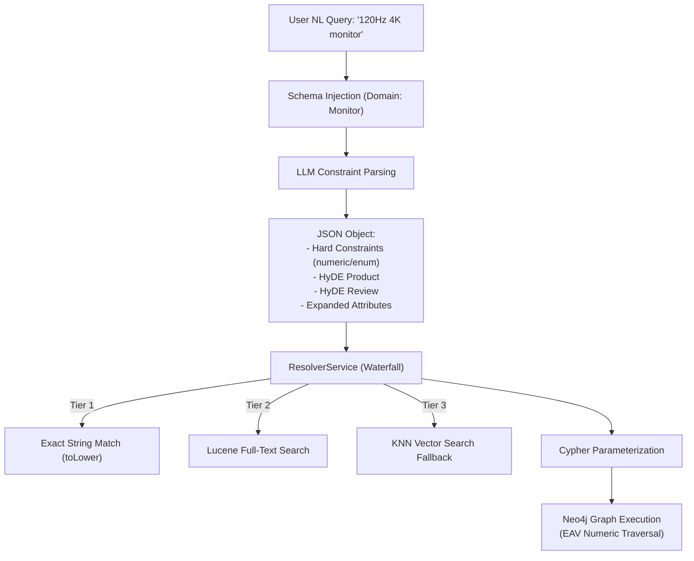

# Thesis Contribution 3: Robust GraphRAG Retrieval via Waterfall Resolution and EAV Schema

**Document ID**: `3-doc-robust-retrieval`  
**Date**: 2026-09-28  
**Status**: Confirmed Master's Thesis Contribution  
**Git Scope**: Meta-Phase A Implementation Plan (A1.5 & F3.2 updates)  
**Relevant Modules**: `src/knowledge_graph/graphdb/decompose_attributes.py`, `src/tools/graph_search_tool.py`, `src/llm_interface/preference_parser.py`, `src/knowledge_graph/domain_schemas.json`  

---

## 1. Formal Research Context

### 1.1 Academic Problem Statement
In Conversational Recommender Systems (CRS) leveraging Knowledge Graphs (KGs), translating unstructured natural language into precise structural graph queries (e.g., Cypher) suffers from severe "vocabulary impedance." Zero-shot Large Language Models frequently generate exact-match constraints (e.g., `Category="monitor"`) that fail catastrophically against canonical database entities (`Category="Computer Monitors"`), resulting in zero retrieval yield. Furthermore, generic Knowledge Graphs fail at mathematical numerical reasoning (e.g., `<` or `>`) when technical specifications are stored as strings or discrete nodes, crippling the system's ability to filter complex technical queries.

### 1.2 Formal Research Question (RQ)
$$\mathbf{RQ_3}: \text{"To what extent does a tiered Waterfall Entity Resolution strategy, combined with Schema Injection and an Entity-Attribute-Value (EAV) numeric schema, improve retrieval yield, precision, and groundedness in GraphRAG compared to zero-shot LLM-to-Cypher generation?"}$$

### 1.3 Hypotheses
* **$\mathbf{H_1}$ (Alternative Hypothesis)**: Decoupling constraint extraction from query execution via Schema Injection and Waterfall Entity Resolution significantly reduces exact-match failure rates, while the EAV numeric schema improves quantitative filtering precision without causing graph sparsity.
* **$\mathbf{H_0}$ (Null Hypothesis)**: There is no statistically significant improvement in retrieval yield or accuracy compared to baseline zero-shot Cypher generation.

---

## 2. State-of-the-Art Gap Analysis

### 2.1 Limitations of Current Literature
While frameworks like **KBRD** (Knowledge-Based Recommender Dialog System) and **KGSF** (Knowledge Graph based Semantic Fusion) successfully establish the necessity of Entity Linking to bridge conversational input with graph topologies, they heavily rely on implicit neural propagation (e.g., Graph Neural Networks or GraphSAGE). These models are black-box and lack explicit, transparent explainability. Conversely, naive GraphRAG architectures attempt to let LLMs write raw graph queries, causing fatal exact-match string errors and hallucinated node properties.

### 2.2 Red Flag Defense (Novelty Justification)
* **Why this is NOT tutorial/boilerplate code**: This is not a simple LangChain `GraphCypherQAChain`. Rather than trusting an LLM to generate valid queries directly, this architecture creates a deterministic, highly engineered intermediate translation pipeline (Tiered Resolution + Domain Schema Injection + EAV Numerical Casting).
* **Core Scientific Contribution**: This contribution introduces a robust, latency-aware methodology for executing deterministic semantic-to-topological GraphRAG mappings that simultaneously solve the "asymmetric search problem" (via Single-Pass HyDE formulation) and the exact-match failure problem (via Waterfall Resolution), while fully preserving mathematical constraints.

---

## 3. Architecture & Algorithmic Formulation

### 3.1 Architectural Flow

### 3.2 Formal Specifications & Data Models
1.  **Waterfall Resolution Strategy**:
    *   *Literature Context:* Addressing the entity linking requirements established by **KBRD** (Chen et al., 2019) and **KGSF** (Zhou et al., 2020), this strategy efficiently bridges conversational input with KG topology:
    *   **Tier 1 (Lexical Exact)**: $f_{exact}(e) = n \iff \text{toLower}(e) == \text{toLower}(n.name)$
    *   **Tier 2 (Lucene Substring)**: $f_{lucene}(e) = \text{Top}_1(\text{db.index.fulltext.queryNodes}(e))$
    *   **Tier 3 (Semantic Vector)**: $f_{vector}(e) = \text{KNN}(\text{embed}(e), \mathcal{V}_{index})$
2.  **Entity-Attribute-Value (EAV) Numeric Schema & Schema Injection**:
    *   *Literature Context:* Inspired by constraint tracking methodologies in sequential models like **TSCR**, this schema ensures deterministic extraction without hallucination.
    *   Replaces the sparse, wide-node structure `(Product {refresh_rate: 120})`.
    *   Implements `(p:Product)-[:HAS_ATTRIBUTE]->(a:TechnicalSpec {key: 'refresh_rate', numeric_value: 120.0})`. Enables standard mathematical operations in Cypher without breaking graph scalability.
3.  **Single-Pass Structured Generation (HyDE)**:
    *   *Literature Context:* Adapting the core principle of **HyDE** (Gao et al., 2023)—generating hypothetical documents to solve asymmetric semantic gaps—but optimized for real-time latency.
    *   Fuses Hypothetical Document Embeddings and Query Expansion into a single LLM JSON output to solve asymmetric search problems without incurring $3\times$ latency penalties.

### 3.3 Key Implemented Classes & Interfaces
*   `ResolverService`: Implements the three-tier Waterfall Entity Resolution to bridge unstructured LLM entities to canonical canonical graph IDs.
*   `preference_parser.py` (updated): Now accepts injected domain schemas (`domain_schemas.json`) to constrain the LLM generation to valid attributes, preventing zero-shot property hallucination.

---

## 4. Empirical Instrumentation & Reproducibility

### 4.1 Evaluation Metrics
| Metric | Dimension | Target / Expected Impact |
|---|---|---|
| Zero-Result Error Rate | System Robustness | Drastic reduction due to Waterfall Resolution and elimination of exact-match string errors. |
| HitRate@K / NDCG@K | Recommendation Quality | Improvement via Multi-Index Semantic integration (HyDE + Query Expansion). |
| Latency (ms) | System Feasibility | Kept within bounds by placing Semantic Vector Search exclusively in Tier 3 of the Waterfall. |

### 4.2 Instrumentation & Benchmarks in Code
*   `tests/test_graph_search_tool.py`: Integration testing will measure query failure rates against raw string extraction versus the `ResolverService` middleware.

### 4.3 Relevant Literature Citations
*   **KBRD**: Chen et al., "Towards Knowledge-Based Recommender Dialog System" (EMNLP 2019) – For establishing the necessity of entity linking in dialog graphs.
*   **KGSF**: Zhou et al., "Improving Conversational Recommender Systems via Knowledge Graph based Semantic Fusion" (KDD 2020) – For providing the basis of combining semantic inputs with structured KG topologies.
*   **HyDE**: Gao et al., "Precise Zero-Shot Dense Retrieval without Relevance Labels" (ACL 2023) – For validating the effectiveness of hypothetical document generation to solve asymmetric semantic gaps.
*   **TSCR**: "Transformer-based Sequential Conversational Recommendation" (Contextualizing the flow of constraints).

---

## 5. Master's Thesis Chapter Mapping

* **Target Thesis Chapter**: Chapter 4: Hybrid GraphRAG Retrieval & Multi-Agent Verification
* **Key Claims to Make in Thesis Text**:
  1. Relying on zero-shot LLM translation directly to Cypher creates fatal "vocabulary impedance" leading to empty retrieval sets.
  2. The Waterfall Resolution Strategy combined with an EAV Numeric schema effectively bridges conversational intent to exact mathematical graph operations without sacrificing scalability or latency.
* **Suggested Baseline Comparisons**: 
  * Baseline 1: Standard LLM-to-Cypher (LangChain).
  * Baseline 2: Pure Dense Vector Retrieval.
  * Our Approach: Schema-Injected Extraction + Waterfall Resolution + EAV Cypher Execution.
