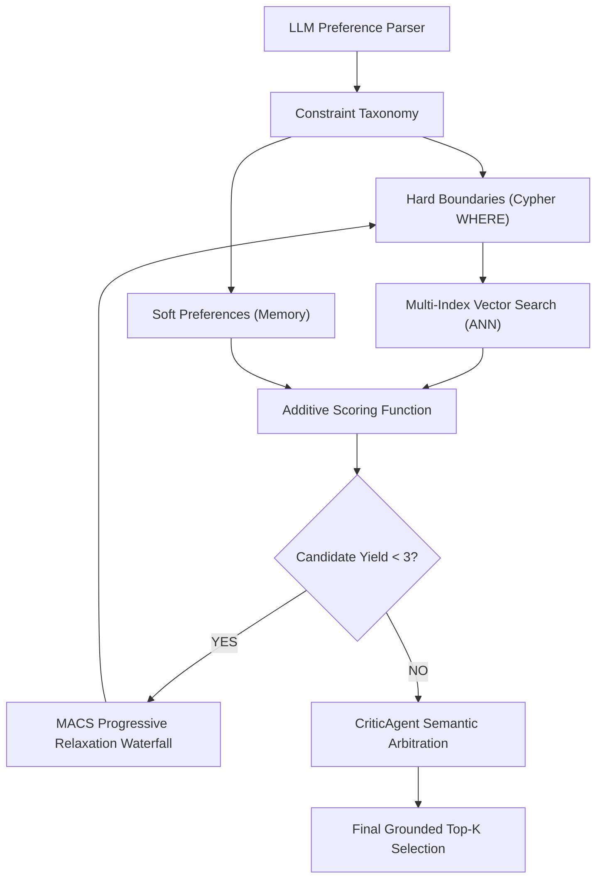

# Thesis Contribution 4: Progressive Relaxation & Soft-Scored Hybrid Graph Retrieval

**Document ID**: `4-doc-hybrid-scoring`  
**Date**: 2026-09-29  
**Status**: Confirmed Master's Thesis Contribution  
**Git Scope**: `Meta_Phase_A_Execution_Plan.md` (4-Pillar Remediation Blueprint)  
**Relevant Modules**: `src/tools/graph_search_tool.py`, `src/agents/critic_agent.py`, `src/llm_interface/preference_parser.py`  

---

## 1. Formal Research Context

### 1.1 Academic Problem Statement
In Conversational Recommender Systems (CRS) backed by Knowledge Graphs, translating extracted natural language preferences directly into strict Boolean database queries (e.g., Cypher `WHERE` clauses) introduces catastrophic structural brittleness known as the "Recall Cliff." Empirical analysis shows that strict conjunctive constraints ($C_1 \land C_2 \land \dots \land C_n$) frequently yield zero results due to trivial ontological mismatches (e.g., `toFloat("144Hz")` yielding `NULL`), NaN anomalies in numerical data (e.g., flagship products lacking explicit price data), and semantic substring contamination (e.g., third-party compatibility titles). 

### 1.2 Formal Research Question (RQ)
$$\mathbf{RQ_4}: \text{"To what extent does decoupling natural language preferences into 'hard boundaries' (Boolean) and 'soft preferences' (additive scoring), combined with progressive constraint relaxation, improve candidate yield and Recall@K compared to monolithic Boolean Cypher filtering?"}$$

### 1.3 Hypotheses
* **$\mathbf{H_1}$ (Alternative Hypothesis)**: Implementing an explicit constraint taxonomy with in-memory additive soft-scoring and MACS (Multi-Agent Constraint Solving) progressive relaxation significantly reduces zero-candidate retrieval failures and increases overall $HitRate@K$ without compromising preference groundedness.
* **$\mathbf{H_0}$ (Null Hypothesis)**: Progressive relaxation and soft scoring do not yield a statistically significant improvement in retrieval success rates compared to strict Boolean graph constraints.

---

## 2. State-of-the-Art Gap Analysis

### 2.1 Limitations of Current Literature
Current frameworks for GraphRAG and LLM-driven recommendation often adopt monolithic Text-to-Cypher translations or inject all constraints into a single SQL/Cypher filter. This results in the over-constraining of candidate pools. While recent SOTA literature (such as MACS, DualAgent-Rec, and G-CRS) highlights the necessity of constraint relaxation and dual-agent feedback, many open-source implementations still rely on rigid intersection of vector candidates and Boolean graph predicates, leading to brittle, non-recoverable search states.

### 2.2 Red Flag Defense (Novelty Justification)
* **Why this is NOT tutorial/boilerplate code**: Moving away from standard LangChain Cypher-QA chains, this contribution implements a bespoke **4-Pillar Remediation Blueprint**. It explicitly shifts negotiable dimensions out of the graph query engine and into a custom Python-based continuous additive scoring algorithm, supplemented by a deterministic constraint relaxation waterfall.
* **Core Scientific Contribution**: A robust hybrid retrieval architecture that enforces non-negotiable boundaries at the database layer while optimizing for maximum semantic recall via additive scoring and programmatic relaxation (MACS) at the application layer.

---

## 3. Architecture & Algorithmic Formulation

### 3.1 Architectural Flow


### 3.2 Formal Specifications & Data Models
The architecture enforces a strict **Constraint Taxonomy**:
1.  **Non-Negotiable Hard Boundaries ($\mathcal{H}$)**: E.g., `budget_ceiling`, `excluded_brands`. Passed directly to Cypher.
    *   *NaN Protection*: `WHERE (node.price IS NULL OR node.price <= $price_max)`
2.  **Negotiable Soft Preferences ($\mathcal{S}$)**: E.g., target technical specs, preferred brands. Evaluated via Additive Scoring:
    *   $\mathbf{S} = S_{vec} + w_{brand} S_{brand} + w_{cat} S_{category} + \sum w_i S_{attr_i}$
3.  **MACS Progressive Relaxation**: If the candidate pool size $N < 3$, a cascading function $R(\mathcal{H}, \mathcal{S})$ progressively widens numerical constraints (e.g., $price\_max \times 1.15$) and drops low-confidence soft specifications, logging the `relaxed_constraints` state for conversational transparency.

### 3.3 Key Implemented Classes & Interfaces
* `GraphSearchTool`: Refactored to separate Cypher string compilation (hard constraints) from the post-hoc additive scoring algorithm (soft constraints). Implements the relaxation recursion loop.
* `CriticAgent`: Updated to intercept `relaxed_constraints` from the retrieval engine, arbitrate semantic betrayals, and dynamically generate explicit disclosure warnings to the end-user regarding unmet preferences.

---

## 4. Empirical Instrumentation & Reproducibility

### 4.1 Evaluation Metrics
| Metric | Dimension | Target / Expected Impact |
|---|---|---|
| HitRate@K | Recommendation Quality | Eliminate 0-result retrieval failures (Recall Cliff) |
| Recoverability Rate | Conversation Quality | Increase the percentage of successful conversational turns following an over-constrained query |
| Latency | System Feasibility | Ensure the in-memory additive scoring + iterative relaxation loop operates within real-time thresholds (<1500ms) |

### 4.2 Instrumentation & Benchmarks in Code
The system includes a suite of adversarial test queries in `tests/test_graph_search_tool.py` that specifically probe the known vulnerabilities of Boolean extraction:
* **The EAV Unit Trap**: Queries containing unit-bearing strings ("144Hz").
* **Flagship NaN Liquidation**: Strict budget boundaries against null-value benchmark products (e.g., AirPods Pro).
* **Negative Keyword Contamination**: Queries requiring third-party accessories but explicitly excluding the parent brand ("no Apple").

### 4.3 Experimental Replication Protocol
Instructions for an independent researcher to replicate the experiment:
```bash
# Execute empirical vulnerability test suite
pytest tests/test_graph_search_tool.py -k "test_macs_relaxation or test_soft_scoring" -v

# Run end-to-end evaluation benchmark
python scripts/evaluate_retrieval.py --baseline boolean_cypher --target soft_scoring
```

---

## 5. Master's Thesis Chapter Mapping

* **Target Thesis Chapter**: Chapter 4: Hybrid Semantic-Structural Retrieval & Knowledge Representation
* **Key Claims to Make in Thesis Text**:
  1. Strict semantic-to-Boolean translation in CRS results in an unacceptably high rate of 0-result failures ("Recall Cliff") due to ontological and numerical discrepancies.
  2. A decoupled architecture (Cypher for Hard Boundaries, Additive Python Scoring for Soft Preferences) combined with Progressive Relaxation mathematically ensures candidate yield without sacrificing interpretability.
* **Suggested Baseline Comparisons**: Evaluating the new 4-Pillar architecture against a traditional Text-to-Cypher RAG baseline.
* **Related Academic Citations**: 
  - MACS (arXiv:2608.14068)
  - DualAgent-Rec (WWW 2026 / arXiv:2601.19121)
  - G-CRS (PAKDD 2025 / arXiv:2503.06430)
