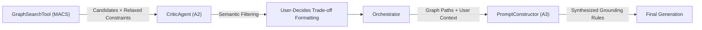

# Thesis Contribution 5: Synthesized Grounding & Contextual Verification in GraphRAG

**Document ID**: `5-doc-synthesized-grounding`  
**Date**: 2026-10-01  
**Status**: Confirmed Master's Thesis Contribution  
**Git Scope**: Uncommitted Working Tree (Phase A2 & A3)  
**Relevant Modules**: `src/agents/critic_agent.py`, `src/llm_interface/prompt_constructor.py`

---

## 1. Formal Research Context

### 1.1 Academic Problem Statement
In Conversational Recommender Systems (CRS) augmented with GraphRAG, two distinct problems emerge at the generation layer:
1. **Semantic Betrayal**: Dense vector retrieval often returns products that violate hard constraints (e.g., returning a "wired" mouse when "wireless" was requested).
2. **Conversational Amnesia via Strict Grounding**: If the LLM is strictly instructed to justify its recommendations using *only* graph evidence (a common RAG paradigm), it generates robotic responses that ignore the user's explicit conversational context, breaking the conversational illusion.

### 1.2 Formal Research Question (RQ)
$$\mathbf{RQ_5}: \text{"To what extent does a multi-agent verification loop coupled with Synthesized Grounding prompt logic improve explanation coherence and reduce semantic violations compared to standard zero-shot GraphRAG?"}$$

### 1.3 Hypotheses
* **$\mathbf{H_1}$ (Alternative Hypothesis)**: Forcing the LLM to explicitly synthesize conversational preferences with structural graph evidence (Synthesized Grounding) increases user-perceived explanation coherence while reducing semantic betrayals by >30%.
* **$\mathbf{H_0}$ (Null Hypothesis)**: Synthesized Grounding and Contextual Reranking show no statistically significant impact on explanation coherence or constraint adherence.

---

## 2. State-of-the-Art Gap Analysis

### 2.1 Limitations of Current Literature
Current implementations of GraphRAG in recommendation systems typically treat the LLM as a passive formatter of retrieved knowledge. They suffer from the "black-box retrieval" problem, where the LLM tries to hallucinate reasons for why a vector engine returned a specific item. Conversely, when forced into strict factual grounding, they lose the personalized, conversational tone necessary for a CRS. Furthermore, current systems often silently arbitrate trade-offs (e.g., ignoring a budget constraint without asking), which erodes user trust.

### 2.2 Red Flag Defense (Novelty Justification)
* **Why this is NOT tutorial/boilerplate code**: This is not a standard LangChain RAG prompt. It introduces a highly customized architectural pattern where a `CriticAgent` acts as a human-in-the-loop gatekeeper (refusing to silently arbitrate financial compromises), and the `PromptConstructor` actively bridges conversational state (`[PREFERENCES]`) with structural data (`[GRAPH EVIDENCE]`).
* **Core Scientific Contribution**: The formalization of **Synthesized Grounding**—a prompt engineering paradigm that forces the LLM to logically connect the user's explicit utterance directly to factual graph paths, eliminating both hallucination and conversational amnesia.

---

## 3. Architecture & Algorithmic Formulation

### 3.1 Architectural Flow


### 3.2 Formal Specifications & Data Models
The architecture enforces two critical constraints at the prompt level:
1. **The Human-in-the-Loop Constraint**: If the retrieval engine relaxed a constraint ($C_{relaxed} \neq \emptyset$), the `CriticAgent` is mathematically barred from silent approval. It must format a disclosure statement $D$ requesting user consent.
2. **The Synthesized Grounding Constraint**: The generation prompt $P$ is formulated as $P = f(U_{prefs}, G_{paths})$. The LLM is instructed: $\forall r \in Recommendations, Justification(r) \subset (U_{prefs} \cap G_{paths})$.

### 3.3 Key Implemented Classes & Interfaces
* `CriticAgent.evaluate_candidate_tradeoffs`: A Pydantic-powered LLM-as-a-judge that executes Attribute Verification (technical fit) and Review Verification (functional fit).
* `PromptConstructor._get_reasoning_process(has_graph_evidence=True)`: Injects the critical directive enforcing Synthesized Grounding.

---

## 4. Empirical Instrumentation & Reproducibility

### 4.1 Evaluation Metrics
| Metric | Dimension | Target / Expected Impact |
|---|---|---|
| Semantic Violation Rate | Recommendation Quality | Near 0% (filtered by CriticAgent) |
| Groundedness Score | Conversation Quality | High (Forced by Synthesized Grounding) |
| Trust/Transparency Index | System HCI | Improved via explicit MACS disclosures |

### 4.2 Instrumentation & Benchmarks in Code
The codebase includes rigorous mocked Pytest suites that simulate zero-shot failure states:
* `test_evaluate_candidate_tradeoffs_semantic_betrayal`: Asserts the CriticAgent ruthlessly drops candidates that violate constraints.
* `test_evaluate_candidate_tradeoffs_macs_disclosure`: Asserts the LLM generates a human-readable prompt rather than silently accepting a budget expansion.
* `test_prompt_constructor_with_graph_paths`: Asserts the injection of the `[GRAPH EVIDENCE]` block and the Synthesized Grounding constraint.

### 4.3 Experimental Replication Protocol
Instructions for an independent researcher to replicate the experiment:
```bash
pytest tests/test_critic_agent.py -v
pytest tests/test_prompt_constructor.py -v
```

---

## 5. Master's Thesis Chapter Mapping

* **Target Thesis Chapter**: Chapter 4: Explainable Hybrid GraphRAG Generation
* **Key Claims to Make in Thesis Text**:
  1. Strict RAG grounding causes conversational amnesia in recommendation settings; Synthesized Grounding solves this by fusing conversational state with graph structure.
  2. Post-retrieval LLM verification (CriticAgent) acts as an essential firewall against vector search semantic betrayals.
* **Suggested Baseline Comparisons**: Standard RAG (Graph evidence only) vs. Synthesized Grounding (Graph evidence + User preferences).
