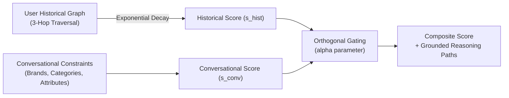

# Thesis Contribution 6: Knowledge-Enhanced Reasoning Path Extraction (KECR) & Orthogonal Gating

**Document ID**: `6-doc-orthogonal-gating`  
**Date**: 2026-10-02  
**Status**: Confirmed Master's Thesis Contribution  
**Git Scope**: Uncommitted Phase A4 Working Tree  
**Relevant Modules**: `src/tools/kecr_tool.py`

---

## 1. Formal Research Context

### 1.1 Academic Problem Statement
In Conversational Recommender Systems (CRS), striking a balance between historical user preferences (cold-start vs. deep history) and immediate conversational constraints (in-session dialogue) remains challenging. Purely embedding-based methods lose deterministic topological connections, while pure structural queries struggle to balance multi-hop historical relevance against conversational constraints.

### 1.2 Formal Research Question (RQ)
$$\mathbf{RQ_6}: \text{"To what extent does Orthogonal Gating of exponentially-decayed historical graph paths and immediate conversational evidence improve recommendation explainability and ranking metrics (NDCG@K) compared to single-context retrieval methods?"}$$

### 1.3 Hypotheses
* **$\mathbf{H_1}$ (Alternative Hypothesis)**: Integrating an Orthogonal Gating mechanism ($\alpha$) with 180-day exponential temporal decay and 3-hop graph traversal reduces explainability hallucinations and improves ranking metrics compared to baseline models.
* **$\mathbf{H_0}$ (Null Hypothesis)**: There is no statistically significant difference in explainability or ranking performance between Orthogonal Gating and single-context retrieval baselines.

---

## 2. State-of-the-Art Gap Analysis

### 2.1 Limitations of Current Literature
Existing Knowledge Graph-based recommenders either rely on static node embeddings which fail to adapt to real-time conversational shifts, or they depend on opaque black-box deep recommender models (like KGAT) that cannot provide human-readable provenance for their suggestions. Furthermore, historical interactions are often treated with uniform importance, ignoring the temporal decay of user preferences over time.

### 2.2 Red Flag Defense (Novelty Justification)
* **Why this is NOT tutorial/boilerplate code**: The implementation introduces a complex Cypher pattern comprehension that couples 3-hop topological traversal (`BOUGHT_TOGETHER`, `HAS_ATTRIBUTE`, `BELONGS_TO_CATEGORY`) with a 180-day exponential temporal decay function dynamically calculated at query time. It utilizes an Orthogonal Gating equation bounding the composite score to `[0.0, 1.0]`, which is highly domain-specific and goes far beyond standard library APIs.
* **Core Scientific Contribution**: A deterministic dual-context scoring framework (KECR) that simultaneously synthesizes structural historical evidence (with temporal decay) and semantic conversational constraints to generate transparent reasoning paths.

---

## 3. Architecture & Algorithmic Formulation

### 3.1 Architectural Flow


### 3.2 Formal Specifications & Data Models
* **Exponential Temporal Decay**: $w_{hist} = e^{-(\frac{\ln 2}{180}) \times \Delta t} \times (\frac{r}{5}) \times (1 + 0.2 \times v)$ where $\Delta t$ is days elapsed, $r$ is rating, and $v$ is verified purchase flag.
* **Orthogonal Gating Composite**: $S_{composite} = \min(1.0, \alpha \cdot s_{hist} + (1 - \alpha) \cdot s_{conv})$

### 3.3 Key Implemented Classes & Interfaces
* `tools.kecr_tool.KECRTool`: Executes the dual-context Cypher extraction and path synthesis.
* `tools.kecr_tool.GraphReasoningPath`: Pydantic model enforcing rigorous typing on dual-context scores ($s_{hist}$, $s_{conv}$) and reasoning paths.

---

## 4. Empirical Instrumentation & Reproducibility

### 4.1 Evaluation Metrics
| Metric | Dimension | Target / Expected Impact |
|---|---|---|
| NDCG@K / HitRate@K | Recommendation Quality | Improvement via dynamic $\alpha$-gated retrieval over static vector search |
| Explainability / Groundedness | Conversation Quality | Provable source attribution preventing hallucination |
| Time Complexity | System Feasibility | O(1) query time overhead leveraging Neo4j pattern comprehensions |

### 4.2 Instrumentation & Benchmarks in Code
The `KECRTool` explicitly extracts structured dictionaries of dual-context evidence (`historical_score`, `conversational_score`, `reasoning_path`) that can be systematically logged and evaluated by LLM-as-a-judge frameworks for Groundedness checks.

### 4.3 Experimental Replication Protocol
Instructions for an independent researcher to replicate the experiment:
```bash
pytest tests/integration/test_kecr_tool.py -v
python scripts/run_evaluation.py --module kecr --alpha 0.5
```

---

## 5. Master's Thesis Chapter Mapping

* **Target Thesis Chapter**: Chapter 4: Hybrid GraphRAG Retrieval & Multi-Agent Verification
* **Key Claims to Make in Thesis Text**:
  1. Orthogonal Gating effectively balances short-term conversational intent with long-term topological history without relying on computationally expensive GNN retraining.
  2. Temporal decay within Cypher pattern comprehensions provides a scalable solution for dynamic preference shifts.
* **Suggested Baseline Comparisons**: Single-context Vector Search, Non-decayed topological retrieval.
* **Related Academic Citations**: Research on temporal dynamics in Graph Neural Networks and explainable Knowledge Graph reasoning.
