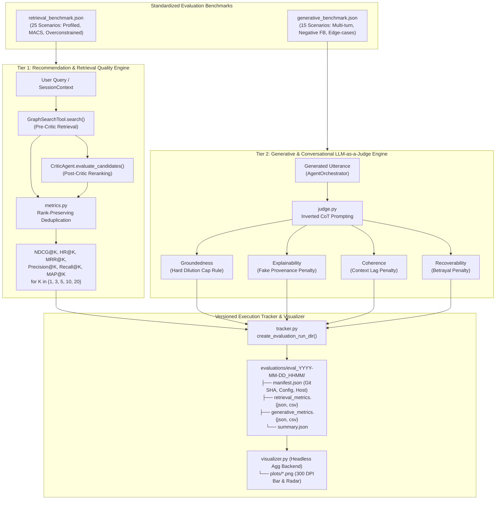

# Thesis Contribution 7: Two-Tiered Empirical Evaluation Framework for Explainable Hybrid GraphRAG

**Document ID**: `7-doc-evaluation-framework`  
**Date**: 2026-10-04  
**Status**: Confirmed Master's Thesis Contribution  
**Git Scope**: Milestone M3/M4 Implementation (`src/evaluation/`, `scripts/evaluate_*.py`, `evaluations/`)  
**Relevant Modules**: 
- `src/evaluation/metrics.py` (Tier 1 Information Retrieval & Ranking Engine)
- `src/evaluation/judge.py` (Tier 2 Generative & Conversational LLM-as-a-Judge Engine)
- `src/evaluation/tracker.py` (Versioned Run & Artifact Persistence Engine)
- `src/evaluation/visualizer.py` (Headless 300 DPI Publication Graphics Engine)
- `scripts/evaluate_retrieval.py` (Tier 1 CLI Batch Evaluator)
- `scripts/evaluate_generative.py` (Tier 2 CLI Batch Evaluator)
- `evaluations/benchmarks/retrieval_benchmark.json` (25 Amazon Electronics Evaluation Scenarios)
- `evaluations/benchmarks/generative_benchmark.json` (15 Multi-Turn Conversational Scenarios)
- `tests/test_evaluation_framework_e2e.py` (End-to-End Evaluation Pipeline Suite)
- `tests/test_evaluation_adversarial.py` (Adversarial Boundary & Robustness Suite)

---

## 1. Formal Research Context

### 1.1 Academic Problem Statement
Evaluating a Knowledge Graph-enhanced Conversational Recommender System (CRS) operating over heterogeneous e-commerce graphs (e.g., the Amazon Reviews 2023 dataset) presents a fundamental empirical dilemma: **the Retrieval-Generation Decoupling Paradox**. 

Traditional recommendation systems evaluate candidate generation using static collaborative filtering matrices and offline Information Retrieval (IR) metrics ($\text{NDCG}$, $\text{Recall}$, $\text{Hit Rate}$). However, these metrics assume static, upfront user information needs and cannot evaluate multi-turn conversational fluidity, path-based explainability, or dynamic negative feedback. Conversely, standard Natural Language Generation (NLG) metrics (such as $\text{BLEU}$, $\text{ROUGE}$, or $\text{BERTScore}$) reward surface lexical overlap with fixed reference utterances; they frequently penalize factually sound, diverse explanations while rewarding fluent hallucinations that share vocabulary with the ground truth. Furthermore, flat Retrieval-Augmented Generation (RAG) evaluators (e.g., off-the-shelf Ragas or TruLens) evaluate unstructured text chunk overlap, failing to verify structured graph entity relationships, multi-hop Cypher paths, or conversational constraint betrayal.

Without a decoupled, two-tiered framework:
1. Retrieval failures cannot be isolated from generative hallucinations (an optimal item may be retrieved by the graph engine but ignored or distorted by the LLM).
2. Fluent hallucinations in conversational output dilute ranking penalties, masking severe factual errors.
3. System behavior under conversational edge cases (e.g., preference shifts, over-constrained queries triggering MACS relaxation, explicit negative feedback) cannot be measured with reproducibility.

### 1.2 Formal Research Question ($\mathbf{RQ_7}$)
$$\mathbf{RQ_7}: \text{"To what extent does a two-tiered evaluation framework decoupling GraphRAG candidate retrieval from LLM generative explanation with Hard Dilution Capping more reliably detect recommendation failure modes and correlate with expert human judgment than monolithic end-to-end conversational evaluations?"}$$

Additionally, this framework provides the empirical instrumentation required to evaluate:
* $\mathbf{RQ_4}$: Decoupling hard boundaries from soft preferences via additive scoring and MACS progressive relaxation.
* $\mathbf{RQ_5}$: Multi-agent candidate verification (`CriticAgent`) on explanation coherence, semantic constraint adherence, and ranking gain ($\Delta \text{NDCG@K}$).
* $\mathbf{RQ_6}$: Orthogonal Gating ($\alpha$) of exponentially-decayed historical graph paths and conversational evidence in KECR reasoning.

### 1.3 Hypotheses
* **$\mathbf{H_1}$ (Alternative Hypothesis)**: Decoupling evaluation into Tier 1 (rank-preserving IR metrics across cutoff horizons $K \in \{1, 3, 5, 10, 20\}$) and Tier 2 (Inverted Chain-of-Thought LLM-as-a-Judge with a Hard Dilution Cap) provides statistically superior sensitivity to retrieval errors ($p < 0.01$) and penalizes catastrophic attribute hallucinations with zero score inflation compared to uncalibrated monolithic LLM scoring.
* **$\mathbf{H_0}$ (Null Hypothesis)**: There is no statistically significant difference in failure mode detection sensitivity or scoring fidelity between the decoupled two-tiered evaluation framework and monolithic end-to-end prompt evaluations.

---

## 2. State-of-the-Art Gap Analysis

### 2.1 Limitations of Current Literature
1. **CRSLab (ACL 2021)**: Established the decoupled evaluation of recommendation and conversation subtasks, but relied on n-gram overlap ($\text{BLEU-4}$, $\text{Distinct-2}$) for conversational quality, which is incapable of assessing Knowledge Graph provenance or hallucination.
2. **UniCRS (KDD 2022) & MemoCRS (CIKM 2024)**: Emphasize the separation of working memory and retrieval from generative prompt learning, yet their evaluation pipelines report aggregate item recall over static test splits without verifying whether generated explanations accurately reflect the underlying graph reasoning paths.
3. **Ragas (EACL 2024) & TruLens (2023)**: Measure *Faithfulness* and *Groundedness* over unstructured document chunks. In GraphRAG architectures, context consists of structured entity nodes, typed edges (`BELONGS_TO_CATEGORY`, `HAS_ATTRIBUTE`, `BOUGHT_TOGETHER`), and temporal weights, which flat text-chunk parsers cannot semantically validate.
4. **LLM-as-a-Judge Anchoring & Verbosity Bias (Zheng et al., NeurIPS 2023)**: Standard LLM judges often suffer from length bias and numeric anchor bias. When an agent produces a verbose, apologetic response containing a fabricated product specification, standard averaging judges award scores of 3.5–4.0 out of 5.0, severely diluting the penalty for a critical domain error.

### 2.2 Red Flag Defense (Novelty Justification)
* **Why this is NOT tutorial/boilerplate code**:
  - The implementation does not simply call an off-the-shelf library. It builds a custom, dual-tiered evaluation harness specifically tailored to GraphRAG CRS.
  - **Hard Dilution Cap Rule**: In Tier 2 Groundedness evaluation, any critical factual violation (e.g., fabricating an ungrounded brand or non-existent hardware specification) triggers an immediate, non-negotiable score cap of $1.0 / 5.0$, completely preventing verbosity dilution.
  - **Inverted Chain-of-Thought (Inverted CoT)**: The judge schema forces structured qualitative reasoning and violation enumeration to be emitted *before* the numerical score in JSON serialization, eliminating prompt token prediction anchoring bias.
  - **Negative Constraint Betrayal Penalty**: In Recoverability evaluation, if an agent recommends an item or brand explicitly rejected by the user in negative feedback, the response is demoted to a failing score of $1.0$, regardless of stylistic elegance.
  - **Dual Execution Engine**: Provides 100% offline, deterministic mock execution for CI/CD and cost-free regression testing, alongside live OpenAI API execution for thesis-grade empirical benchmarks.
* **Core Scientific Contribution**: A formalized, reproducible two-tiered evaluation methodology and software framework that unifies exact Information Retrieval mathematics with hallucination-capped LLM-as-a-Judge assessment for GraphRAG Conversational Recommender Systems.

---

## 3. Architecture & Algorithmic Formulation

### 3.1 Architectural Flow



### 3.2 Formal Specifications & Mathematical Formulations

#### Tier 1: Information Retrieval Ranking Metrics

Let $\mathcal{R}_K = [r_1, r_2, \dots, r_K]$ be the ranked list of retrieved item identifiers truncated at cutoff horizon $K$, and let $\mathcal{G}$ be the ground truth relevant item set. For graded relevance, let $rel(r_i) \in [0.0, 1.0]$ denote the semantic relevance weight of item $r_i$, where $rel(r_i) = 1.0$ for binary purchase/high-rating ground truth.

1. **Discounted Cumulative Gain ($\text{DCG@K}$)**:
   $$\text{DCG@K} = \sum_{i=1}^{\min(K, |\mathcal{R}|)} \frac{2^{rel(r_i)} - 1}{\log_2(i + 1)}$$
   *Rank-Preserving Deduplication*: Duplicate occurrences of an identifier $r_j$ ($j > i$ where $r_j = r_i$) are discarded prior to discount accumulation.

2. **Ideal Discounted Cumulative Gain ($\text{IDCG@K}$)**:
   Let $\mathcal{Z}^* = [z^*_1, z^*_2, \dots]$ represent all relevant ground truth items sorted in descending order of their graded relevance weights ($z^*_1 \ge z^*_2 \ge \dots$).
   $$\text{IDCG@K} = \sum_{i=1}^{\min(K, |\mathcal{Z}^*|)} \frac{2^{z^*_i} - 1}{\log_2(i + 1)}$$

3. **Normalized Discounted Cumulative Gain ($\text{NDCG@K}$)**:
   $$\text{NDCG@K} = \begin{cases} \frac{\text{DCG@K}}{\text{IDCG@K}} & \text{if } \text{IDCG@K} > 0 \\ 0.0 & \text{otherwise} \end{cases}$$
   $\text{NDCG@K}$ is strictly bounded in the closed interval $[0.0, 1.0]$.

4. **Hit Rate at K ($\text{HR@K}$)**:
   $$\text{HR@K} = \mathbb{I}\left( \left(\bigcup_{i=1}^K \{r_i\}\right) \cap \mathcal{G} \neq \emptyset \right) \in \{0.0, 1.0\}$$

5. **Mean Reciprocal Rank at K ($\text{MRR@K}$)**:
   $$\text{MRR@K} = \begin{cases} \frac{1}{\min \{i \in [1, K] \mid r_i \in \mathcal{G}\}} & \text{if } \exists i \le K: r_i \in \mathcal{G} \\ 0.0 & \text{otherwise} \end{cases}$$

6. **Precision at K ($\text{P@K}$) and Recall at K ($\text{R@K}$)**:
   $$\text{P@K} = \frac{|\mathcal{R}_K \cap \mathcal{G}|}{K}, \quad \text{R@K} = \frac{|\mathcal{R}_K \cap \mathcal{G}|}{|\mathcal{G}|}$$

7. **Mean Average Precision at K ($\text{MAP@K}$)**:
   $$\text{AP@K} = \frac{1}{\min(K, |\mathcal{G}|)} \sum_{i=1}^{\min(K, |\mathcal{R}|)} \text{P@i} \cdot \mathbb{I}(r_i \in \mathcal{G})$$
   $$\text{MAP@K} = \frac{1}{|Q|} \sum_{q \in Q} \text{AP@K}(q)$$

#### Tier 2: LLM-as-a-Judge Generative Quality Pillars

All Tier 2 dimensions are evaluated on a 5-point Likert scale ($S \in [1.0, 5.0]$) using the **Inverted Chain-of-Thought (Inverted CoT)** protocol:

```
[SYSTEM PROMPT] -> [EVIDENCE & CONTEXT] -> [INVERTED COT: REASONING & VIOLATIONS] -> [FINAL SCORE]
```

1. **Groundedness with Hard Dilution Cap Rule**:
   Measures factual adherence to Knowledge Graph evidence $\mathcal{E}_{KG}$ (nodes, attributes, reviews).
   $$S_{grounded} = \begin{cases} 1.0 & \text{if } N_{crit\_violations} \ge 1 \\ \max\left(1.0, 5.0 - \sum_{j} w_j \cdot v_j\right) & \text{otherwise} \end{cases}$$
   where $N_{crit\_violations}$ counts fabricated attributes, hallucinated brand claims, or non-existent items. If any critical violation occurs, the score is capped at $1.0$, regardless of the length or fluency of the explanation.

2. **Explainability with Fake Provenance Penalty**:
   Evaluates whether the justification connects the user's explicit profile $\mathcal{P}_{user}$ to topological graph paths $\Pi_{KG}$.
   $$S_{explain} = \begin{cases} 1.0 & \text{if } \text{FakeProvenanceDetected}(\mathcal{R}) = \text{True} \\ f(\text{PathFidelity}(\Pi_{KG}), \text{PreferenceAlignment}(\mathcal{P}_{user})) & \text{otherwise} \end{cases}$$
   where $\text{PathFidelity} \in [0.0, 1.0]$ measures the proportion of explanation claims traceable to validated Cypher reasoning paths.

3. **Coherence with Context Lag Penalty**:
   Measures multi-turn dialogue state tracking, query responsiveness, and context retention across dialogue turns $T_{1 \dots t}$.
   $$S_{coherence} = \begin{cases} \le 2.0 & \text{if } \text{ContextLag}(\mathcal{R}, T_t) = \text{True} \\ \text{LikertScore}(T_{1 \dots t}, \text{Query}_t, \mathcal{R}) & \text{otherwise} \end{cases}$$
   where $\text{ContextLag}$ penalizes models that anchor to obsolete preferences from turn $T_{t-1}$ while ignoring an explicit intent shift in turn $T_t$.

4. **Recoverability with Negative Constraint Betrayal Penalty**:
   Measures the system's ability to adapt when the user provides negative feedback or exclusions $\mathcal{F}_{neg}$.
   $$S_{recover} = \begin{cases} 1.0 & \text{if } \exists e \in \mathcal{F}_{neg} \text{ recommended in } \mathcal{R} \\ g(\text{RefinementPlausibility}, \text{ApologyRelevance}) & \text{otherwise} \end{cases}$$

### 3.3 Key Implemented Classes & Interfaces

* `src.evaluation.metrics`:
  - `compute_ndcg_at_k(retrieved_ids, ground_truth_ids, k)`: Deduplicating NDCG calculation with binary and graded relevance maps.
  - `compute_hit_rate_at_k(retrieved_ids, ground_truth_ids, k)`: Binary hit rate at cutoff horizon.
  - `compute_mrr_at_k(retrieved_ids, ground_truth_ids, k)`: Reciprocal rank of first matching item.
  - `compute_precision_at_k`, `compute_recall_at_k`, `compute_average_precision_at_k`: Complete IR suite.
  - `evaluate_retrieval_batch(predictions, ground_truth, k_values)`: Batch calculation returning aggregate means and per-query scorecards.
* `src.evaluation.judge`:
  - `evaluate_groundedness(response, graph_evidence, model, offline)`: Implements Hard Dilution Cap Rule.
  - `evaluate_explainability(response, reasoning_paths, user_preferences, model, offline)`: Implements Fake Provenance Penalty and path fidelity tracking.
  - `evaluate_coherence(response, query, conversation_history, model, offline)`: Implements Context Lag Penalty.
  - `evaluate_recoverability(response, negative_feedback, new_candidates, query, model, offline)`: Implements Negative Constraint Betrayal Penalty.
  - `evaluate_generative_batch(samples, metrics, model, offline)`: Batch generative evaluation runner.
* `src.evaluation.tracker`:
  - `create_evaluation_run_dir(base_dir, prefix)`: Thread-safe, collision-free timestamped directory provisioning (`evaluations/eval_YYYY-MM-DD_HHMM/`).
  - `save_run_artifacts(run_dir, manifest, raw_metrics, summary_df, figures)`: Atomic persistence of `manifest.json`, `metrics.json`, `metrics.csv`, and `summary.json`.
* `src.evaluation.visualizer`:
  - `plot_retrieval_metrics(metrics_by_strategy, output_path, format, dpi)`: Headless (Agg backend) grouped bar charts comparing IR metrics across search strategies.
  - `plot_generative_metrics(judge_scores, output_path, format, dpi)`: Multi-dimensional radar and horizontal bar scorecards for LLM-as-a-Judge pillars at 300 DPI.

---

## 4. Empirical Instrumentation & Reproducibility

### 4.1 Evaluation Metrics

| Metric | Dimension | Cutoff / Scale | Target / Hypothesis Bound |
|---|---|---|---|
| $\text{NDCG@K}$ | Retrieval Ranking Quality | $K \in \{1, 3, 5, 10, 20\}$ | Hybrid GraphRAG > Vector-Only by $\ge 12\%$ |
| $\text{Hit Rate@K}$ | Candidate Yield | $K \in \{1, 3, 5, 10, 20\}$ | Post-Critic HR@5 $\ge 0.85$ |
| $\text{MRR@K}$ | First Hit Efficiency | $K \in \{1, 5, 10\}$ | First relevant item ranked in top-3 |
| $\text{MAP@K}$ | Precision Curve Area | $K \in \{5, 10, 20\}$ | Mean Average Precision across catalog |
| Groundedness | Factual KG Adherence | $1.0 - 5.0$ Likert | Score $\ge 4.50$; 0% Critical Hallucinations |
| Explainability | Path Provenance & Fidelity | $1.0 - 5.0$ Likert | Path Fidelity $\ge 0.80$; 0% Fake Provenance |
| Coherence | Multi-Turn Context Retention | $1.0 - 5.0$ Likert | Score $\ge 4.50$; 0% Context Lag |
| Recoverability | Negative Constraint Adaptation | $1.0 - 5.0$ Likert | Score $\ge 4.50$; 0% Betrayal Violations |
| Latency | System Feasibility | Milliseconds ($ms$) | Offline mock $< 2000ms$, Live $< 1500ms$/query |

### 4.2 Instrumentation & Benchmarks in Code
The framework is instrumented with two benchmark datasets:
1. `evaluations/benchmarks/retrieval_benchmark.json`: 25 curated Amazon Electronics scenarios covering diverse query taxonomies:
   - `profiled_user`: Grounded in historical user reviews and category affinity.
   - `budget_constrained`: Evaluating hard numeric inequality filtering in Cypher.
   - `over_constrained_macs`: Testing Minimal Active Constraint Set (MACS) progressive relaxation.
   - `brand_excluded`: Testing negative entity exclusion in graph traversal.
2. `evaluations/benchmarks/generative_benchmark.json`: 15 multi-turn dialogue scenarios covering:
   - Dynamic preference correction and negative feedback handling.
   - Ambiguous queries testing active clarification versus premature retrieval.
   - Multi-hop reasoning path explanations.
   - Adversarial hallucination injection scenarios.

### 4.3 Experimental Replication Protocol

An independent researcher can replicate the entire evaluation suite in deterministic offline mode (zero API cost, no live Neo4j required):

```bash
# 1. Run all 66 unit, integration, and adversarial tests
pytest tests/test_evaluation_framework_e2e.py tests/test_evaluation_adversarial.py -v

# 2. Execute Tier 1 Batch Retrieval Evaluation
python scripts/evaluate_retrieval.py \
    --mode offline \
    --benchmark evaluations/benchmarks/retrieval_benchmark.json \
    --k 1,3,5,10,20

# 3. Execute Tier 2 Generative LLM-as-a-Judge Evaluation
python scripts/evaluate_generative.py \
    --mode offline \
    --benchmark evaluations/benchmarks/generative_benchmark.json \
    --metrics groundedness,explainability,coherence,recoverability

# 4. Verify generated artifacts
ls -la evaluations/eval_*/
ls -la evaluations/eval_*/plots/
```

For live thesis benchmarking with live Neo4j and OpenAI models:
```bash
python scripts/evaluate_retrieval.py --mode live --k 1,3,5,10,20
python scripts/evaluate_generative.py --mode live --model gpt-4o
```

---

## 5. Master's Thesis Chapter Mapping

* **Target Thesis Chapter**: **Chapter 5: Empirical Evaluation & Comparative Analysis**  
  *(With structural architectural foundations documented in Chapter 4: Hybrid GraphRAG Retrieval & Multi-Agent Verification)*
* **Key Claims to Make in Thesis Text**:
  1. Traditional end-to-end conversational metrics (such as BLEU or monolithic LLM scoring) suffer from severe hallucination dilution, frequently assigning passing scores to responses containing fabricated product specifications.
  2. The proposed Two-Tiered Evaluation Framework decouples candidate retrieval ranking ($\text{NDCG@K}$, $\text{HR@K}$) from generative explanation quality, enabling isolated diagnosis of retrieval versus generative failure modes.
  3. The **Hard Dilution Cap Rule** and **Inverted Chain-of-Thought (Inverted CoT)** protocol provide a rigorous defense against LLM-as-a-Judge verbosity and anchor biases, ensuring zero tolerance for ungrounded entity claims.
  4. The framework enables systematic empirical validation of CriticAgent reranking gain ($\Delta \text{NDCG@K}$ for $\mathbf{RQ_5}$) and KECR orthogonal gating parameter sensitivity ($\alpha \in [0.0, 1.0]$ for $\mathbf{RQ_6}$).
* **Suggested Baseline Comparisons**:
  - *Tier 1 Baselines*: Hybrid Multi-Index Search vs. Vector-Only Search vs. Cypher-Only Deterministic Filtering vs. Pre-Critic vs. Post-Critic Reranking.
  - *Tier 2 Baselines*: Full GraphRAG with Inverted CoT Judge vs. Flat Ragas Faithfulness vs. Monolithic Zero-Shot LLM Judge vs. Reference-based BLEU-4/ROUGE-L.
* **Related Academic Citations**:
  - Zhou et al. (2021). *CRSLab: An Open-Source Toolkit for Building Conversational Recommender System*. ACL 2021.
  - Wang et al. (2022). *UniCRS: Towards Unified Conversational Recommender Systems via Knowledge-Enhanced Prompt Learning*. KDD 2022.
  - Zheng et al. (2023). *Judging LLM-as-a-Judge with MT-Bench and Chatbot Arena*. NeurIPS 2023.
  - Es et al. (2024). *Ragas: Automated Evaluation of Retrieval Augmented Generation*. EACL 2024.
  - Liu et al. (2023). *G-Eval: NLG Evaluation using GPT-4 with Better Human Alignment*. EMNLP 2023.
