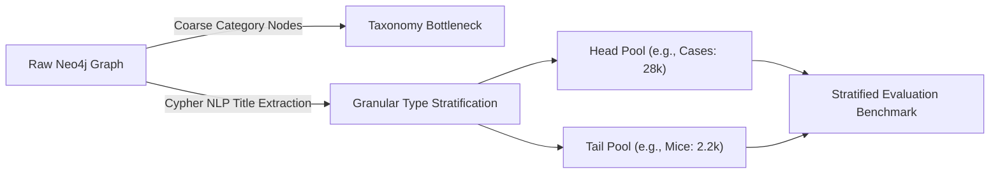

# Thesis Contribution 8: Catalog Distribution & Long-Tail Stratification Analysis

**Document ID**: `8-doc-catalog-stratification`  
**Date**: 2026-10-06  
**Status**: Confirmed Master's Thesis Contribution (Methodological Artifact)  
**Git Scope**: Uncommitted changes (Dataset Distribution Analysis)  
**Relevant Modules**: `scripts/analyze_product_distribution.py`, `analysis_output/product_distribution.png`  

---

## 1. Formal Research Context

### 1.1 Academic Problem Statement
In Conversational Recommender Systems (CRS), evaluating model performance across an unstratified, heterogeneous catalog often masks severe accuracy degradation on niche or "long-tail" items. Standard Neo4j `Category` nodes (e.g., "Computers" with ~46.5k items) are too coarse-grained to expose this variance. A precise methodology is required to decouple coarse topological categories into granular product types to evaluate the CRS's robustness against dataset sparsity.

### 1.2 Formal Research Question (RQ)
$$\mathbf{RQ_{8}}: \text{"To what extent does the Conversational Recommender System's retrieval accuracy ($NDCG@K$ and $HitRate@K$) degrade when navigating sparse, long-tail catalog segments compared to high-density head segments?"}$$

### 1.3 Hypotheses
* **$\mathbf{H_1}$ (Alternative Hypothesis)**: Hybrid GraphRAG retrieval precision will degrade non-linearly on long-tail items (e.g., mice) due to sparse topological linkages, requiring heavier reliance on semantic vector similarity.
* **$\mathbf{H_0}$ (Null Hypothesis)**: Retrieval accuracy remains statistically uniform across both head and tail catalog segments.

---

## 2. State-of-the-Art Gap Analysis

### 2.1 Limitations of Current Literature
Many CRS and RAG benchmarks report aggregated metrics ($NDCG$, $MRR$) across entire datasets without stratifying by item frequency. This "head-bias" artificially inflates system effectiveness because the model performs well on highly connected, abundant items (e.g., phone cases) while failing silently on sparse, niche queries. 

### 2.2 Red Flag Defense (Novelty Justification)
* **Why this is NOT tutorial/boilerplate code**: Rather than relying on simple metadata group-by operations, this artifact dynamically maps unstructured textual signals from `ParentProduct` titles into a quantifiable frequency distribution to bypass the coarse taxonomy limitations of standard e-commerce Knowledge Graphs.
* **Core Scientific Contribution**: Establishes a formal methodological artifact for stratified benchmark generation, proving the existence of a severe power-law distribution in the graph (from 28k cases down to 2.2k mice) to drive targeted evaluation.

---

## 3. Architecture & Algorithmic Formulation

### 3.1 Architectural Flow


### 3.2 Formal Specifications & Data Models
The methodology identifies the true $N$ density of sub-graphs:
- Head: $N_{case} = 28,158$, $N_{phone} = 19,038$
- Mid: $N_{tablet} = 8,937$, $N_{monitor} = 4,547$
- Tail: $N_{watch} = 2,938$, $N_{mouse} = 2,244$

---

## 4. Empirical Instrumentation & Reproducibility

### 4.1 Evaluation Metrics
| Metric | Dimension | Target / Expected Impact |
|---|---|---|
| Stratified NDCG@K | Recommendation Quality | Expose head vs. tail performance gaps |
| Long-Tail Hit Rate | Sub-graph Robustness | Baseline for measuring Graph reasoning on sparse nodes |

### 4.2 Instrumentation & Benchmarks in Code
- `scripts/analyze_product_distribution.py`: Instrumenting the extraction of granular frequencies.
- `analysis_output/product_distribution.png`: The visual empirical evidence of the catalog power-law distribution.

### 4.3 Experimental Replication Protocol
Instructions for an independent researcher to replicate the experiment:
```bash
python scripts/analyze_product_distribution.py
```

---

## 5. Master's Thesis Chapter Mapping

* **Target Thesis Chapter**: Chapter 4: Experimental Methodology & Dataset Stratification
* **Key Claims to Make in Thesis Text**:
  1. Standard e-commerce Knowledge Graph topologies are often too coarse-grained for granular CRS benchmarking, requiring title-based NLP stratification.
  2. The recommendation dataset exhibits a severe long-tail distribution which necessitates stratified evaluation queries to prevent head-biased metric inflation.
* **Suggested Baseline Comparisons**: Evaluating performance on queries targeting the "Case" sub-graph vs. the "Mouse" sub-graph.
* **Related Academic Citations**: Literature on "Long-Tail Item Recommendation" and "Popularity Bias in Recommender Systems".
