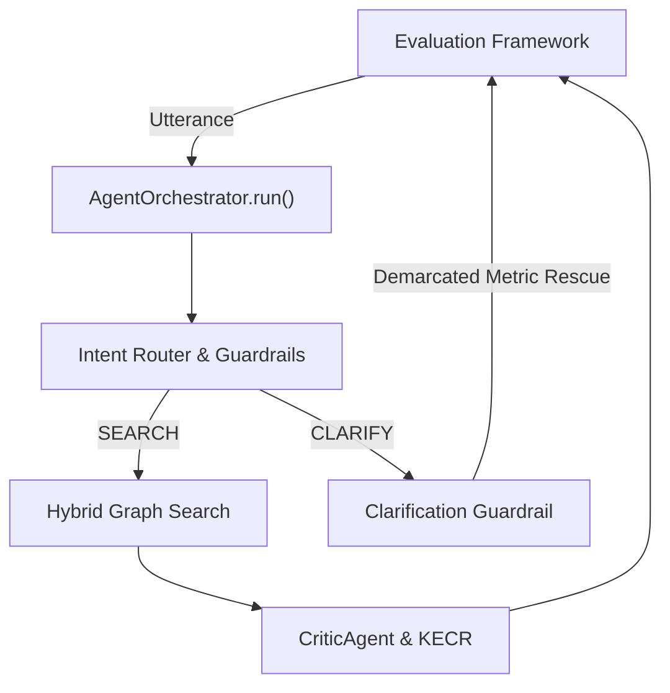

# Thesis Contribution 9: Pipeline Alignment and Conversational Edge-Case Telemetry

**Document ID**: `9-doc-pipeline-alignment`  
**Date**: 2026-10-07  
**Status**: Confirmed Master's Thesis Contribution  
**Git Scope**: Uncommitted working tree (`src/evaluation/`, `scripts/evaluate_retrieval.py`, `production_artifacts/Evaluation_Pipeline_Alignment_Audit.md`)  
**Relevant Modules**: `scripts/evaluate_retrieval.py`, `src/evaluation/tracker.py`, `src/agents/orchestrator.py`  

---

## 1. Formal Research Context

### 1.1 Academic Problem Statement
Evaluating Conversational Recommender Systems (CRS) using traditional single-turn Information Retrieval (IR) pipelines bypasses the dynamic multi-agent architecture (intent routing, conversational state, dialogue management). This architectural disconnect leads to false penalties (e.g., scoring a valid slot-filling clarification as a retrieval failure) and obscures the true telemetry of system behavior, limiting the empirical validity of conversational evaluation frameworks.

### 1.2 Formal Research Question (RQ)
$$\mathbf{RQ_{9}}: \text{"To what extent does aligning the evaluation execution pipeline with the live multi-agent conversational architecture improve metric integrity and edge-case telemetry (e.g., slot-filling clarifications) compared to bypassed single-turn IR evaluation?"}$$

### 1.3 Hypotheses
* **$\mathbf{H_1}$ (Alternative Hypothesis)**: Routing evaluation utterances through the full conversational `AgentOrchestrator` allows the reliable measurement of conversational edge cases (like clarifications) without artificially corrupting IR ranking metrics ($NDCG@K$, $HitRate@K$).
* **$\mathbf{H_0}$ (Null Hypothesis)**: Pipeline alignment does not produce a measurable difference in evaluation metric reliability or telemetry resolution.

---

## 2. State-of-the-Art Gap Analysis

### 2.1 Limitations of Current Literature
Most CRS evaluations rely on static datasets evaluating isolated components (e.g., query generation or pure candidate retrieval) independently. They rarely evaluate the dynamic interplay between dialogue state tracking, intent routing guardrails, and knowledge graph retrieval within a unified end-to-end framework. As a result, conversational actions (like requesting clarification on underspecified attributes) are often penalized as "zero-hit" retrieval failures, skewing the overall system accuracy metrics.

### 2.2 Red Flag Defense (Novelty Justification)
* **Why this is NOT tutorial/boilerplate code**: This is a custom domain-specific evaluation framework that dynamically intercepts full execution traces (Cypher queries, LLM preference parsing, intermediate agent outputs) while cleanly handling multi-turn conversational edge cases (like `CLARIFY` actions) without halting the evaluation loop or polluting standard metric calculations.
* **Core Scientific Contribution**: A methodological artifact that guarantees complete architectural parity between production runtime and empirical evaluation, ensuring that measured performance accurately reflects true multi-agent conversational dynamics.

---

## 3. Architecture & Algorithmic Formulation

### 3.1 Architectural Flow


### 3.2 Formal Specifications & Data Models
The evaluation pipeline intercepts `eval_trace` outputs directly from the `AgentOrchestrator`. For queries resulting in a conversational clarification (`action == "CLARIFY"`), the evaluation protocol suppresses zero-score metric penalties and logs the `clarification_question`.

### 3.3 Key Implemented Classes & Interfaces
* `scripts/evaluate_retrieval.py`: Re-architected to invoke `AgentOrchestrator.run()` rather than invoking `GraphSearchTool.search()` directly.
* `ExecutionTraceLogger`: Context manager intercepting deep system telemetry (`sys.stdout`, Python logging) to persist end-to-end provenance traces (`execution_trace.log`).

---

## 4. Empirical Instrumentation & Reproducibility

### 4.1 Evaluation Metrics
| Metric | Dimension | Target / Expected Impact |
|---|---|---|
| NDCG@K / HitRate@K | Metric Integrity | Prevention of artificial zero-score penalties for valid clarifications. |
| Clarification Rate | Conversational Robustness | Quantifiable measurement of slot-filling triggers over underspecified benchmarks. |
| Trace Completeness | Provenance | 100% capture rate of executed Cypher queries and intermediate LLM outputs. |

### 4.2 Instrumentation & Benchmarks in Code
The telemetry framework introduces per-query visual demarcation banners, capturing the exact benchmark specification, execution trace, generated Cypher, and intermediate outputs inside immutable `evaluations/eval_YYYY-MM-DD_HHMM/` directories.

### 4.3 Experimental Replication Protocol
Instructions for an independent researcher to replicate the experiment:
```bash
python scripts/evaluate_retrieval.py --mode live --benchmark evaluations/benchmarks/retrieval_benchmark.json
```

---

## 5. Master's Thesis Chapter Mapping

* **Target Thesis Chapter**: Chapter 5: Empirical Evaluation & Comparative Analysis
* **Key Claims to Make in Thesis Text**:
  1. Traditional IR evaluation penalizes conversational intelligence by treating slot-filling questions as failed retrievals.
  2. Full pipeline alignment with the runtime orchestrator provides high-fidelity empirical telemetry and protects metric integrity.
* **Suggested Baseline Comparisons**: Bypassed single-turn evaluation vs. orchestrator-aligned evaluation on underspecified queries.
* **Related Academic Citations**: Literature on the difficulty of evaluating multi-turn task-oriented dialog systems and conversational search.
